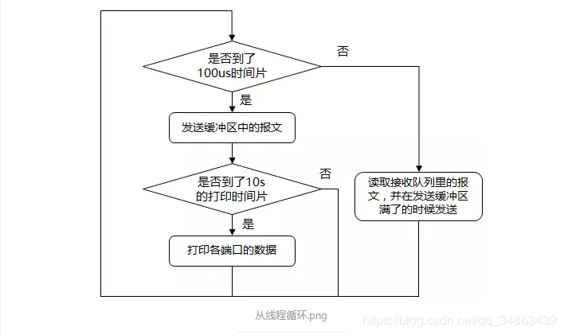

# 概述
在计算机网络中，二层是链路层，是以太网所在的层，识别的是设备端口的MAC地址。

网卡驱动在二层上的作用就是根据设定的目的端口，转发报文到目的端口

<div align="center">  </div>

# 程序流程

<div align="center">  </div>
每个逻辑核在任务分发后会执行如下的循环，直到退出

<div align="center">  </div>


# 代码分析

运行参数：-c 1 -n 2 -- -q 1  -p 1
```bash
-c：指定分配给DPDK使用的逻辑数，我只是使用一个核
-n：每个CPU的内存通道数
--：之后表示为次参数
-q：每个CPU管理的队列数，这里设置为一个队列
-p：使用的端口，我测试的时候使用第一个端口
```

## main

1 init EAL 

2 other init 


3 设置目的端口


4 初始化内存池


5 初始化每一个端口

6 分配所有 lcore 执行函数

## l2fwd_main_loop 

1 获取id  剔除多余lcore 打印信息

2 收发循环
```cpp
    //获取自己的lcore_id
	lcore_id = rte_lcore_id();  // 获取自己的 lcore id
	qconf = &lcore_queue_conf[lcore_id];
 
    //分配后多余的lcore  剔除
	if (qconf->n_rx_port == 0) {   // 因为对每一个 lcore 都执行 main 线程，如果该 lcore 上没有绑定端口，就无事可做。
		RTE_LOG(INFO, L2FWD, "lcore %u has nothing to do\n", lcore_id);
		return;
	}
 
	RTE_LOG(INFO, L2FWD, "entering main loop on lcore %u\n", lcore_id);
    
	//打印信息
	for (i = 0; i < qconf->n_rx_port; i++) {
 
		portid = qconf->rx_port_list[i];
		RTE_LOG(INFO, L2FWD, " -- lcoreid=%u portid=%u\n", lcore_id,
			portid); // 显示一下 lcore 和 port 的对应关系
 
	}
```

3 l2fwd_simple_forward (替换源MAC地址和目的MAC地址）
```cpp
 
	while (!force_quit) {
 
		cur_tsc = rte_rdtsc();  // 获取从开机起至当前的时间戳
 
		/*
		 * TX burst queue drain 
		 * 发送逻辑
		 */
		diff_tsc = cur_tsc - prev_tsc;
		if (unlikely(diff_tsc > drain_tsc)) {  // 时间到了
            //如果tx_buffer满，会发送一批 pkt 出去。
			//如果没满，为了保证没有没被发出的 pkt，所以每个一小段时间，也会发送队列中的包
			for (i = 0; i < qconf->n_rx_port; i++) { // 对 lcore 负责的每个端口
 
				portid = l2fwd_dst_ports[qconf->rx_port_list[i]]; // 与之配对的端口
				buffer = tx_buffer[portid];
 
				sent = rte_eth_tx_buffer_flush(portid, 0, buffer);  // 将 buffer 里的 pkt 全部从 port id 的 0号 Tx queue 发出去
				if (sent)  // 返回值是成功发出的 pkt 数量
					port_statistics[portid].tx += sent;
 
			}
 
			/* if timer is enabled */
			if (timer_period > 0) {
 
				/* advance the timer */
				timer_tsc += diff_tsc;
 
				/* if timer has reached its timeout */
				if (unlikely(timer_tsc >= timer_period)) {
 
					/* do this only on master core */
					if (lcore_id == rte_get_master_lcore()) { // 如果计时器到了，就打印一下信息。只在主核心打印信息
						print_stats();
						/* reset the timer */
						timer_tsc = 0;
					}
				}
			}
 
			prev_tsc = cur_tsc;
		}
 
		/*
		 * Read packet from RX queues
		 * 接收逻辑
		 */
		for (i = 0; i < qconf->n_rx_port; i++) { // 对 lcore 负责的每个端口
 
			portid = qconf->rx_port_list[i]; // 获取端口号
			nb_rx = rte_eth_rx_burst(portid, 0, 
						 pkts_burst, MAX_PKT_BURST); // 收包，收到该端口的 0 号 rx queue
 
			port_statistics[portid].rx += nb_rx;// 更新端口上的收包计数器
 
			for (j = 0; j < nb_rx; j++) { // 对每一个包
				m = pkts_burst[j];  // 包的 mbuf 指针
				// Prefetch: 预取一个 cache 行。参数是要取的地址，类型 void *
                // rte_pktmbuf_mtod：返回 mbuf 中 data 的起始地址
				rte_prefetch0(rte_pktmbuf_mtod(m, void *));
				l2fwd_simple_forward(m, portid); // 收包后进行 L2fwd !!
			}
		}
	}
```
