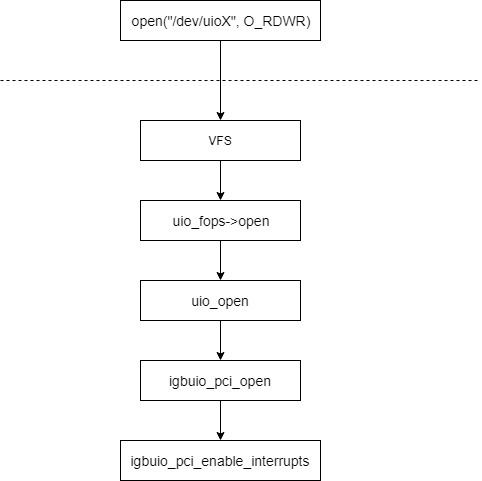
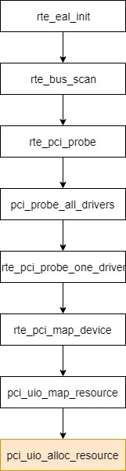

# 简介

PMD是Poll Mode Driver的缩写，即基于用户态的轮询机制的驱动。

<div align="center">  </div>

虽然PMD是在用户态实现设备驱动，但还是依赖于内核提供的策略。其中uio模块，是内核提供的用户态驱动框架，而igb_uio是DPDK kit中拥有与uio交互，bind指定网卡的内核模块。 


# dpdk_devbind.py

dpdk_devbind.py程序主要做了以下几件事(转为shell命令)：
* 1. 为igb_uio驱动添加设备id ： 
    - echo –n “8086 10f5” > /sys/bus/pci/drivers/igb_uio/new_id
* 2. 为设备指定驱动 ： 
    * echo–n“igb_uio”> /sys/bus/pci/devices/0000\:02\:05.0/driver_override
* 3. 执行绑定操作，触发驱动probe  
    * echo –n “0000:02:05.0”>/sys/bus/pci/drivers/igb_uio/bind
* 4. 执行解绑操作 
    *  echo -n“0000:02:05.0”>/sys/bus/pci/drivers/e1000/unbind

* “0000:02:05.0”为设备标识(域:总线编号:设备编号:功能号).
  
1与2只执行一个即可，1是配置驱动，让其支持新的设备。2是配置设备，让其选择驱动。

从以上可知设备驱动的解绑与绑定涉及几个方面 

1. 驱动：igb_uio, uio, e1000等
2. sysfs，用于用户态与内核态进行通讯。 (new_id, driver_override, bind, unbind)
3. 传递的消息:设备ID、设备标识

当使用DPDK脚本dpdk-devbind来bind网卡时，会通过sysfs与内核交互，让内核使用指定驱动来匹配网卡。
* 具体的行为向/sys/bus/pci/devices/(pci id)/driver_override写入指定驱动名称，
* 或者向/sys/bus/pci/drivers/igb_uio(驱动名称）/new_id写入要绑定网卡的PCI ID。
    * 前者是配置设备，让其选择驱动。
    * 后者是是配置驱动，让其支持新的PCI设备。

当使用igb_uio bind指定设备后，内核会调用igb_uio注册的struct pci_driver的probe函数，即igbuio_pci_probe。在这个函数中，设置PCI的一些操作（如设置PCI BAR、DMA等），不是重点，那是驱动工程师的职责:) 对于PMD来说，重点是与UIO的交互。

* 1. 调用igbuio_setup_bars，设置uio_info的uio_mem和uio_port
* 2. 设置uio_info的其他成员
* 3. 调用uio_register_device，注册uio设备

这时，应用层已经可以使用uio设备了。

===============================================================

DPDK的应用层代码，会打开uioX设备。在函数pci_uio_alloc_resource中，

<div align="center">  </div>

当open对应的uio设备时，对应的内核操作为uio_open，其又会调用igb_uio的open函数，流程图如下：

<div align="center">  </div>

igb_uio的默认中断模式为RTE_INTR_MODE_MSIX 

当打开uio设备时，igb_uio注册了一个中断。
* 这时大家应该有个疑问，PMD不是用户态轮询设备吗？为什么还要申请中断，注册中断处理函数呢？
   * 这是因为，即使应用层可以通过uio来实现设备驱动，但是设备的某些事件还是需要内核进行响应，然后通知应用层
   * 当然，现在的中断处理已经非常简单了。

igb_uio中断处理函数 关键步骤是调用uio_event_notify
* 这个函数很简单：
    * 1. 增加uio设备的“事件”数；
    * 2. 唤醒在idev->wait等待队列中的task；
    * 3. 使用信号异步通知async_queue队列中的进程；
* 目前DPDK没有使用异步IO的方式，所有对于DPDK的PMD来说，只有前两个语句有用


uio模块除了实现了上面的“事件”通知，还支持了mmap方法
* 其mmap的函数为uio_mmap

至此，uio已经可以让PMD的应用层访问设备的大部分资源了。

===============================================================


# PMD驱动分析
dpdk接管网卡时涉及uio、igb_uio等内核驱动模块，那么dpdk的PMD驱动与这些模块之间是什么样的关系呢？
* 其实dpdk是借助了linux内核提供的uio用户态IO驱动框架来实现的。
* UIO分为用户态（dpdk PMD）与内核态两部分(igb_uio)以及UIO框架本身。
* 用户态部分实现真正的业务处理，内核态部分主要是接管硬件资源提供给用户态部分使用。


<div align="center">  </div>

## EAL初始化

当DPDK的app启动时，会进行EAL初始化，如下图：

<div align="center">  </div>

在pci_uio_alloc_resource中，主要是打开dpdk要管理的uio设备 

同时，在pci_uio_map_resource函数中 DPDK还需要把PCI设备的BAR映射到应用层

## PMD的应用层的驱动实现

### 以最简单的e1000驱动为例，
在其初始化函数eth_igb_dev_init中 
 * 当uio设备有事件时，由eth_igb_interrupt_handler负责处理，实现了用户态的中断处理。
 * eth_igb_interrupt_handler非常简单，只是处理设备的状态变化事件，如link status。

接下来，就是最重要的了，PMD如何读取网卡数据。

* DPDK的应用代码，会调用rte_eth_rx_burst读取数据报文。
* 在这个函数中，会调用驱动dev->rx_pkt_burst来做实际的操作。以e1000为例，即eth_igb_recv_pkts。

* 这里的实现很简单。如果网卡接收buffer的描述符表示已经完成一个报文的接收（有E1000_RXD_STAT_DD标志），则rte_mbuf_raw_alloc一个mbuf，进行处理。如果没有报文，直接跳出循环。

对应RTC模型的DPDK应用来说，就是不断的调用rte_eth_rx_burst去“问”网卡是否有新的报文。
* 如果有，就取走所有的报文或达到参数nb_pkts的上限。
* 然后进行报文处理，处理完毕，再次循环。


### 设备驱动模型

dpdk使用了与linux内核类似的设备驱动模型，高层抽象出bus, driver, device三类结构

#### 硬件抽象
<div align="center">  </div>

#### pci枚举

dpdk 环境抽象层初始化时会对系统bus进行扫描，获取当前bus上的设备信息，并匹配相应驱动对设备进行初始化。

##### 1 pci总线及驱动注册
* 1、bus结构初始化
* 2、bus结构注册

##### 2.调用注册宏注册总线
```cpp
#define RTE_REGISTER_BUS(nm, bus) \
RTE_INIT_PRIO(businitfn_ ##nm, BUS); \
static void businitfn_ ##nm(void) \
{\
	(bus).name = RTE_STR(nm);\
	rte_bus_register(&bus); \
}

#define RTE_INIT_PRIO(func, prio) \
static void __attribute__((constructor(RTE_PRIO(prio)), used)) func(void)
```

* 注册宏使用了gcc函数属性constructor，即此注册行为在main函数执行前完成。
* rte_bus_register函数将bus结构连入rte_bus_list全局链表。

##### 3.PMD网卡设备驱动注册
* 1、pci驱动结构初始化
* 2、pci驱动注册

#### bus枚举

环境抽象层初始化时会调用rte_bus_scan对bus中的所有设备进行扫描,然后调用rte_bus_probe匹配相应驱动初始化网卡设备。