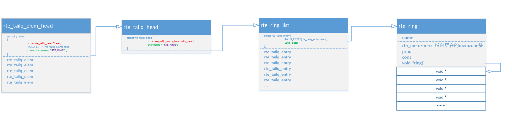
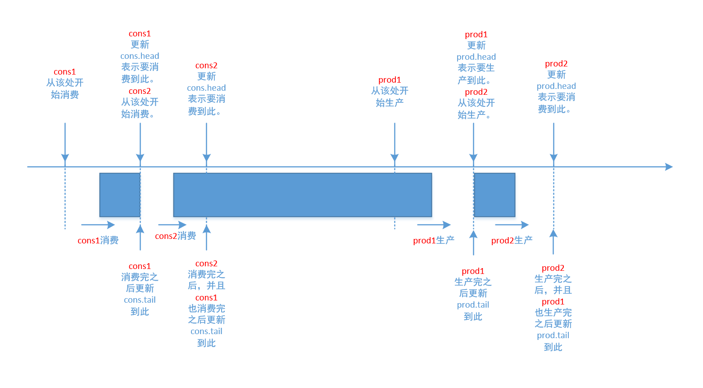
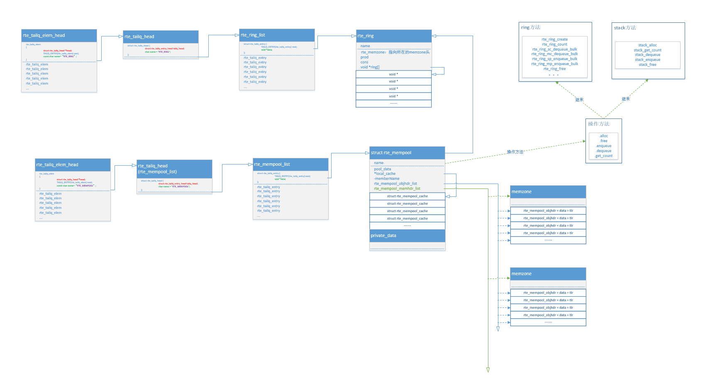

# Ring

## 简介
DPDK所提供的ring本质上是一个FIFO的无锁队列
* 支持单生产者/单消费者/多生产者/多消费者等多种操作模式，同时也支持burst模式来进行以上操作。  
* 物理上它是一个数组，需要在定义时就指定好大小（队列是没有大小限制的），在逻辑上可以看成是一个环 
* 和队列相比，具备如下优势：
    * 更快：仅仅需要一个CAS指令
    * 简单：相比标准的linux无锁队列，实现和使用都相对简单
    * 支持批量入队/出队操做
* 缺点
    * 大小固定
    * 大量ring相比于链表，消耗更多的内存，空ring至少包含n个指针。

<div align="center">  </div>

```cpp
struct rte_ring {
	TAILQ_ENTRY(rte_ring) next;      /**< Next in list. */
 
	//ring的唯一标示，不可能同时有两个相同name的ring存在
	char name[RTE_RING_NAMESIZE];    /**< Name of the ring. */
	int flags;                       /**< Flags supplied at creation. */
 
	/** Ring producer status. */
	struct prod {
		uint32_t watermark;      /**< Maximum items before EDQUOT. */
		uint32_t sp_enqueue;     /**< True, if single producer. */
		uint32_t size;           /**< Size of ring. */
		uint32_t mask;           /**< Mask (size-1) of ring. */
		volatile uint32_t head;  /**< Producer head. */
		volatile uint32_t tail;  /**< Producer tail. */
	} prod __rte_cache_aligned;
 
	/** Ring consumer status. */
	struct cons {
		uint32_t sc_dequeue;     /**< True, if single consumer. */
		uint32_t size;           /**< Size of the ring. */
		uint32_t mask;           /**< Mask (size-1) of ring. */
		volatile uint32_t head;  /**< Consumer head. */
		volatile uint32_t tail;  /**< Consumer tail. */
#ifdef RTE_RING_SPLIT_PROD_CONS
	/*这个属性就是要求gcc在编译的时候，把cons/prod结构都单独分配到一个cache行，为什么这样做？
	 因为如果没有这些的话，这两个结构在内存上是连续的，编译器不会把他们分配到不同cache 行，而
	一般上这两个结构是要被不同的核访问的，如果连续的话这两个核就会产生伪共享问题。*/
	} cons __rte_cache_aligned;
#else
	} cons;
#endif
 
#ifdef RTE_LIBRTE_RING_DEBUG
	struct rte_ring_debug_stats stats[RTE_MAX_LCORE];
#endif
 
	void * ring[0] __rte_cache_aligned; /**< Memory space of ring starts here.
	 	 	 	 	 	 	 	 	 	 * not volatile so need to be careful
	 	 	 	 	 	 	 	 	 	 * about compiler re-ordering */
};
```


## 创建ring

<div align="center">  </div>

在rte_ring_list链表中创建一个rte_tailq_entry节点。在memzone中根据队列的大小count申请一块内存(rte_ring的大小加上count*sizeof（void ）)。紧邻着rte_ring结构的void 数组用于放置入队的对象（单纯的赋值指针值）。rte_ring结构中有生产者结构prod、消费者结构cons。初始化参数之后，把rte_tailq_entry的data节点指向rte_ring结构地址


## 多生产/消费者同时生产/消费

struct cons/prod这两个结构中的有head和tail索引，主要还是考虑多生产者/多消费者使用ring时，会涉及到多线程编程以及锁冲突的问题。
<div align="center">  </div>

* 移动prod.head表示生产者预定的生产数量
   * 当该生产者生产结束，且在此之前的生产也都结束后，移动prod.tail表示实际生产的位置
* 同样，移动cons.head表示消费者预定的消费数量
   * 当该消费者消费结束，且在此之前的消费也都结束后，移动cons.tail表示实际消费的位

## 出/入队列

### 1.入队流程
#### 1.检查free空间是否足够
free_entries = (mask + 1 + cons_tail - prod_head -1);

#### 2.生产预约
利用cas操作，移动r->prod.head，预约生产。

cas：这是一种可以称为基于冲突检测的乐观锁。cas操作是原子性的，由CPU硬件指令实现保证 。


**多生产者的流程** 
* 1 在所有核上，将ring->prod_head和ring->cons_tail拷贝到本地变量中。prod_next本地变量指向prod_head的下一个元素，或者多个元素(bulk enqueue情况下)；如果ring中空间不够，直接报错退出
* 2 在每个核上，修改ring->prod_head指向本地变量prod_next。这个动作的完成需要使用CAS指令，该指令自动完成下述动作
     - 1 如果ring->prod_head和本地变量的prod_head不相等，CAS操作失败，重新执行
     - 2 如果ring->prod_head和本地变量的prod_head相等,CAS操作成功，继续
     - 3 这样如果两个核同时更新该索引，一次就能保证只有一个能成功，另一个失败后会自动尝试继续比较，再第一次添加的基础上继续更新添加。当CAS都更新成功后，core 1添加obj4, core 2添加obj5
* 当CAS都更新成功后，core 1添加obj4, core 2添加obj5
* 每个核都尝试更新ring->prod_tail. 比较ring->prod_tail是否等于本地prod_head,只有true的core能够执行，第一次是core 1成功 
* 当core 1更新成功后，core 2继续判断，此时应该也可以更新了，完成更新。
      


乐观锁的核心算法是**CAS（Compareand Swap，比较并交换）**，它涉及到三个操作数：内存值、预期值、新值。**当且仅当预期值和内存值相等时才将内存值修改为新值。**

* 这样处理的逻辑是，首先检查某块内存的值是否跟之前我读取时的一样，如不一样则表示期间此内存值已经被别的线程更改过，舍弃本次操作，否则说明期间没有其他线程对此内存值操作，可以把新值设置给此块内存。


#### 3.检查是否到了阈值，并添加到统计中

#### 4.等待之前的入队操作完成，移动实际位置
检查在此生产者之前的生产者都生产完成后，移动r->prod.tail，移动实际生产了的位置。

### 2.出队流程

同生产者一个道理


## API 
创建ring
```cpp
struct rte_ring * rte_ring_create（const char *name, unsigned count, int socket_id,unsigned flags）
```

查找ring  
* 如果ring是两个进程共享的，这个时候非创建者只需要使用查找ring的函数查找到ring就可以使用了；

```cpp
 struct rte_ring * rte_ring_lookup（const char *name）
```

入/出队列 

* 单个
```cpp
int rte_ring_enqueue（struct rte_ring *ring,void *data)
int rte_ring_dequeue（struct rte_ring *ring,void **data）
```
* 一群
```cpp
int rte_ring_enqueue_bulk(struct rte_ring *ring,void **data,int count)
int rte_ring_dequeue_bulk(struct rte_ring *ring,void **data,int count)
```
ring状态获取
```cpp
rte_ring_count（）      //查看已经使用的count数目
rte_ring_free_count()   //查看空闲的count数据
rte_ring_empty/rte_ring_full //一键判断空/满
```


# Mempool 

每个mempool都有一个名字，它使用DPDK ring来存储对象，并为每一个lcore提供cache以提升性能。mempool还提供内存填充/对齐机制，以确保将对象公平地布置在DRAM或DDR3 channel上。

入队的时候优先入local_cache中，出队的时候优先从local_cache中出队

<div align="center">  </div >

```cpp
struct rte_mempool {
    char name[RTE_MEMPOOL_NAMESIZE]; /**< Name of mempool. */
    struct rte_ring *ring;           /**< Ring to store objects. */
    phys_addr_t phys_addr;           /**< Phys. addr. of mempool struct. */
    int flags;                       /**< Flags of the mempool. */
    uint32_t size;                   /**< Size of the mempool. */
    uint32_t cache_size;             /**< Size of per-lcore local cache. */
    uint32_t cache_flushthresh;
    /**< Threshold before we flush excess elements. */

    uint32_t elt_size;               /**< Size of an element. */
    uint32_t header_size;            /**< Size of header (before elt). */
    uint32_t trailer_size;           /**< Size of trailer (after elt). */

    unsigned private_data_size;      /**< Size of private data. */

#if RTE_MEMPOOL_CACHE_MAX_SIZE > 0
    // Per-lcore local cache
    struct rte_mempool_cache local_cache[RTE_MAX_LCORE];
#endif

#ifdef RTE_LIBRTE_MEMPOOL_DEBUG
    // Per-lcore statistics. */
    struct rte_mempool_debug_stats stats[RTE_MAX_LCORE];
#endif

    /* Address translation support, starts from next cache line. */

    // Number of elements in the elt_pa array
    uint32_t    pg_num __rte_cache_aligned;
    uint32_t    pg_shift;     /**< LOG2 of the physical pages. */
    uintptr_t   pg_mask;      /**< physical page mask value. */
    uintptr_t   elt_va_start;
    /**< Virtual address of the first mempool object. */
    uintptr_t   elt_va_end;
    /**< Virtual address of the <size + 1> mempool object. */
    phys_addr_t elt_pa[MEMPOOL_PG_NUM_DEFAULT];
    /**< Array of physical page addresses for the mempool objects buffer. */

}  __rte_cache_aligned;
```


## 1、内存池的创建

<div align="center">  </div>

* 1 首先统计每一个对象元素的的大小 
* 2 仅接着统计这个内存池的总大小，由内存池头部、私有结构以及所有对象空间组成。
* 3 接着从大页内存中直接获取一个足够大的缓冲区，当做内存池使用
* 4 将内存池插入到内存池链表中。每创建一个内存池，都会创建一个链表节点
  
现在来看每一个元素的初始化，在rte_mempool_create创建共享内存池，还会创建一个ring(用来管理内存池中的每个对象元素)  
* 初始化好一个对象元素后，会将这个对象元素放到这个ring队列中，
* 在所有元素都初始化完成后，此时ring队列存放了内存池上所有的对象元素。
   * 需要注意的是ring队列存放的是对象元素的指针而已，而不是对象元素本身的拷贝。

## 2、内存的申请

优先从每个cpu本身的缓存(**应用层为每个cpu准备的缓存**)中查找是否有空闲的对象元素，如果有就从cpu本地缓存中获取；如果cpu本地缓存没有空闲的对象元素，则从ring队列中取出一个对象元素。

<div align="center">  </div>

## 3、内存的释放

调用rte_mempool_put将不再使用的内存放回到内存池中。 首先也是查看cpu本地缓存是否还有空间，如果有则优先把元素放到cpu本地缓存；如果没有则将要释放的对象元素放回到ring队列中

## API
```cpp
rte_mempool_create() //创建一个内存池； 
rte_mempool_get()    //从内存池中获取内存空间；  
rte_mempool_put()    //将不再使用的内存空间放回到内存池中。
```

---

# Mbuf 

mbuf实现了message buffer，可以存储报文数据或者控制信息等。mbuf存储在mempool中，以便在数据面提高访问性能

```cpp
struct rte_mbuf {
    MARKER cacheline0;

    void *buf_addr;           /**< Virtual address of segment buffer. */
    phys_addr_t buf_physaddr; /**< Physical address of segment buffer. */

    uint16_t buf_len;         /**< Length of segment buffer. */

    /* next 6 bytes are initialised on RX descriptor rearm */
    MARKER8 rearm_data;
    uint16_t data_off;

    /**
     * 16-bit Reference counter.
     * It should only be accessed using the following functions:
     * rte_mbuf_refcnt_update(), rte_mbuf_refcnt_read(), and
     * rte_mbuf_refcnt_set(). The functionality of these functions (atomic,
     * or non-atomic) is controlled by the CONFIG_RTE_MBUF_REFCNT_ATOMIC
     * config option.
     */
    union {
        rte_atomic16_t refcnt_atomic; /**< Atomically accessed refcnt */
        uint16_t refcnt;              /**< Non-atomically accessed refcnt */
    };
    uint8_t nb_segs;          /**< Number of segments. */
    uint8_t port;             /**< Input port. */

    uint64_t ol_flags;        /**< Offload features. */

    /* remaining bytes are set on RX when pulling packet from descriptor */
    MARKER rx_descriptor_fields1;

    /*
     * The packet type, which is the combination of outer/inner L2, L3, L4
     * and tunnel types.
     */
    union {
        uint32_t packet_type; /**< L2/L3/L4 and tunnel information. */
        struct {
            uint32_t l2_type:4; /**< (Outer) L2 type. */
            uint32_t l3_type:4; /**< (Outer) L3 type. */
            uint32_t l4_type:4; /**< (Outer) L4 type. */
            uint32_t tun_type:4; /**< Tunnel type. */
            uint32_t inner_l2_type:4; /**< Inner L2 type. */
            uint32_t inner_l3_type:4; /**< Inner L3 type. */
            uint32_t inner_l4_type:4; /**< Inner L4 type. */
        };
    };

    uint32_t pkt_len;         /**< Total pkt len: sum of all segments. */
    uint16_t data_len;        /**< Amount of data in segment buffer. */
    uint16_t vlan_tci;        /**< VLAN Tag Control Identifier (CPU order) */

    union {
        uint32_t rss;     /**< RSS hash result if RSS enabled */
        struct {
            union {
                struct {
                    uint16_t hash;
                    uint16_t id;
                };
                uint32_t lo;
                /**< Second 4 flexible bytes */
            };
            uint32_t hi;
            /**< First 4 flexible bytes or FD ID, dependent on
                 PKT_RX_FDIR_* flag in ol_flags. */
        } fdir;           /**< Filter identifier if FDIR enabled */
        struct {
            uint32_t lo;
            uint32_t hi;
        } sched;          /**< Hierarchical scheduler */
        uint32_t usr;         /**< User defined tags. See rte_distributor_process() */
    } hash;                   /**< hash information */

    uint32_t seqn; /**< Sequence number. See also rte_reorder_insert() */

    uint16_t vlan_tci_outer;  /**< Outer VLAN Tag Control Identifier (CPU order) */

    /* second cache line - fields only used in slow path or on TX */
    MARKER cacheline1 __rte_cache_aligned;

    union {
        void *userdata;   /**< Can be used for external metadata */
        uint64_t udata64; /**< Allow 8-byte userdata on 32-bit */
    };

    struct rte_mempool *pool; /**< Pool from which mbuf was allocated. */
    struct rte_mbuf *next;    /**< Next segment of scattered packet. */

    /* fields to support TX offloads */
    union {
        uint64_t tx_offload;       /**< combined for easy fetch */
        struct {
            uint64_t l2_len:7; /**< L2 (MAC) Header Length. */
            uint64_t l3_len:9; /**< L3 (IP) Header Length. */
            uint64_t l4_len:8; /**< L4 (TCP/UDP) Header Length. */
            uint64_t tso_segsz:16; /**< TCP TSO segment size */

            /* fields for TX offloading of tunnels */
            uint64_t outer_l3_len:9; /**< Outer L3 (IP) Hdr Length. */
            uint64_t outer_l2_len:7; /**< Outer L2 (MAC) Hdr Length. */

            /* uint64_t unused:8; */
        };
    };

    /** Size of the application private data. In case of an indirect
     * mbuf, it stores the direct mbuf private data size. */
    uint16_t priv_size;

    /** Timesync flags for use with IEEE1588. */
    uint16_t timesync;

    /* Chain of off-load operations to perform on mbuf */
    struct rte_mbuf_offload *offload_ops;
}
```

## 原理

DPDK把元数据(metadata)和实际数据存储在一个mbuf中，并且使mbuf结构体尽量小，目前仅占用2个cache line，且最常访问的成员在第1个cache line中。


* mbuf从前至后主要由mbuf首部(即rte_mbuf结构体)、head room、实际数据和tailroom构成
   * <div align="center">  </div>

* 上图中的buf只有一个数据段，在某些情况下，比如要处理巨帧(jumbo frame)时，可以把多个mbuf链接起来组成一个mbuf。下图是包含3个数据段的mbuf：
   * <div align="center">  </div>

## 分配与回收 

Mbuf由缓冲池rte_mempool管理，rte_mempool在初始化时一次申请多个mbuf，申请的mbuf个数和长度都由用户指定

**分配**
* 调用rte_mempool_get()从mempool中获取一个mbuf，并将其引用计数置1。

**回收**

* 对于direct mbuf，直接调用rte_mempool_put()进行放回mempool；
* 对于indirect mbuf，需要先detach，然后再free它所attach的实际mbuf。
* 回收mbuf时，会回收mbuf链上的所有mbuf节点。
   * 由mbuf结构体首部、headroom和data等部分组成，实际持有数据，这样的mbuf称为direct mbuf。
   * 但在某些时候，比如需要复制或分片报文时，可能会用到另一种mbuf，它并不真正的持有数据，而是引用direct mbuf的数据，类似于对象的浅拷贝，这种mbuf称为indirect mbuf。


## 拷贝操作

宏RTE_MBUF_SCATTER_GATHER定义rte_mbuf是否支持拷贝功能。

* 报文传输是“零拷贝”，即不需要拷贝报文内容，只需要传送mbuf地址。 
  
* 而在一个报文上送给多个应用时，仍然需要对报文做拷贝并送给不同的应用。Librte_mbuf采用“复制rte_mbuf，共享data数据域”的方式实现报文的拷贝函数rte_pktmbuf_clone() 

# Malloc

## 概述 

DPDK EAL提供了类似malloc的内存分配API，通过它可以分配任意大小的大页内存，同时有利于程序移植 (glibc malloc->rte_malloc)。
* 不要在数据平面代码中使用DPDK malloc，因为它在分配和释放时使用了锁，影响效率；应该使用mempool获取内存。

主要有2个数据结构
* struct malloc_heap - 用于在每个socket上跟踪空闲内存
   * malloc_heap使用链表来维护空闲内存(free-list)，当多个线程都需要访问此链表时，使用锁lock来进行同步 
* struct malloc_elem - 用于分配和空闲内存跟踪的基本元素

Malloc相关数据结构的内部布局如下图所示
<div align="center">  </div>

## malloc heap初始化
在EAL初始化阶段，大页内存的memseg创建好之后，会调用rte_eal_malloc_heap_init()来初始化malloc heap。主要过程有
* 在每个memseg首部添加state为FREE的节点
* 在每个memseg尾部添加state为BUSY的节点做为结束标记
* 将FREE节点挂到malloc heap的空闲内存链表free-list中


## 内存分配
核心函数malloc_heap_alloc(librte_eal/common/malloc_heap.c)。

首先从free_list中找到size对应的空闲节点，然后根据需要对此节点做一些处理，比如如果节点的内存大于所需内存，会分裂成两个节点。内存分配是有锁的(heap->lock)。


## 内存释放

核心函数rte_free(librte_eal/common/rte_malloc.c)。

首先从内存地址得到malloc_elem节点首部的地址，然后检查此节点紧挨着的前后是否有FREE内存块，如果有的话则将它们合并成一个FREE内存节点， 添加到free_list。

# Memseg 

## 概述 

DPDK把连续的内存段称之为memseg，它的示意图如下：

 <div align="center">  </div>

 ```cpp
 * Physical memory segment descriptor.
 */
 struct rte_memseg {
     phys_addr_t phys_addr;      /**< Start physical address. */
     union {
         void *addr;         /**< Start virtual address. */
         uint64_t addr_64;   /**< Makes sure addr is always 64 bits */
     };
 #ifdef RTE_LIBRTE_IVSHMEM
     phys_addr_t ioremap_addr; /**< Real physical address inside the VM */
 #endif
     size_t len;               /**< Length of the segment. */
     uint64_t hugepage_sz;     /**< The pagesize of underlying memory */
     int32_t socket_id;        /**< NUMA socket ID. */
     uint32_t nchannel;        /**< Number of channels. */
     uint32_t nrank;           /**< Number of ranks. */
 #ifdef RTE_LIBRTE_XEN_DOM0
     /**< store segment MFNs */
     uint64_t mfn[DOM0_NUM_MEMBLOCK];
 #endif
 } __rte_packed;
 ```

## 初始化

在rte_eal_hugepage_init(librte_eal/linuxapp/eal/eal_memory.c)中：
```cpp
for (i = 0; i < nr_hugefiles; i++) {
    new_memseg = 0;

    /* if this is a new section, create a new memseg */
    if (i == 0)
        new_memseg = 1;
    else if (hugepage[i].socket_id != hugepage[i-1].socket_id)
        new_memseg = 1;
    else if (hugepage[i].size != hugepage[i-1].size)
        new_memseg = 1;
    else if ((hugepage[i].physaddr - hugepage[i-1].physaddr) !=
        hugepage[i].size)
        new_memseg = 1;
    else if (((unsigned long)hugepage[i].final_va -
        (unsigned long)hugepage[i-1].final_va) != hugepage[i].size)
        new_memseg = 1;

    if (new_memseg) {
        j += 1;
        if (j == RTE_MAX_MEMSEG)
            break;

        mcfg->memseg[j].phys_addr = hugepage[i].physaddr;
        mcfg->memseg[j].addr = hugepage[i].final_va;
        mcfg->memseg[j].len = hugepage[i].size;
        mcfg->memseg[j].socket_id = hugepage[i].socket_id;
        mcfg->memseg[j].hugepage_sz = hugepage[i].size;
    }
    /* continuation of previous memseg */
    else{
        mcfg->memseg[j].len += mcfg->memseg[j].hugepage_sz;
    hugepage[i].memseg_id = j;
}
```

# Memzone

## 概述
<div align="center">  </div>

## 初始化 

在EAL初始化过程中，先调用rte_eal_memory_init()进行了大页内存初始化，紧接着调用rte_eal_memzone_init()进行了memzone的初始化。

在rte_eal_malloc_heap_init中，把各个memory segment挂到malloc heap链表中，以供之后使用

## 内存分配

核心函数是memzone_reserve_aligned_thread_unsafe(librte_eal/common/eal_common_memzone.c)。

内存分配通过malloc_heap_alloc完成

## 内存释放

rte_memzone_free(librte_eal/common/eal_common_memzone.c)

先求得memzone对应的idx，然后把该memzone结构体清0，最后释放堆内存。
