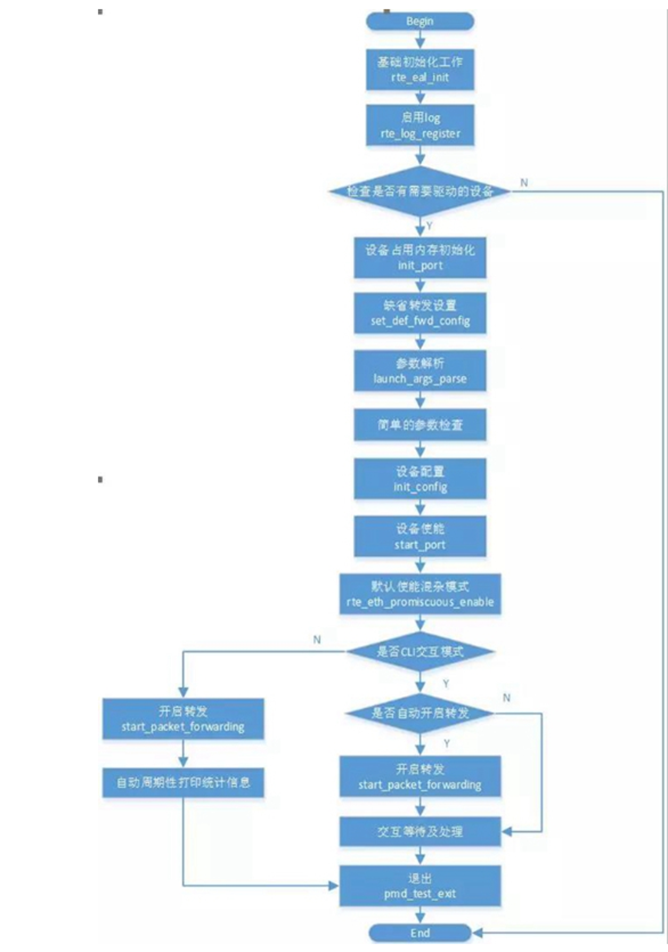
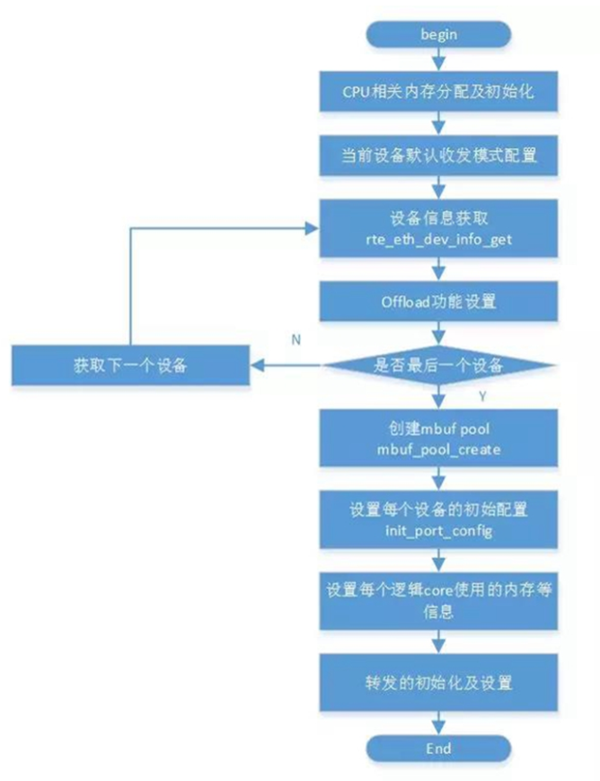
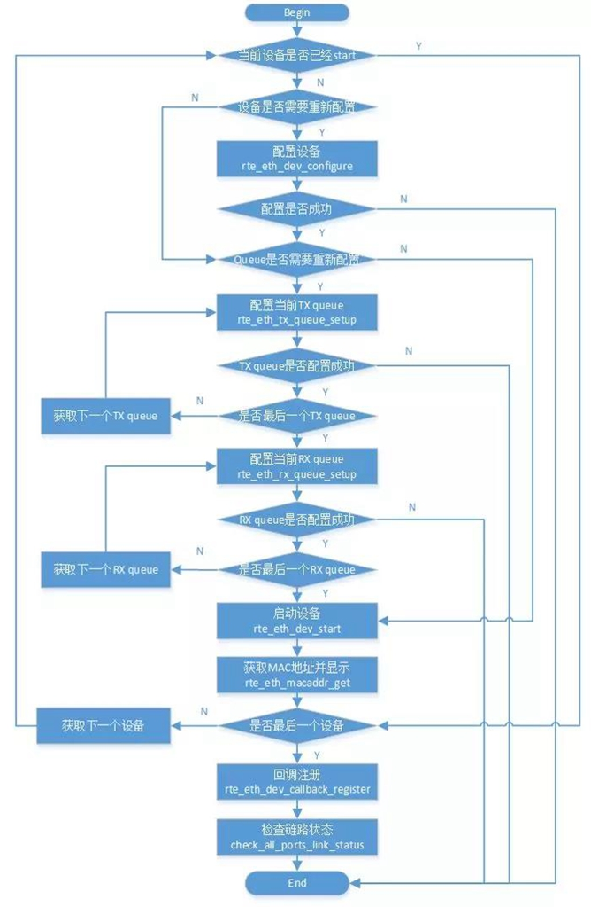
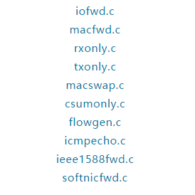
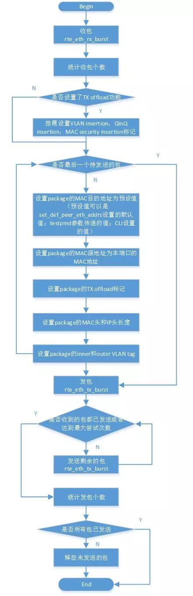

# 简介

## testpmd的基础代码 

包括testpmd的启动运行，参数解析，设备的检测和配置。
```cpp
config.c (这个文件名可能有些误导。实际上，这个文件中包含的是UI相关的配置和显示的代码。)
cmdline.c
bpf_cmd.c
cmdline_flow.c
cmdline_mtr.c
cmdline_tm.c
```
## 转发功能代码

转发模式的设计是一种简化问题的思路。简单的切换转发模式可以规避复杂的难以实现的配置。
```cpp
csumonly.c
flowgen.c
icmpecho.c
ieee1588fwd.c
iofwd.c
macfwd.c
macswap.c
rxonly.c
softnicfwd.c
txonly.c
```
# 基础代码导读

<div align="center">  </div>

## 2.2 rte_eal_init

## 2.3 set_def_fwd_config 转发相关默认配置。

## 2.4 launch_args_parse  参数解析

## 2.5 init_config
在这里实现的几大块功能，包括
* 1、 运行DPDK的逻辑core的配置
* 2、 收发包所需要的mbuf的配置
* 3、 设备的设置。在这里是将配置信息存放在适当的地方，下面进行使能设备的时候才会将其真正的设置到硬件中，使其生效。
* 4、 转发引擎的配置
<div align="center">  </div>

## 2.6 start_port

<div align="center">  </div>

# 用户接口 CLI
CLI都是比较类似的，简单的说，实现的就是解析字符串并将其和某个API关联起来，然后执行API的过程。

## 数据结构介绍
```cpp
cmdline_parse_inst_t cmd_showport = {
               .f =cmd_showport_parsed,
               .data =NULL,
               .help_str= "show|clear port "
                              "info|stats|xstats|fdir|stat_qmap|dcb_tc|cap"
                              "<port_id>",
               .tokens= {
                              (void*)&cmd_showport_show,
                              (void*)&cmd_showport_port,
                              (void*)&cmd_showport_what,
                              (void*)&cmd_showport_portnum,
                              NULL,
               },
};
```
## 解析介绍
上述的变量cmd_showport被放在了数组main_ctx中。当用户输入一串字符后，程序将会遍历main_ctx数组中所有的变量，判断此字符串是否和数组中的某个变量匹配。这部分的工作实际上是由librte_cmdline完成的
* 1.将获取的一串字符分拆成若干子字符串。
* 2.将这些子字符串和main_ctx数组中的变量逐个匹配。
* 3.当发现某个变量可以和输入的字符串匹配时，并不会停止，而是继续匹配剩下的变量。当发现还有另外一个变量可以和输入的字符串匹配时，将会报错——含义模糊的命令。
* 4.匹配工作完成后，如果只有一个变量和输入的字符串匹配，则通过变量的f域执行处理函数。

# 常用转发引擎 
<div align="center">  </div>


默认使用的是iofwd，而macfwd，rxonly和txonly也是经常使用的

## Iofwd

Iofwd是最简单的转发引擎，所实现的功能是讲收到的包原封不动的转发出去
<div align="center">  </div>

## Macfwd

Macfwd比iofwd要复杂一些，主要区别是macfwd在收到包后，会对包进行处理后再转发。由于这些包处理都集中在层二，所以这种转发模式被称为macfwd
* Macfwd的主要处理函数是pkt_burst_mac_forward
   * <div align="center">  </div>

## Rxonly
Rxonly的功能非常简单，仅仅接受包，然后将其释放。其用途也很比较确定，一般用来测试网卡的收包功能是否正常。

其主函数pkt_burst_receive的流程如下：
<div align="center">  </div>

## Txonly

Txonly在发包时，不依赖也不关心网卡收到的包，所发送的包是由软件自己生成的
<div align="center">  </div>

## Macswap

macswap也是对收到的包进行层二的改动。这个改动是和简单的，就是将层二包头里的源mac地址和目的mac地址相互交换

这个简单的改动可以规避网卡某些特性对收发包的限制。例如，如果网卡不支持混杂模式，则包的目的mac地址必须填对

Macswap的主要处理函数是pkt_burst_mac_swap

<div align="center">  </div>