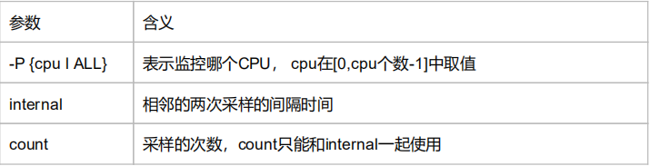

# 1 基础命令工具

##  grep搜索字符
<div align="center">  </div>


递归搜索目录下所有文件, 搜索 msg_server目录下所有文件，打印出包含 login的行。

```bash
grep login ‐r msg_server/
```
反向查找，查找文件中，不包含 hello 的行。

```bash
grep ‐v login ImUser.cpp
```
找出文件中包含 login的行，打印出行号，并显示前后3行，并忽略大小写

```bash
grep ‐C 3 ‐i ‐n login ImUser.cpp
```
## find查找文件

通过文件名查找文件的所在位置，文件名查找支持模糊匹配  
 
**find [指定查找目录] [查找规则] [查找完后执行的action]**


```bash
1 find . ‐name FILE_NAME


##查找/etc/下名称中带有passwd的文件，查找一层 
2 find /etc ‐maxdepth 1 ‐name passwd 
##查找/etc/下名称中带有*.conf的文件，且只查找第二层 
6 find /etc ‐maxdepth 2 ‐mindepth 2 ‐name *.conf 


3 find /mnt ‐size 20K  ##查找/mnt文件大小近似20k的文件 
4 find /mnt ‐size +20K ##查找/mnt文件大小大于20k的文件 
5 find /mnt ‐size ‐20K ##查找/mnt文件大小小于20k的文件 


7 find /mnt ‐type d ##按type查找/mnt中目录 
8 find /mnt ‐type f ##按type查找/mnt中文件 


9  find /mnt ‐cmin 10 ##查找/mnt中十分钟左右修改的 
10 find /mnt ‐cmin +10 ##查找/mnt中十分钟以上修改的 
11 find /mnt ‐cmin ‐10 ##查找/mnt中十分钟以内修改的 
12 find /mnt ‐ctime 10 ##查找/mnt中十天左右修改的 
13 find /mnt ‐ctime +10 ##查找/mnt中十天以上修改的 
14 find /mnt ‐ctime ‐10 ##查找/mnt中十天以内修改的
```


## uptime机器启动时间+负载
查看机器的启动时间、登录用户、平均负载等情况，通常用于在线上应急或者技术攻关中，确定操作系统的重启时间。

```bash
[root@VM_0_3_centos src]# uptime
13:01:52 up 46 days, 22:03, 4 users, load average: 0.13, 0.08, 0.05
```
从上面的输出可以看到如下信息
* 当前时间： 13:01:52 
* 系统已经运行的时间：43天22小时3分钟。
* 前在线用户：4个用户。 
* 系统平均负载:0.13 , 0.08, 0.05，为最近1分钟、5分钟、15分钟的系统负载情况。

系统的平均负载是指在特定的时间间隔内队列中运行的平均进程数。
* 如果一个进程满足以条件，它就会位于运行队列中。
  * 它没有在等待I/O操作的结果。
  * 它没有主动进入等待状态(也就是没有调用’wait'相关的系统API ) 
  * 没有被停止(例如:等待终止)。
* 如果每个CPU内核的当前活动进程数不大于3的话，那么系统的性能是良好的。
* 如果每个CPU内核的任务数大于5，那么这台机器的性能有严重问题。

## ulimit用户资源

显示当前的各种系统对用户使用资源的限制: ulimit -a

设置用户的最大进程数： ulimit -u 1024

设置用户可以打开的最大文件句柄数：ulimit -n 65530

## scp远程拷贝


```bash
1 scp liaoqingfu@122.152.222.180:/home/liaoqingfu/test.txt . //下载文件 
2 scp mi9.aac liaoqingfu@122.152.222.180:/home/liaoqingfu/   //上传文件 
3 scp ‐r liaoqingfu@122.152.222.180:/home/liaoqingfu/ .      //下载目录 
4 scp ‐r test liaoqingfu@122.152.222.180:/home/liaoqingfu/   //上传目录
```

## sed字符替换

命令格式1：**sed   's/原字符串/新字符串/'    文件** 
命令格式2：**sed   's/原字符串/新字符串/g'   文件** 

* 这两种命令格式的区别在于是否有个“g”。
    * 没有“g”表示只替换第一个匹配到的字符串，
    * 有“g”表示替换所有能匹配到的字符串，
    * “g”可以认 为是“global”（全局的）的缩写，没有“全局的”结尾就不要替换全部，


# 2 查看活动进程的命令

## ps进程信息

常用方式：ps ­elf 和ps ­ef
```bash
[root@VM_0_3_centos ~]# ps ‐elf
F S UID        PID  PPID  C PRI  NI ADDR SZ WCHAN  STIME TTY          TIME CMD
4 S root         1     0  0  80   0 ‐ 12938 ep_pol Jul06 ?        00:16:54 /usr/lib/systemd/systemd ‐‐switched‐root ‐
1 S root         2     0  0  80   0 ‐     0 kthrea Jul06 ?        00:00:00 [kthreadd]
1 S root         3     2  0  80   0 ‐     0 smpboo Jul06 ?        00:04:44 [ksoftirqd/0]
```
根据进程的名字或者其他信息，通过grep命令找到目标进程，也可以看到进程启动脚木的全路径。

## top进程cpu内存信息

top命令用于查看活动进程的CPU和内存信息，能够实时显示系统中各个进程的资源占用情况，可以按照CPU、内存的使用情况和执行时间对进程进行排序。

```bash
t：切换报示进程和CPU状态信息。 
n：切换显示内存信息。 
r：重新设置一个进程的优先级。系统提示用户输人需要改变的进程PID及需要设置的进程优先级，然后输入个正数值使优先级降低
k：终止一个进程，系统将提示用户输入需要终止的进程PID o 
s：改变刷新的时间间隔。
u：查看指定用户的进程。 
```
## pidstat进程资源

pidstat用于监控全部或指定的进程占用系统资源的情况，包括CPU、内存、磁盘I/O、程切换、线程数等数据。

```bash
­u：表示查看cpu相关的性能指标 
­w：表示查看上下文切换情况 
­t：查看线程相关的信息，默认是进程的;常与­w结合使用(cpu的上下文切换包括进程的切换、线程的切换、中断的切换) ­
d：展示磁盘 I/O 统计数据 ­
p：指明进程号 
```
**使用范例：pidstat ­urd ­p 进程号**

```bash
[root@VM_0_3_centos ~]# pidstat ‐urd ‐p 24615
Linux 3.10.0‐957.5.1.el7.x86_64 (VM_0_3_centos)     08/22/2019  _x86_64_    (1 CPU)

# 输出CPU的使用信息 ‐u
03:48:12 PM   UID       PID    %usr %system  %guest    %CPU   CPU  Command
03:48:12 PM     0     24615    0.00    0.00    0.00    0.00     0  nginx

# 输出内存的使用信息 ‐r
03:48:12 PM   UID       PID  minflt/s  majflt/s     VSZ    RSS   %MEM  Command 
03:48:12 PM     0     24615      0.00      0.00   58252  24940   1.32  nginx

# 输出磁盘I/O的使用信息 ‐d
03:48:12 PM   UID       PID   kB_rd/s   kB_wr/s kB_ccwr/s  Command 
03:48:12 PM     0     24615      0.07      0.00      0.00  nginx

```

# 3 内存命令


## free内存

用于显示系统内存的使用情况，包括总体内存、己经使用的内存；还可用于显示系统内核使用的缓冲

**持续观察内存的状况，此时可以使用 -s 选项并指定间隔的秒数：**
```bash
[root@VM_0_3_centos ~]# free ‐h ‐s 3              
              total        used        free      shared  buff/cache   available 
Mem:           1.8G        972M         70M        548K        795M        662M 
Swap:          7.8G        462M        7.4G
```

free 与 available
* 在 free 命令的输出中，有一个 free 列，同时还有一个 available 列。这二者到底有何区别？
    * free 是真正尚未被使用的物理内存数量
    * available 就比较有意思了，它是从应用程序的角度看到的可用内存


# 3 CPU使用情况监控命令 

## vmstat 显示统计信息

此命令显示关于内核线程、虚拟内存、磁盘I/O 、陷阱和CPU占用率的统计信息

```bash
[root@VM_0_3_centos ~]# vmstat 
procs ‐‐‐‐‐‐‐‐‐‐‐memory‐‐‐‐‐‐‐‐‐‐ ‐‐‐swap‐‐ ‐‐‐‐‐io‐‐‐‐ ‐system‐‐ ‐‐‐‐‐‐cpu‐‐‐‐‐ 
r  b   swpd   free   buff  cache   si   so    bi    bo   in   cs us sy id wa st  
4  0 473600  77560  60640 749436    0    0    51    56    2    8  2  2 92  4  0
```
```bash
buff：是I/O系统存储的磁盘块文件的元数据的统计信息。
cache：是操作系统用来缓存磁盘数据的缓冲区，操作系统会自动一调节这个参数，在内存紧张时操作系统会减少cache的占用空间来保证其他进程可用。
cs：参数表示线程环境的切换次数，此数据太大时表明线程的同步机制有问题。
si和so较大时，说明系统频繁使用交换区，应该查看操作系统的内存是否够用。
bi和bo代表I/O活动，根据其大小可以知道磁盘I/O的负载情况。
```

## mpstat CPU信息

此命令用于实时监控系统CPU的一些统计信息，这些信息存放在/proc/stat文件中，  
在多核CPU系统里，不但能查看所有CPU的平均使用信息，还能查看某个特定CPU的信息。

**使用方式：mpstat [­P {cpu|ALL}] [internal [count]]**

<div align="center">  </div>


使用mpstat ­P ALL 5 2命令，表示每5秒产生一个报告，总共产生2个


1.vmstat和mpstat 命令的差别：mpstat 可以显示每个处理器的统计，而 vmstat 显示所有处理器的统计。
2.vmstat中所有关于CPU的总结都适合mpstat。当您看到较低的 %idle 数字时，您知道出现了 CPU 不足的问题。当您看到较高的 %iowait 数字 时，您知道在当前负载下 I/O 子系统出现了某些问题。


# 4 监控磁盘I/O的命令

## iostat IO状态

该命令用于监控CPU占用率、平均负载值及I/O读写速度等。

常用用法

cpu的统计信息，如果是多cpu系统，显示的所有cpu的平均统计信息。
```bash
1 # kb/s显示磁盘信息，每2s刷新一次 
2 iostat ‐d ‐k 2 
3 # kb/s显示磁盘统计信息及扩展信息，每1s刷新 ，刷新10次结束 
4 iostat ‐dkx 1 10
```

```bash
%user：用户进程消耗cpu的比例 
%nice：用户进程优先级调整消耗的cpu比例 
%sys：系统内核消耗的cpu比例 
%iowait：等待磁盘io所消耗的cpu比例 
%idle：闲置cpu的比例（不包括等待磁盘I/O)
```

磁盘的统计参数
```bash
tps：该设备每秒的传输次数
kB_read/s：每秒从设备（drive expressed）读取的数据量；
kB_wrtn/s：每秒向设备（drive expressed）写入的数据量；
kB_read：读取的总数据量；
kB_wrtn：写入的总数量数据量；这些单位都为Kilobytes。
```

## swapon查看分区使用情况

查看交互分区的使用情况 
**使用方法：swapon ­s**

## df硬盘使用情况

该命令用于查看文件系统的硬盘挂载点和空间使用情况。
**使用方式：df ­h**

## du目录文件大小

du ­a 显示目录和目录下子目录和文件占用磁盘空间的大小。直接使用­a 以字节为单位，­ha 如下图以M或K为结果显示。 
du ­s 显示当前所在目录大小 du ­s ­h home 显示home目录大小 
du ­c 显示几个目录或文件占用的磁盘空间大小，还要统计它们的总和 
du ­lh ­­max­depth=1 : 查看当前目录下一级子文件和子目录占用的磁盘容量

# 5 查看网络信息和网络监控的命令

## 5.1 ifconfig查看和设置网络设备

该命令用于查看机器挂载的网卡情况。
```bash
add<地址> 设置网络设备IPv6的IP地址。 
del<地址> 删除网络设备IPv6的IP地址。 

up 启动指定的网络设备。 
down 关闭指定的网络设备。 

<hw<网络设备类型><硬件地址> 设置网络设备的类型与硬件地址。 
io_addr<I/O地址> 设置网络设备的I/O地址。
irq<IRQ地址> 设置网络设备的IRQ。 
media<网络媒介类型> 设置网络设备的媒介类型。 
mem_start<内存地址> 设置网络设备在主内存所占用的起始地址。 
metric<数目> 指定在计算数据包的转送次数时，所要加上的数目。 

mtu<字节> 设置网络设备的MTU。 
netmask<子网掩码> 设置网络设备的子网掩码。 
tunnel<地址> 建立IPv4与IPv6之间的隧道通信地址。

­broadcast<地址> 将要送往指定地址的数据包当成广播数据包来处理。 
­pointopoint<地址> 与指定地址的网络设备建立直接连线，此模式具有保密功能。 
­promisc 关闭或启动指定网络设备的promiscuous模式。 

[IP地址] 指定网络设备的IP地址。 
[网络设备] 指定网络设备的名称。
```

启动关闭指定网卡
```bash
1 # ifconfig eth0 down 
2 # ifconfig eth0 up
```

配置IP地址
```bash
1 # ifconfig eth0 192.168.1.56 
2 //给eth0网卡配置IP地址 

3 # ifconfig eth0 192.168.1.56 netmask 255.255.255.0 
4 // 给eth0网卡配置IP地址,并加上子掩码 

5 # ifconfig eth0 192.168.1.56 netmask 255.255.255.0 broadcast 192.168.1.255
6 // 给eth0网卡配置IP地址,加上子掩码,加上个广播地址
```

## ping 检测网络故障

ping命令是用于检测网络故障的常用命令，可以用来钡J试一台主机到另外一台主机的网络是否连通

```bash
ping [‐dfnqrRv][‐c<完成次数>][‐i<间隔秒数>][‐I<网络界面>][‐l<前置载入>][‐p<范本样式>][‐s<数据包大小>][‐t<存活数值>][主机名称或IP 地址]


­-d 使用Socket的SO_DEBUG功能。 
-c<完成次数> 设置完成要求回应的次数。 
-f 极限检测。 
-i<间隔秒数> 指定收发信息的间隔时间。 
-I<网络界面> 使用指定的网络接口送出数据包。 
-l<前置载入> 设置在送出要求信息之前，先行发出的数据包。 
-n 只输出数值。 
-p<范本样式> 设置填满数据包的范本样式。 
-q 不显示指令执行过程，开头和结尾的相关信息除外。 
-r 忽略普通的Routing Table，直接将数据包送到远端主机上。
-R 记录路由过程。 -s<数据包大小> 设置数据包的大小。 
-t<存活数值> 设置存活数值TTL的大小。 
-v 详细显示指令的执行过程
```

TTL：每经过一个‘路由点‘，就把预先设定的这个TTL数值减1，直到最后TTL=1时报文就被扔掉，不向下转发。ping显示的TTL是指：被ping主机那里 返回的报文，到了你这里，从它自己预设的TTL减小到还剩下多少

## telnet 远程登录服务

telnet是TCP/IP协议族的一员，是网络远程登录服务的标准协议，帮助用户在本地计算机上连接远程主机。 
使用方式：telnet IP PO

* 和ssh的区别
    * 端口区别：telnet是23 ssh是22 
    * 本质：telnet是明码传输，ssh是加密传输

## nc 瑞士军刀

nc是NetCat的简称，在网络调试工具中享有“瑞士军刀”的美誉，此命令功能丰富、短小精悍、简单实用，被设计成一款易用的网络工具，


参数
* -l 用于指定nc将处于侦听模式。指定该参数，则意味着nc被当作server，侦听并接受连接，而非向其它地址发起连接。 
* -p 暂未用到（老版本的nc可能需要在端口号前加-p参数，下面测试环境是centos6.6，nc版本是nc-1.84，未用到-p参数） 
* -s 指定发送数据的源IP地址，适用于多网卡机 
* -u 指定nc使用UDP协议，默认为TCP 
* -v 输出交互或出错信息，新手调试时尤为有用 
* -w 超时秒数，后面跟数字


```bash
nc ‐l 9999                         # 开启一个本地9999的TCP协议端口，由客户端主动发起连接，一旦连接必须由服务端发起关闭
nc ‐vw 2 129.204.197.215 11111     # 通过nc去访问129.204.197.215主机的11111端口，确认是否存活；可不加参数nc ‐ul 9999                        # 开启一个本地9999的UDP协议端口，客户端不需要由服务端主动发起关闭
nc 129.204.197.215 9999 < test     # 通过129.204.197.215的9999TCP端口发送数据文件
nc ‐l 9999 > zabbix.file           # 开启一个本地9999的TCP端口，用来接收文件内容


# 测试网速A机器操作如下：
nc ‐l 9999 > /dev/null

# B机器开启数据传输
nc 129.204.197.215 9999 </dev/zero

# A机器进行网络监控
sar ‐n DEV 2 100000

```

## nslookup 检测DNS服务器能否正确解析 

这是一款检测网络中DNS服务器能否正确解析域名的工具命令，并且可以输出。 
**使用方式: nslookup sina.com**

## sar 多功能的监控工具

sar是一个多功能的监控工具，使用简单，不需要管理员权限，可以输出每秒的网卡存取速度，适合线上排查问题时使用。

使用方式： sar ­n DEV 1 1

此命令除了可以用于查看网卡的信息，还可以用来收集如下服务的状态信息。 
* ­A：所有报告的总和。 ­
* u：CPU利用率。 
* ­v：进程、I节点、文件和锁表状态。 ­
* d：硬盘的使用报告。 
* ­r：没有使用的内存页面和硬盘快。 
* ­g：串口I/O的情况。 
* ­b：缓冲区的使用情况。 
* ­a：文件的读写情况。 ­
* c：系统的调用情况。 
* ­R：进程的活动情况。 
* ­y：终端设备的活动情况。 
* ­w：系统的交换活动。

## netstat 显示网络连接、端口信息等

此命令显示网络连接、端口信息等，另外一个命令ss与netstat命令类似，

**根据进程查找端口**

（1）根据进程名查找进程ID
  ps ­elf | grep 进程

（2）根据进程ID查找进程开启的端口
  netstat ­nap | grep 2461

**根据端口查找进程**
（1）根据使用端口的进程号
  netstat ­nap | grep 8080
（2）根据进程ID查找进程的详细信息
  ps ‐elf | grep 25901

## tcpdump 网络状况分析和跟踪工具

  tcpdump是网络状况分析和跟踪工具，是可以用来抓包的实用命令，使用前需要对TCP/IP有所熟悉，因为过滤使用的信息都是TCP/IP格式。 
  
  显示来源IP或者目的IP为192.168.1.102的网络通信：
  sudo tcpdump ­i eth0 host 192.168.1.102

  显示去往102.168.1.102的所有ftp会话信息： 
  tcpdump ­i eth1 'dst 192.168.1.102 and (port 21 or 20)' 
  
  显示去往102.168.1.102的所有HTTP会话信息： 
  tcpdump ­ni eth0 'dst 192.168.1.102 and tcp and port 8080'


## ethtool

查看网卡：ethtool ens33 # PS在云主机检测不到网卡信息

```bash

1 (1)查看网卡的接口信息
2 ethtool eth1 #查看网络接口eth1的信息 
3 (2)关闭网卡eth1的自动协商 
4 ethtool ‐s eth1 autoneg off 
5 (3)修改网卡速率为 100Mb/s 
6 ethtool ‐s eth4 speed 100 

7 (4)查看网卡驱动信息 
8 ethtool ‐i eth0 
9 (5)查看网卡的一些工作统计信息 
10 ethtool –S eth0 

11 (6)停止和查看网卡的发送模块TX的状态 
12 ethtool ‐A tx off eth0 #修改tx的状态 
13 ethtool ‐a eth0 #查看tx的状态 

14 (7)关闭网卡对收到的数据包的校验功能 
15 ethtool ‐K rx off eth0 #关闭校验 
16 ethtool –k eth0 #查看校验启动状态

```

# 6 日志监控工具 

## tail 

在实时日志上打印颜色，给每个状态给上不同的颜色，INF绿色、WARN黄色、ERROR红色
```bash
tail ‐f /data/rtc/room_server/log/roll.log | perl ‐pe 
's/(INF)/\e[0;32m$1\e[0m/g,s/(WARN)/\e[0;33m$1\e[0m/g,s/(ERROR)/\e[1;31m$1\e[0m/g'
```

## multitail

可同时开启多视窗看log，适合用在看部署在很多机器上的项目的log ­cS [color_scheme] :
可以选择输出的log的颜色，推荐使用goldengate，也可自 定义(修改/etc/multitail.conf)

同时监控两个文件

* multitail /var/log/apache2/error.log /var/log/apache2/error.log.1

分成两列监控两个文件

*  multitail ‐s 2 /var/log/mysqld.log /var/log/xferlog

分成两列监控，第一列3个，第二列2个
* multitail ‐s 2 ‐sn 3,2 /var/log/mysqld.log /var/log/xferlog /var/log/yum.log /var/log/ajenti.log /var/log/xferlog

合并两个文件
* multitail /var/log/mysqld.log ‐I /var/log/xferlog

合并两个文件并且区分颜色  
*  multitail ‐ci green /var/log/yum.log ‐ci yellow ‐I /var/log/mysqld.log