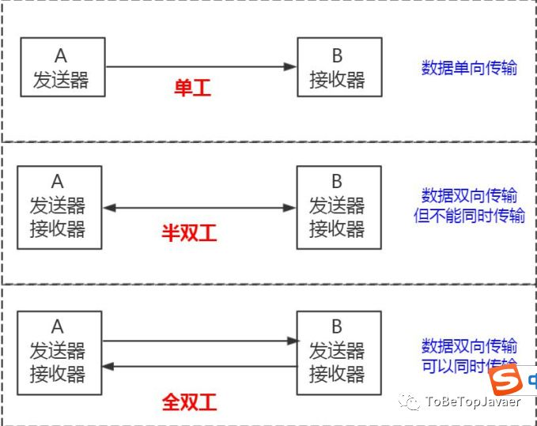

# 一 MySQL安装

ubuntu MySQL安装 
```bash
sudo apt-get install mysql-server 
apt-get install mysql-client
sudo apt-get install libmysqlclient-dev 
```
启动，停止，重启 
```bash
sudo /etc/init.d/mysql start|stop|restart
```

客户端连接 
```bash
mysql -h127.0.0.1 -uroot -p
```

# 二 MySQL SQL执行过程


查询缓存在mysql8.0已经去掉了

<div align="center">  </div>

* 大体来说，MySQL 可以分为 Server 层和存储引擎层两部分。
  * Server 层包括连接器、查询缓存、分析器、优化器、执行器等，涵盖 MySQL 的大多数核心服务功能，以及所有的内置函数（如日期、时间、数学和加密函数等），所有跨存储引擎的功能都在这一层实现，比如存储过程、触发器、视图等。
  * 存储引擎层负责数据的存储和提取。其架构模式是插件式的，支持 InnoDB、MyISAM、Memory 等多个存储引擎。现在最常用的存储引擎是 InnoDB

## 跟数据库如何建立连接 ？
首先，MySQL 必须要运行一个服务，监听默认的 3306 端口
 * MySQL 是支持多种通信协议的，可以使用同步/异步的方式，支持长连接/短连接

通信类型：同步或者异步
```bash
同步通信的特点：
     1、同步通信依赖于被调用方，受限于被调用方的性能。
        也就是说，应用操作数据库，线程会阻塞，等待数据库的返回。
     2、一般只能做到一对一，很难做到一对多的通信。

异步跟同步相反：
     1、异步可以避免应用阻塞等待，但是不能节省 SQL 执行的时间
     2、如果异步存在并发，每一个 SQL 的执行都要单独建立一个连接，避免数据混乱。但是这样会给服务端带来巨大的压力

如果要异步，必须使用连接池，排队从连接池获取连接而不是创建新连接     

```
连接方式：长连接或者短连接

```bash
一般我们会在连接池中使用长连接。
保持长连接会消耗内存。长时间不活动的连接，MySQL 服务器会断开
```
通信协议
```bash
第一种是 Unix Socket。

如果指定-h 参数，就会用第二种方式，TCP/IP 协议。

```
通信方式

```bash
要么是客户端向服务端发送数据，要么是服务端向客户端发送数据，
这两个动作不能同时发生。

所以客户端发送 SQL 语句给服务端的时候，（在一次连接里面）数据是不能分成小块发送的，
不管你的 SQL 语句有多大，都是一次性发送。

另一方面，对于服务端来说，也是一次性发送所有的数据，
不能因为你已经取到了想要的数据就中断操作，这个时候会对网络和内存产生大量消耗。
```

* <div align="center">  </div>


## 一条SQL查询语句是如何执行的？

```sql
SELECT * FROM t WHERE id=1
```

连接器


```bash
检查用户名密码和权限
  建立连接的过程通常是比较复杂的，所以要尽量使用长连接。
  但是使用长连接后，MySQL 占用内存涨得特别快

解决方案:
  1 定期断开长连接  
  2 如果用的是5.7以后，可以在每次执行一个比较大的操作后，
    通过执行 mysql_reset_connection 来重新初始化连接资源。
    这个过程不需要重连和重新做权限验证，但是会将连接恢复到刚刚创建完时的状态。
```
查询缓存
```bash
  因为只要表记录有更新或者表结构有改动都会导致整个表的所有缓存失效。 
  MySQL 8.0 版本后删除了缓存的功能，
```
分析器
```bash
词法分析阶段
    SELECT识别为查询操作，t识别为表名，id识别为字段名

语法分析阶段
    把词法分析出来的关键词组装成语法树，
    这时分析器就理解这条SQL是要干什么了：查询表t里面id等于1的记录。    

```
优化器 
```bash 
优化器是在表里面有多个索引的时候，决定使用哪个索引
```
执行器
```bash
MySQL通过分析器知道了要做什么，通过优化器知道了该怎么做，具体做什么就交给执行器去做了
```

## 一条SQL更新语句是如何执行的？
```sql
UPDATE t SET c=c+1 WHERE id=2
```
流程基本跟查询一样，不过会多两个日志文件：redo log和binlog

binlog
```bash
binlog是重要的归档日志

  在数据库发生误删除需要恢复的时候，
      一般是通过最近的一次全量备份加上这个全量备份时间点后面的binglog来恢复。

  在数据库需要扩容，
       做主从复制的时候，主库的dump线程会把binlog推送给从库，从而实现复制。

```
redo log

```bash
redo log是InnoDB引擎特有的，它可以保证即使数据库发生异常重启，
之前提交的记录都不会丢失，这个能力称为crash-safe


如果有人要赊账或者还账的话，掌柜一般有两种做法：
  一种做法是直接把账本翻出来，把这次赊的账加上去或者扣除掉；
  另一种做法是先在粉板上记下这次的账，等打烊以后再把账本翻出来核算

与此类似，InnoDB 的 redo log 是固定大小的，
比如可以配置为一组 4 个文件，每个文件的大小是 1GB，那么这块“粉板”总共就可以记录 4GB 的操作。


```
下面是这个 update 语句的执行流程图，图中浅色框表示是在 InnoDB 内部执行的，深色框表示是在执行器中执行的。

<div align="center">  </div>

# MySQL基本操作


