# 平衡二叉搜索树（AVL）

1、退化成链表的二叉搜索树： 删除节点时，可能会导致二叉搜索树退化成链表 

* 如何防止二叉搜素树退化成链表？让添加，删除，搜索的复杂度维持在O(logn)。

2、如何改进二叉搜索树？  

* 节点的添加，删除顺序是无法限制的，也就是随机的。
* 那么改进方案是：在节点的添加，删除操作之后，想办法让二叉搜索树恢复平衡（减小树的高度）。

合适的方案是：用尽量少的调整次数达到适度平衡。

3、什么是平衡因子：某节点的左右子树的高度差 

AVL树的特点：
* 每个节点的平衡因子只可能是1，0，-1。即绝对值<=1，如果超过1，称之为失衡。
* 每个节点的左右子树高度差不超过1。
* 搜索，添加，删除的时间复杂度是O(logn)  

AVL树和红黑树，都是在二叉搜索树的基础上，增加了自平衡的功能。 

## 一，失衡的几种情况 

n代表node，p代表parent，g代表grandparent

### 1.1，**添加失衡 LL - 右旋传（单旋）**   

LL表示失衡节点与添加节点的关系，添加节点在失衡节点的左边的左边 

  

因为是g左边的左边的节点使它失去平衡，所以这种情况称之为LL。
LL的情况，一般需要右旋转

  

思路：
   - g.left = p.right
   - p.right = g
   - 让p成为这颗子树的根节点。
   - 改变之后整棵树仍然是一颗二叉搜索树：T0 < n < T1 < p < T2 < g < T3。
   - 整棵树都达到平衡。

还需要注意维护：
   - T2，p，g的parent属性。
   -  先后更新g，p的高度属性。

### 1.2，**添加失衡 RR - 左旋转（单旋）**

RR表示失衡节点与添加节点的关系，添加节点在失衡节点的右边的右边。

 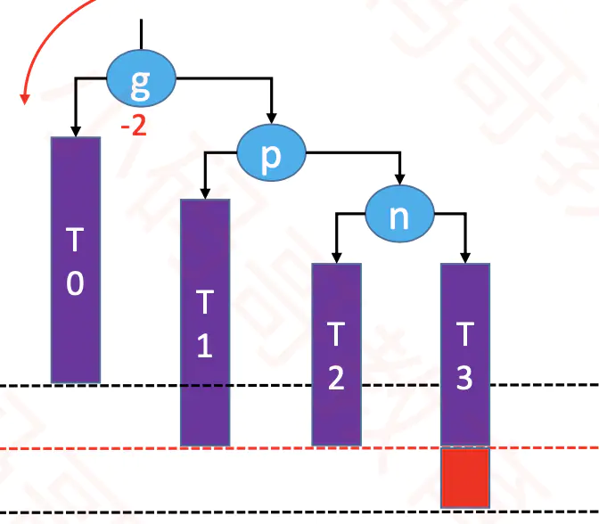 

那么我们需要左旋转，使树达到平衡。

  

### 1.3，**添加失衡 LR - RR左旋转，LL右旋转（双旋）** 

p是g的left节点，n是p的right节点，此时往n添加节点，这种情况称为LR。
LR表示失衡节点与添加节点的关系，添加节点在失衡节点的左右。 

 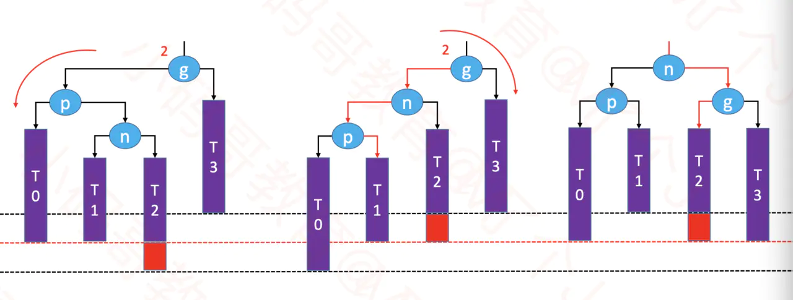 
 

如果是LR，首先要进行一次`左旋转`，将二叉树变为LL。然后再进行一次`右旋转`，即可使树达到平衡。 

## 1.4，**添加失衡 RL - LL右旋转，RR左旋转（双旋）**
首先进行`右旋转`，使树变成RR，然后再进行`左旋转`，即可达到平衡。
RL表示失衡节点与添加节点的关系，添加节点在失衡节点的右边的左边

  
 

## 1.5，**删除失衡 LL - 右旋传（单旋）**

删除节点`可能会导致父节点或祖先节点失衡（只有一个节点会失衡）`，其他节点都不可能失衡。

删除红色节点，g的平衡因子变为2，需要对g进行右旋转。

 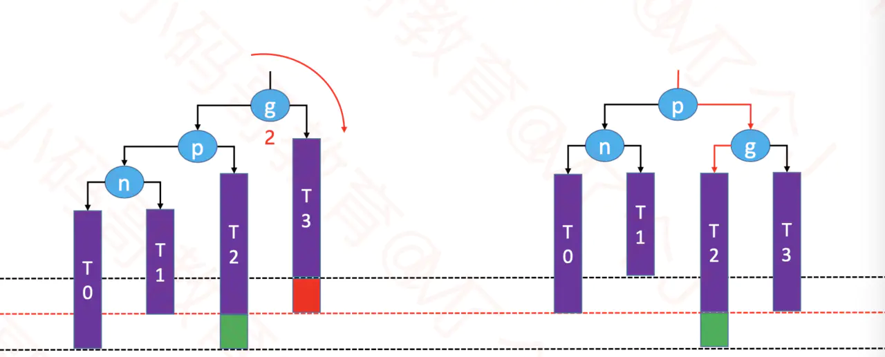 
  

* 旋转后，整棵树是否平衡，取决于旋转后子树的高度是否发生变化。其实就取决于绿色节点是否存在。 
* 如果绿色节点不存在，那么在右旋转后，子树的高度减少1，可能会导致更高层的祖父节点失衡。

 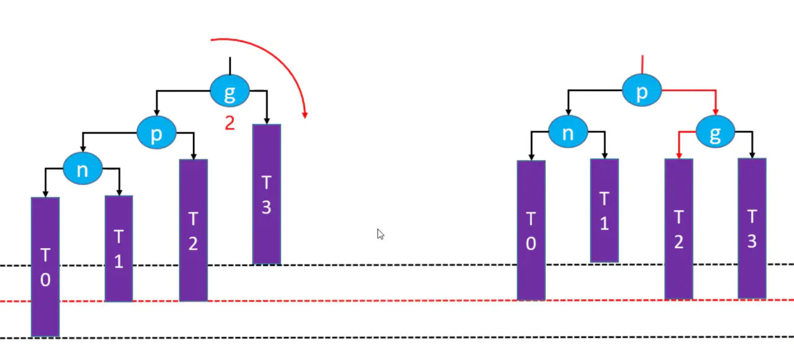 
  

* 更高层的祖先节点失衡，则需要再次恢复平衡，然后又可能导致更高层的祖先节点失衡...
* 极端情况下，所有祖先节点都需要进行恢复平衡的操作，共O(logn)次调整。 

---

# B树 

## 一、B树性质 
B树是一种平衡的多路搜索树，多用于文件系统，数据库的实现。 
B树特点 
* 一个节点可以存储超过2个元素，可以拥有超过2个子节点。
* 拥有二叉树的一些性质。
* 平衡，每个节点的所有子树高度一致。
* 比较矮。
  
m阶B树的性质（m >= 2）---所谓m阶B树，就是m路平衡搜索树

- **每个结点最多有m-1个关键字。** 
- **非根结点至少有Math.ceil(m/2)-1个关键字。**
    - 每个结点中的关键字都按照从小到大的顺序排列
    - 所有叶子结点都位于同一层

       * 
  

 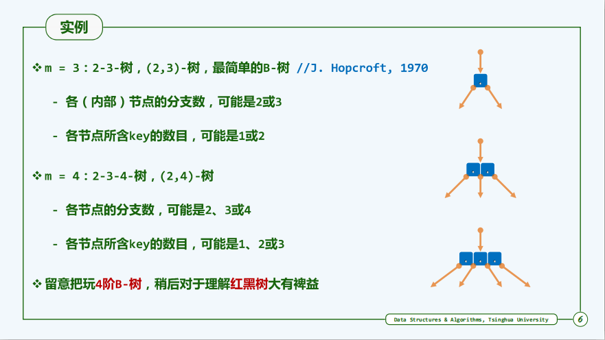 

B树 和  二叉搜索树

 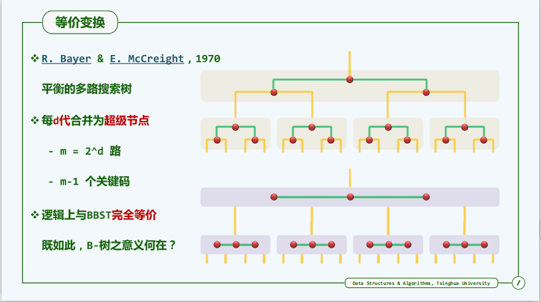 
 

## 二、B树的操作 

### 1、搜索

  
 

### 2、插入 - 上溢与分裂

插入的时候，我们需要记住一个规则：
* **`判断当前结点key的个数是否小于等于m-1，如果满足，直接插入即可， 如果不满足，将节点的中间的key将这个节点分为左右两部分，中间的节点放到父节点中即可。`**

### 3、删除 - 下溢与合并

**步骤**

* 1）
   * 如果当前需要删除的key位于非叶子结点上，则用后继key（这里的后继key均指后继记录的意思）覆盖要删除的key，然后在后继key所在的子支中删除该后继key。
    - 此时后继key一定位于叶子结点上，这个过程和二叉搜索树删除结点的方式类似。删除这个记录后执行第2步 
* 2）
   * 该结点key个数大于等于Math.ceil(m/2)-1，结束删除操作，否则执行第3步。
* 3）
   *  如果兄弟结点key个数大于Math.ceil(m/2)-1，则父结点中的key下移到该结点，兄弟结点中的一个key上移，删除操作结束。 
   -  否则，将父结点中的key下移与当前结点及它的兄弟结点中的key合并，形成一个新的结点。
   -  原父结点中的key的两个孩子指针就变成了一个孩子指针，指向这个新结点。然后当前结点的指针指向父结点，重复上第2步。
   - 有些结点它可能即有左兄弟，又有右兄弟，那么我们任意选择一个兄弟结点进行操作即可。

**实例**

现在有一个初始状态是下面这样的B树，然后进行删除操作。

  
  

删除15，这种情况是删除叶子节点的元素，如果删除之后，节点数还是大于m/2，这种情况只要直接删除即可。

  
  

  

接着，我们把22删除，这种情况的规则：**22是非叶子节点，对于非叶子节点的删除，我们需要用后继key（元素）覆盖要删除的key，然后在后继key所在的子支中删除该后继key**，对于删除22，需要将后继元素24移到被删除的22所在的节点。

 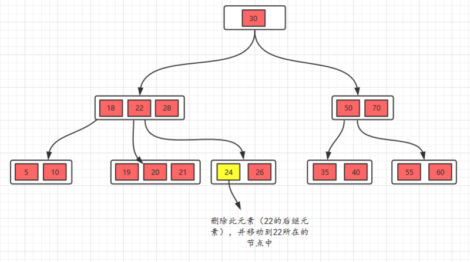 

  

此时发现26所在的节点只有一个元素，小于2个（m/2），这个节点不符合要求，这时候的规则（向兄弟节点借元素）
* 如果删除叶子节点，如果删除元素后元素个数少于（m/2），并且它的兄弟节点的元素大于（m/2），也就是说兄弟节点的元素比最少值m/2还多，将先将父节点的元素移到该节点，然后将兄弟节点的元素再移动到父节点。

  

  

接着删除28，删除叶子节点，删除后不满足要求，所以，我们需要考虑向兄弟节点借元素，但是，兄弟节点也没有多的节点（2个），借不了，怎么办呢？
* 如果遇到这种情况，首先，还是将先将父节点的元素移到该节点，然后，将当前节点及它的兄弟节点中的key合并，形成一个新的节点。

  

移动之后，跟兄弟节点合并

  

# B+树

## 1，特点

B+树其实和B树是非常相似的，我们首先看看相同点。
* 根节点至少一个元素
* 非根节点元素范围：m/2 <= k <= m-1
  
除此之外B+树还有以下的要求

* B+树内部结点只用于索引，所有数据都保存在叶子结点中。
* 阶数m同时限制了叶子结点最多存储m-1个记录。 
* 叶子结点中的记录也按照key的大小排列。
* 每个叶子结点都存有相邻叶子结点的指针，叶子结点本身依关键字的大小自小而大顺序链接。

  

## 2，插入 - 上溢与分裂

只需要记住一个技巧即可：
* 当节点元素数量大于m-1的时候，按中间元素分裂成左右两部分，中间元素分裂到父节点当做索引存储，但是，本身中间元素还是分裂右边这一部分的。

**实例**：5阶B+树的节点最少2个元素，最多4个元素。
插入5，10，15，20

  

插入25，此时元素数量大于4个了，分裂

 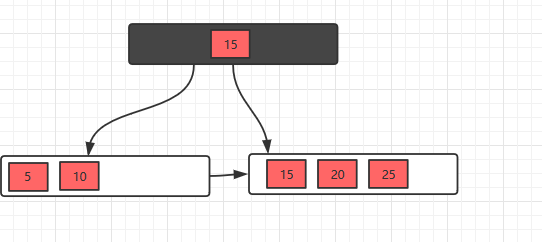 

## 3，删除 -下溢与合并

因为叶子节点有指针的存在，向兄弟节点借元素时，不需要通过父节点了，而是可以直接通过兄弟节移动即可（前提是兄弟节点的元素大于m/2），然后更新父节点的索引；
如果兄弟节点的元素不大于m/2（兄弟节点也没有多余的元素），则将当前节点和兄弟节点合并，并且删除父节点中的key，

**实例**

初始状态

 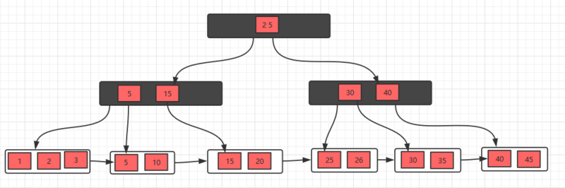 

删除10，删除后，不满足要求，发现左边兄弟节点有多余的元素，所以去借元素，最后，修改父节点索引

  

删除元素5，发现不满足要求，并且发现左右兄弟节点都没有多余的元素，所以，可以选择和兄弟节点合并，最后修改父节点索引

  

发现父节点索引也不满足条件，所以，需要做跟上面一步一样的操作

 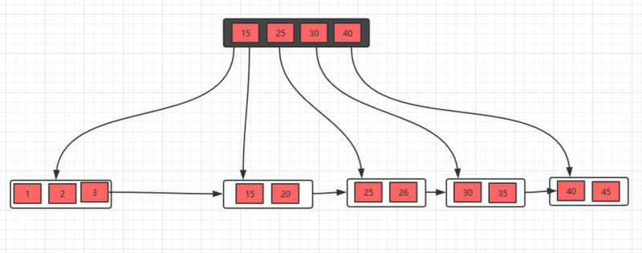 

## 总结
B+树相对于B树有一些自己的优势，可以归结为下面几点。
* 单一节点存储的元素更多，使得查询的IO次数更少
* 所有的查询都要查找到叶子节点，查询性能是稳定的
* 所有的叶子节点形成了一个有序链表，更加便于查找。

---

# 红黑树

## 性质

  

 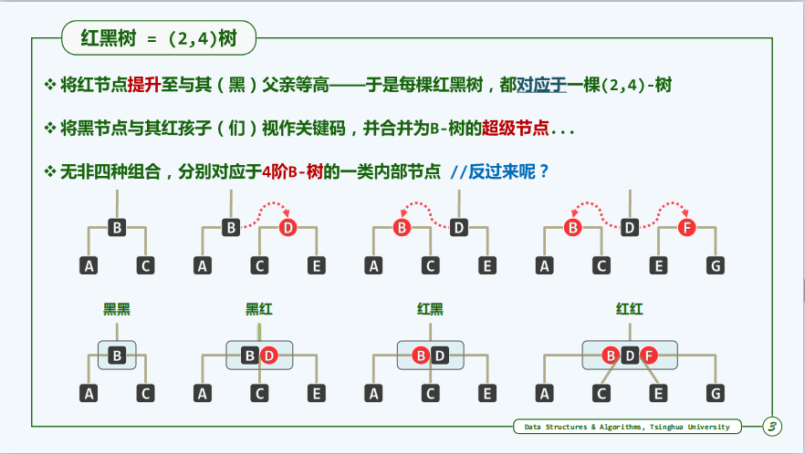 

## 插入

## 删除