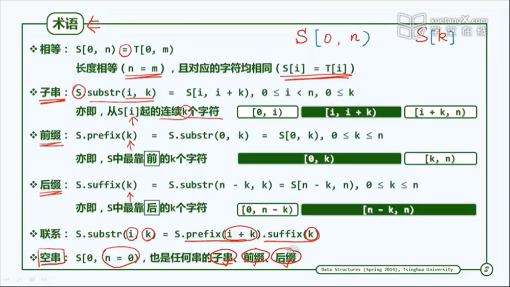
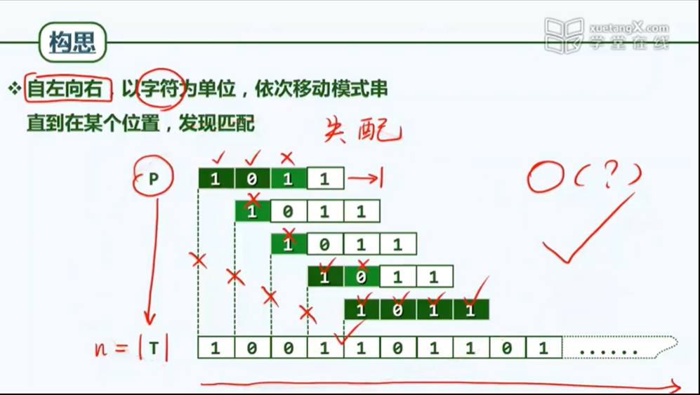
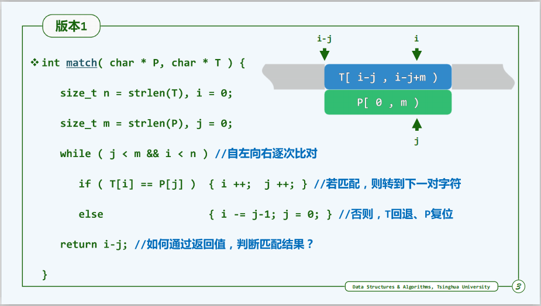
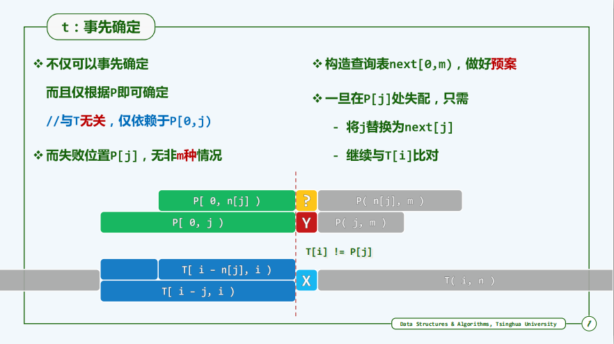
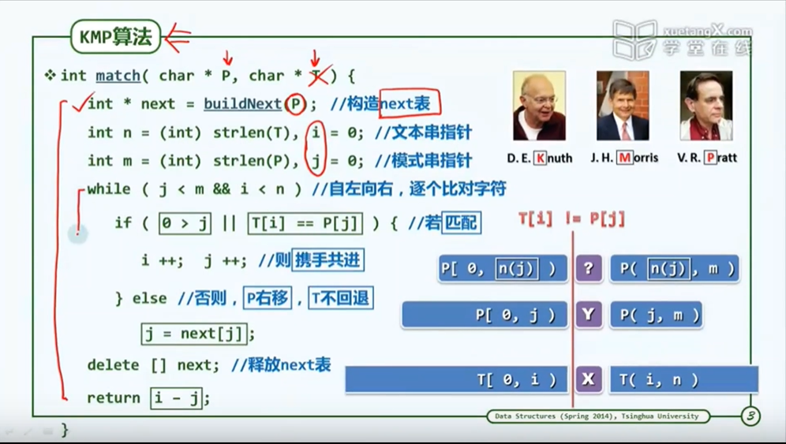

术语

  

# 蛮力匹配
构思

  

实现  
理解i-j: 回到初始匹配位置 +1 从文本串下一个字符重新开始 

  

# KMP算法

## 从记忆力到预知力:

之易者不占，善易者不卜 

蛮力 为何低效？ 

* T(文本串)回退   P(模式串)复位之后, 此前对比过的字符串，将`再次`参与比对 

###  **不变性:  道定前，则不困**  

  

不变性： **`在T[i]和P[j]进行比较时，T(文本串)的子串【T[i-j,i)]】和P(模式串)的前缀【P[0,j)】完全相等`**   

* 这意味着我们已经完全掌握了这个子串的全部信息 

    * （蛮力算法并不知道这一点： 他还会中规中矩的将模式串右移一个字符，然后试图重新和新的文本串子串进行匹配）

    * 这意味着在当前情况下 这个子串和这个模式串的当前比对 都会成功，尽管他们的第一次比对有必要，但像蛮力算法那样在此后还反复将他们比对，就显然是没有必要的 

事实上，只要我们的记忆力足够强，就能将上一轮的比对信息存储起来  并为后续的比对所利用  

### **将 记忆力 转化为 预知力**  

  

依然回到我们这个实例  根据分析 在当前比对 失败与这个模式串的末位字符后，即便我们依然只能向后移动一个字符 但相对于新的P[j]而言 整个前缀都无需重复比对了，也就是说我们只需从上一次失败的位置出发，继续进行下一轮的比对，从哪里跌倒，就从哪里爬起来  

只要我们能够对这类信息充分加以利用，就可以获得两个方面的优化效果： 
* 一方面 我们可以大幅滑动模式串  另一方面 我们也可以避免大量的重复比对 

为了同时兑现这两个方面的优化  我们的算法实际上只需有某一种预知力即可 
* **具体来说 就是 我们在每一次失败之后，我们应该将模式串中哪一个字符与文本串中哪一个失败的字符彼此重新对齐，并继续从这个位置开始 重新比对？** 

方法？ 成本？ 预处理？  好消息是 所有这些都是可能的

## next表

### 制表备查

**本质上讲，他就是构造了一张查询表**  

回到我们刚才的问题，在当前这轮比对，首次失败于T[i]和P[j]之后  我们应当如何向后滑动模式串 从而等效地以一个新的P[j]来与刚才的T[i]对齐 并从这个位置开始 继续新一轮的比对?  
 
这里的好消息的是 新的P[j]不仅可以事先确定，而且这个位置取决于仅模式串，而与主串无关

为什么？
* 事实上 ，在这样一个时刻 主串无非4个部分  
    * 文本串的这个前缀以及后缀  当前这一轮已经匹配的这个子串  以及失配的这个字符  

    * 不难看出 这个前缀与后缀 ，对于新的这个P[j]字符的确没有任何影响

    * 这个匹配的子串 表面看对它有所影响  但它与模式串的前缀是匹配的 所以与其说这个影响来自与文本串，不如说最终来自于模式串 

    * 既然下一个接替的字符完全取决于模式串自身，由此出发，再进一步的 与其说 这个接替的字符是取决于模式串，不如说 他取决于被它顶替的此前的那个P[j]  

    * 事实上 在一个长度为m的模式串中，这样的字符P[j]无非m种情况  

    * 而kmp算法在此处的关键诀窍在于，将所有这m种情况事先处理，并且归纳整理为一张查询表

  

### **`主算法`**

  

## 理解next表

### 快速移动

kmp能够做到快速右移 也就是说 kmp能够很聪明的对齐位置，这些对齐位置之所以能够排除掉，是因为kmp发现他们不具备必要条件，这种必要条件就具体体现为模式串自身的某种匹配特性

在T[i]和P[j]之间发现一次失配，接下来kmp会去查询next表,取出对应的表项t 并用P[t]来取代此前的P[j],使之继续与之前的T[i]相对齐，并从这个位置出发，进行后续的比对 

KMP在这种场合 为何选择这样一个特定的t ？
我们来考察t所对应的这个前缀，在kmp算法中 这个前缀不再回重复接受比对 

我们能看到 之所以能够这样 是因为kmp这个前缀必然会与主串中对应的这个子串完全匹配

### 避免回溯

### 通配哨兵

## 构建next表
0