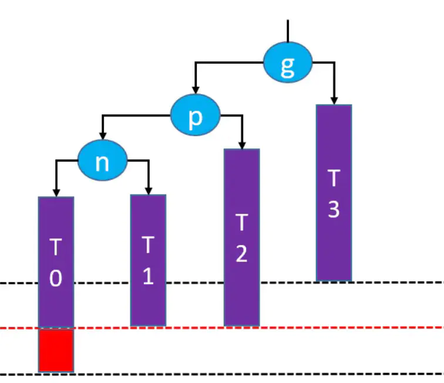
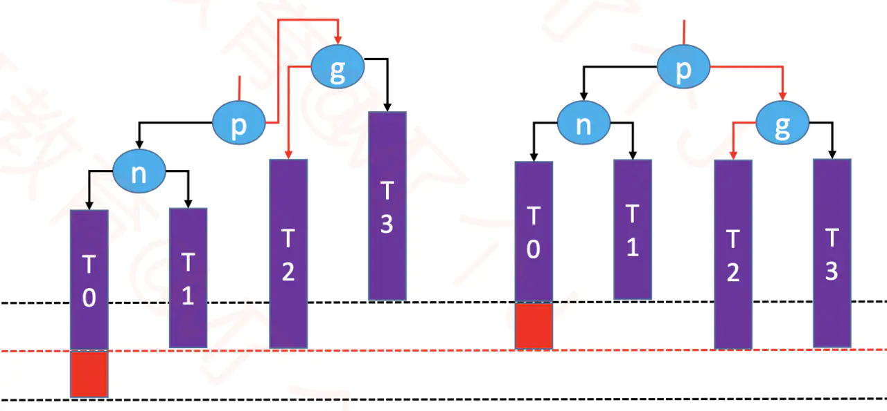

# 平衡二叉搜索树（AVL）

1、退化成链表的二叉搜索树： 删除节点时，可能会导致二叉搜索树退化成链表 

* 如何防止二叉搜素树退化成链表？让添加，删除，搜索的复杂度维持在O(logn)。

2、如何改进二叉搜索树？  

* 节点的添加，删除顺序是无法限制的，也就是随机的。
* 那么改进方案是：在节点的添加，删除操作之后，想办法让二叉搜索树恢复平衡（减小树的高度）。

合适的方案是：用尽量少的调整次数达到适度平衡。

3、什么是平衡因子：某节点的左右子树的高度差 

AVL树的特点：
* 每个节点的平衡因子只可能是1，0，-1。即绝对值<=1，如果超过1，称之为失衡。
* 每个节点的左右子树高度差不超过1。
* 搜索，添加，删除的时间复杂度是O(logn)  

AVL树和红黑树，都是在二叉搜索树的基础上，增加了自平衡的功能。 

## 失衡的几种情况 

n代表node，p代表parent，g代表grandparent

### **添加失衡 LL - 右旋传（单旋）**   

LL表示失衡节点与添加节点的关系，添加节点在失衡节点的左边的左边 

  

因为是g左边的左边的节点使它失去平衡，所以这种情况称之为LL。
LL的情况，一般需要右旋转

  

思路：
   - g.left = p.right
   - p.right = g
   - 让p成为这颗子树的根节点。
   - 改变之后整棵树仍然是一颗二叉搜索树：T0 < n < T1 < p < T2 < g < T3。
   - 整棵树都达到平衡。

还需要注意维护：
-   T2，p，g的parent属性。
-   先后更新g，p的高度属性。
