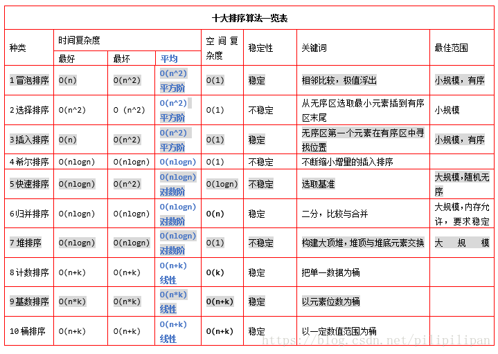
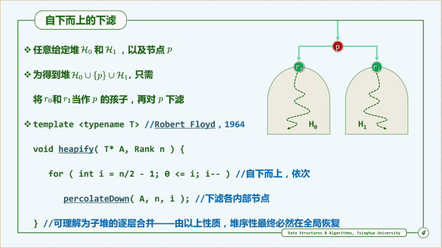
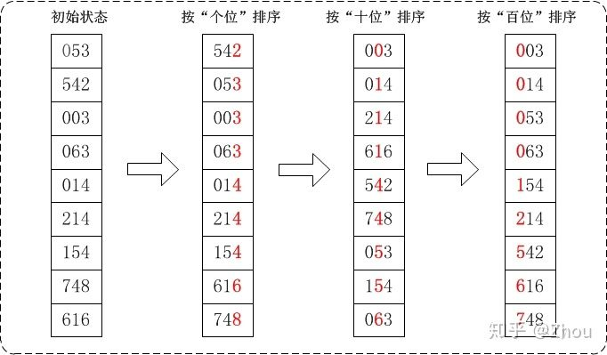

# [排序](https://www.cnblogs.com/onepixel/articles/7674659.html)

<div align="center">  </div>

<div align="center">  </div>

# 交换排序

## 冒泡排序

思想： 大数沉底

```c++
void sort(int[] nums) {
    //定义一个布尔变量 hasChange，用来标记每轮遍历中是否发生了交换
    boolean hasChange = true; 
    //每轮遍历开始，将 hasChange 设置为 false
    for (int i = 0; i < nums.length - 1 && hasChange; i++) {
        hasChange = false;
        //进行两两比较，同时记录一下有交换发生
        for (int j = 0; j < nums.length - 1 - i; j++) {
            if (nums[j] > nums[j + 1]) {
                swap(nums, j, j + 1);
                hasChange = true;
            }      
        }
     }
 }
```


## 快速排序

<div align="center">  </div>
<div align="center">  </div>

```cpp

typedef int Rank;

//轴点构造算法：通过调整元素位置构造区间[lo, hi)的轴点，并返回其秩
Rank  partition(vector<Rank>& elem, Rank lo, Rank hi) { //版本A：基本形式

    swap(elem[lo], elem[lo + rand() % (hi - lo)]); //任选一个元素与首元素交换
    hi--;      //[lo, hi)                                   
    Rank pivot = elem[lo];                         //以首元素为候选轴点——经以上交换，等效于随机选取

    while (lo < hi) { //从向量的两端交替地向中间扫描

        while ((lo < hi) && (pivot <= elem[hi])) //在不小于pivot的前提下
            hi--; //向左拓展右端子向量
        elem[lo] = elem[hi]; //小于pivot者归入左侧子序列

        while ((lo < hi) && (elem[lo] <= pivot)) //在不大于pivot的前提下
            lo++; //向右拓展左端子向量
        elem[hi] = elem[lo]; //大于pivot者归入右侧子序列

    } //assert: lo == hi

    elem[lo] = pivot; //将备份的轴点记录置于前、后子向量之间
    return lo; //返回轴点的秩
}

void quickSort(vector<Rank>& elem, Rank lo, Rank hi) { //0 <= lo < hi <= size

    if (hi - lo < 2) return; //单元素区间自然有序，否则...

    Rank mi = partition(elem, lo, hi); //在[lo, hi)内构造轴点

    quickSort(elem, lo, mi); //对前缀递归排序
    quickSort(elem, mi + 1, hi); //对后缀递归排序
}
```
# 插入排序

## 简单插入排序
<div align="center">  </div>

```c++
void sort(int[] nums) {
    // 将数组的第一个元素当作已经排好序的，从第二个元素，即 i 从 1 开始遍历数组
    for (int i = 1, j, current; i < nums.length; i++) {
        // 外围循环开始，把当前 i 指向的值用 current 保存
        current = nums[i];

        // 指针 j 内循环，和 current 值比较，若 j 所指向的值比 current 值大，则该数右移一位
        for (j = i - 1; j >= 0 && nums[j] > current; j--) {
            nums[j + 1] = nums[j];
        }
    
        // 内循环结束，j+1 所指向的位置就是 current 值插入的位置
        nums[j + 1] = current;
    }
}
```

## 希尔排序 
<div align="center">  </div>
<div align="center">  </div>
<div align="center">  </div>


<div align="center">  </div>

# 选择排序

## 直接选择排序
冒泡排序： 
* 每次排序 都等价于 将最大元素转到 有序序列和无序序列的分界点  从这个角度看 冒泡排序就是选择排序
    * 1 相邻元素比较   2 元素位置交换 
    * 然而很遗憾 将最大元素转到合适位置的任务 是由一系列短距离也就是相邻元素之间的移动构成 
    * 这种小步慢跑的移动 就是低效率来源  那为啥不一次到位？

选择排序：
*  每次迭代只做了一次元素的移动  而不是像冒泡排序那样 在每一步都有可能做元素移动 

<div align="center">  </div>

```cpp
template <typename T> //列表的选择排序算法：对起始于位置p的n个元素排序
void List<T>::selectionSort(ListNodePosi(T) p, int n) { //valid(p) && rank(p) + n <= size

    ListNodePosi(T) head = p->pred; ListNodePosi(T) tail = p;

    for (int i = 0; i < n; i++) tail = tail->succ; //待排序区间为(head, tail)

    while (1 < n) { //在至少还剩两个节点之前，在待排序区间内
        ListNodePosi(T) max = selectMax(head->succ, n); //找出最大者（歧义时后者优先）
        insertB(tail, remove(max)); //将其移至无序区间末尾（作为有序区间新的首元素）
        tail = tail->pred; n--;
    }
}
```

## 堆排序 

###  完全二叉堆
结构：向量的形+ 完全二叉树的神
<div align="center">  </div>
插入与上滤
<div align="center">  </div>

删除与下滤:  高处不胜寒
<div align="center">  </div>

建堆  
蛮力：自上而下的上滤 nlogn 不可接受
<div align="center">  </div>
自下而上的下滤 n 
<div align="center">  </div>

堆排序
<div align="center">  </div>

# 归并排序

## 二路归并排序
<div align="center">  </div>

```cpp
void sort(int*A, int lo, int hi) {
  // 判断是否只剩下最后一个元素
  if (lo >= hi) return;
  
  // 从中间将数组分成两个部分
  int mid = lo + (hi - lo) / 2;
  
  // 分别递归地将左右两半排好序
  sort(A, lo, mid);
  sort(A, mid + 1, hi);

  // 将排好序的左右两半合并  
  merge(A, lo, mid, hi);
}

void merge(int* nums, int lo, int mid, int hi) {
    // 复制一份原来的数组
    int[] copy = nums.clone();
  
    // 定义一个 k 指针表示从什么位置开始修改原来的数组，i 指针表示左半边的起始位置，j 表示右半边的起始位置
    int k = lo, i = lo, j = mid + 1;
  
    while (k <= hi) {
        if (i > mid) {
            nums[k++] = copy[j++];
        } else if (j > hi) {
          nums[k++] = copy[i++];
        } else if (copy[j] < copy[i]) {
          nums[k++] = copy[j++];
        } else {
          nums[k++] = copy[i++];
        }
    }
}
```

# 计数排序/桶排序/基数排序

待排序范围取值有限 这种算法优势就越明显

总结
* 基数排序和桶排序可以看成是计数排序的泛化版本，使用了某些措施优化排序过程。
* 基数排序可以看做是多轮桶排序，基数排序以有效位的角度，每个有效位都进行一轮桶排序。

散列原理：  
  * vector-->rank访问  
  * List  -->posi访问  
  * BST   -->key访问
  * Hash  -->value访问

<div align="center">  </div>
<div align="center">  </div>

hash函数的构造方法：
   * 1、直接定址法 
   * 2、相乘取整法
   * 3、平方取中法
   * 4、折叠法 
   * 5、除余法：
   * 6、随机数法

根据鸽巢原理可得，哈希表的重复问题（冲突）是不可避免 
 * 1 开放定址法 
 * 2 链地址法
 * 3 再哈希法：
 * 4 建立公共溢出区：


## 计数排序
计数排序不是基于比较的排序算法，其核心在于将输入的数据值转化为键存储在额外开辟的数组空间中。 作为一种线性时间复杂度的排序，计数排序要求输入的数据必须是有确定范围的整数。

算法描述
* 找出待排序的数组中最大和最小的元素；
* 统计数组中每个值为i的元素出现的次数，存入数组C的第i项；
* 对所有的计数累加（从C中的第一个元素开始，每一项和前一项相加）；
* 反向填充目标数组：将每个元素i放在新数组的第C(i)项，每放一个元素就将C(i)减去1

## 桶排序
桶排序是计数排序的升级版。它利用了函数的映射关系，高效与否的关键就在于这个映射函数的确定。

桶排序 (Bucket sort)的工作的原理：假设输入数据服从均匀分布，将数据分到有限数量的桶里，每个桶再分别排序（有可能再使用别的排序算法或是以递归方式继续使用桶排序进行排）。  

算法描述
* 设置一个定量的数组当作空桶；
* 遍历输入数据，并且把数据一个一个放到对应的桶里去；
* 对每个不是空的桶进行排序；
* 从不是空的桶里把排好序的数据拼接起来。 


<div align="center">  </div>

## 基数排序

其原理是将整数按位数切割成不同的数字，然后对每个位数上的数字进行分别比较。

算法描述
* 取得数组中的最大数，并取得位数；
* arr为原始数组，从最低位开始取每个位组成radix数组；
* 对radix进行计数排序（利用计数排序适用于小范围数的特点）；

<div align="center">  </div>


