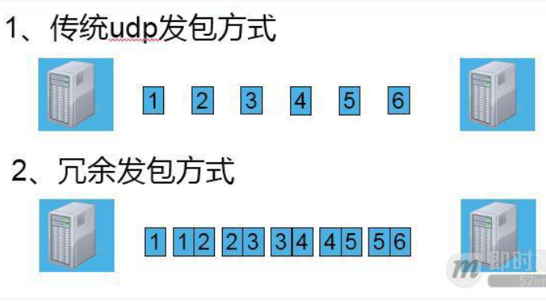

## UDP的传输方式：面向报文
面向报文的传输方式决定了 UDP 的数据发送方式是一份一份的，也就是应用层交给 UDP 多长的报文，UDP 就照样发送，即一次发送一个报文。那么UDP的报文大小由哪些影响因素呢？ UDP 数据包的理论长度是多少，合适的 UDP 数据包应该是多少呢？

**(1) UDP 报文大小的影响因素，主要有以下3个**
* [1] UDP协议本身，UDP协议中有16位的UDP报文长度，那么UDP报文长度不能超过2^16=65536；
* [2] 以太网(Ethernet)数据帧的长度，数据链路层的MTU(最大传输单元)；
* [3] socket的UDP发送缓存区大小

**(2) UDP数据包最大长度：**
* 根据 UDP 协议，从 UDP 数据包的包头可以看出，UDP 的最大包长度是2^16-1的个字节。
* 由于UDP包头占8个字节，而在IP层进行封装后的IP包头占去20字节，所以这个是UDP数据包的最大理论长度是2^16 - 1 - 8 - 20 = **65507字节**。
  
**(3) UDP数据包理想长度**
* 为了减少 UDP 包丢失的风险，我们最好能控制 UDP 包在下层协议的传输过程中不要被切割。
* 在下层数据链路层最大传输单元是1500字节的情况下，要想IP层不分包，那么UDP数据包的最大大小应该是1500字节 – IP头(20字节) – UDP头(8字节) = 1472字节。
* 不过鉴于Internet上的标准MTU值为576字节，所以建议在进行Internet的UDP编程时，最好将UDP的数据长度**控制在 (576-8-20)548字节以内**

## UDP数据包的发送和接收问题
**(1) UDP的通信有界性：**
* 在阻塞模式下，UDP的通信是以数据包作为界限的，
* 即使server缓冲区再大也要按client发包的次数来多次接收数据包
* 即客户端分几次发送过来，服务端就必须按几次接收。

**(2) UDP数据包的无序性和非可靠性：**
client依次发送1、2、3三个UDP数据包，server端先后调用3次接收函数，可能会依次收到3、2、1次序的数据包，收包可能是1、2、3的任意排列组合，也可能丢失一个或多个数据包。

**(3) UDP数据包的接收：**
client发送两次UDP数据，第一次 500字节，第二次300字节，server端阻塞模式下接包情况？
* 由于UDP通信的有界性，接收到只能是500或300，又由于UDP的无序性和非可靠性，接收到可能是300，也可能是500，
* 也可能一直阻塞在recvfrom调用上，直到超时返回(也就是什么也收不到)。

在假定数据包是不丢失并且是按照发送顺序按序到达的情况下，server端阻塞模式下接包，先后三次调用：recvfrom( 200)，recvfrom( 1000)，recvfrom( 1000)，接收情况如何呢？
* 由于UDP通信的有界性，
* 第一次recvfrom( 200)将接收第一个500字节的数据包，
    * 但用户空间buf只有200字节，于是只会返回前200字节，剩下300字节将丢弃。
* 第二次recvfrom( 1000)将返回300字节，
* 第三次recvfrom( 1000)将会阻塞。

**(4) UDP包分片问题：**
如果MTU是1500，Client发送一个8000字节大小的UDP包，那么Server端阻塞模式下接包，在不丢包的情况下，recvfrom(9000)是收到1500，还是8000。如果某个IP分片丢失了，recvfrom(9000)，又返回什么呢？

* 根据UDP通信的有界性，在buf足够大的情况下，接收到的一定是一个完整的数据包，UDP数据在下层的分片和组片问题由IP层来处理，提交到UDP传输层一定是一个完整的UDP包，
* 那么recvfrom(9000)将返回8000。如果某个IP分片丢失，udp里有个CRC检验，如果包不完整就会丢弃，也不会通知是否接收成功，所以UDP是不可靠的传输协议，那么recvfrom(9000)将阻塞。

## UDP丢包问题
在不考虑UDP下层IP层的分片丢失，CRC检验包不完整的情况下，造成UDP丢包的因素有哪些呢？
**[1] UDP socket缓冲区满造成的UDP丢包：**

**[2] UDP socket缓冲区过小造成的UDP丢包：**

**[3] ARP缓存过期导致UDP丢包：**
  * ARP 的缓存时间约10分钟，APR 缓存列表没有对方的 MAC 地址或缓存过期的时候，会发送 ARP 请求获取 MAC 地址，
  * 在没有获取到 MAC 地址之前，用户发送出去的 UDP 数据包会被内核缓存到 arp_queue 这个队列中，默认最多缓存3个包，多余的 UDP 包会被丢弃

## UDP的冗余传输方案

外网通信链路不稳定的情况下，有什么办法可以降低UDP的丢包率呢？ 

一个简单的办法来采用冗余传输的方式

* 如下图，一般采用较多的是延时双发，
   * 双发指的是将原本单发的前后连续的两个包合并成一个大包发送，
   * 这样发送的数据量是原来的两倍。

* 这种方式提高丢包率的原理比较简单，例如本例的冗余发包方式，
   * 在偶数包全丢的情况下，依然能够还原出完整的数据，
   * 也就是在这种情况下，50%的丢包率，依然能够达到100%的数据接收。

  

## UDP的使用原则小结

[1] 实时性要求很高，并且几乎不能容忍重传：
* 例子：NTP协议，实时音视频通信，多人动作类游戏中人物动作、位置。

[2] TCP实在不方便实现多点传输的情况；

[3] 需要进行NAT穿越；

[4] 对网络状态很熟悉，确保udp网络中没有氓流行为，疯狂抢带宽；

[5] 熟悉UDP编程。

