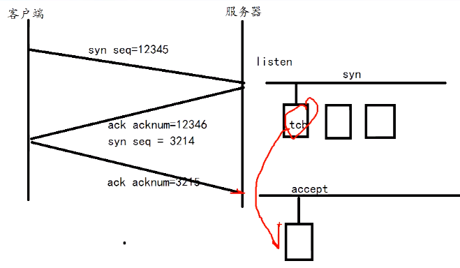

# 用户态协议栈设计原理

**目录**
* [一 前言](##为什么要搞这个? )
    - [1.为什么要搞这个?](#1文件描述符)
    - [2.单台服务器并发数量的极限在哪？](##单台服务器并发数量的极限在哪？ )
    - [3.如何把协议栈做到用户态里面？](##如何把协议栈做到用户态里面？ )
* [二 如何实现一个小的UDP协议栈？](##为什么要搞这个? )
    - [1.怎么定义数据结构?](#1文件描述符)
    - [2.怎么读取UDP包？](#2相关调用)
* [三 如何实现一个小的TCP协议栈？](##为什么要搞这个? )
   


## 为什么要搞这个? 
之前实习期间一直在做DPDK（啥是DPDK可以看后面文章或者自行谷歌）相关的东西，头一次接触到这个东西的时候，第一个感觉 卧槽   这东西黑科技啊 这么牛逼  现在服务器大多还是关注C1000K的问题的时候，DPDK已经可以搞C10M了  但是之前一直有个很大的疑惑？  为什么现在流行的还是内核的协议栈呢？ 我觉得可能还是时间的问题吧，刚好也可以趁这个时候学习下用户态协议栈 。好处也大概有以下三点  
> 1 了解TCP协议的细节  
> 2 服务器并发数量的极限  
> 3 网卡数据的理解


## 单台服务器并发数量的极限在哪？ 

在考虑单台服务器的并发性能的时候  我们常常从以下五元组来考虑这个问题

> **1-CPU     2-内存    3-网卡  4-带宽   5-内核**

经过多年的发展，很多场景下，硬件已经并不是瓶颈所在，网络协议的设计与当初的电话系统息息相关，直接说结论: `其实现在最大的瓶颈在于内核`，该结论是一位大佬提出来的，对于这个结论有兴趣的可以看C10M的相关问题：  `于是有人提出把协议栈搬到用户态的解决方案` 对于为什么要把协议栈搬到用户态 详情还是可以参考C10M相关问题

> C10M：[链接](C10M.md)


##  如何把协议栈做到用户态里面？ 

我们需要有个东西，将网卡映射到内存中，这个东西就是 netmap/dpdk 对于netmap和dpdk的介绍，可以看我后面相关文章或者自行谷歌 。

怎么理解这件事情呢？

`站在CPU的角度来说 mmap  就是把网卡内部（网卡上存储数据）空间映射到内存中；这样 就使得我们操作网卡和操作内存是一样的 这个就是把协议栈做到用户态的基础`

---

##  如何在netmap基础上面实现一个小的UDP协议栈？

为什么选择netmap介绍： 因为对比DPDK操作来说 无论是操作还是理论都要简单很多 而且也很容易理解，当然就没有DPDK那么强悍了

### **我们先定义数据结构**：

UDP数据帧如下


以太网头


```
struct ethhdr {
	unsigned char h_dest[ETH_ALEN];
	unsigned char h_source[ETH_ALEN];
	unsigned short h_proto;
} __attribute__ ((packed));
```

IP头


```
标识：也就是说的每一个的ID号 唯一地标识主机发送的每一个数据报，其初始值是随机的，每发送一个数据报其值就加1。
 
标志: 位1保留，位2表禁止分片(DF)，若设置了此位，IP模块将不对数据报进行分片，在此情况下若IP数据报超过MTU，IP模块将丢弃数据报并返回一个ICMP差错报文；位3标识更多分片(MF)，除了数据报的最后一个分片，其他分片都要把它设置为1
  
位偏移：分片相对原始IP数据报数据部分的偏移。
  
生存时间:：数据报到达目的地之前允许经过的路由器跳数。TTL值被发送端设置，常设置为64。数据报在转发过程中每经过一个路由该值就被路由器减1.当TTL值为0时，路由器就将该数据包丢弃，并向源端发送一个ICMP差错报文。

```
```
struct iphdr {
	unsigned char version:4;
    unsigned char ihl:4;
	unsigned char tos;
	unsigned short tot_len;
	unsigned short id;
	unsigned short flag_off;
	unsigned char ttl;
	unsigned char protocol;
	unsigned short check;
	unsigned int saddr;
	unsigned int daddr;
} __attribute__ ((packed));
```
udp头


```
struct udphdr {
	unsigned short source;
	unsigned short dest;
	unsigned short len;
	unsigned short check;
} __attribute__ ((packed));
```
udp应用数据
```
struct udppkt {
	struct ethhdr eh;
	struct iphdr ip;
	struct udphdr udp;
	unsigned char body[128];
} __attribute__ ((packed));
```

### **然后利用netmap去读取**
```
int main(){

    //打开网卡设备
    struct nm_desc* nmr=nm_open("net_map:eth0",NULL);
    if(nmr==NULL){
        return -1;
    }

    //设置poll读事件
    struct pollfd pfd={0};
    pfd.fd=nmr->fd;
    pfd.events=POLLIN;

    
    unsigned char*stream=NULL;
    struct nm_pkthdr h;
    while(1){
         
        //poll监听
        int ret=poll(&fd,1,-1);
        if(ret<0) continue;
        
        //网卡来数据了
        if(pfd.revents&POLLIN){
          stream =nm_nextpkt(mnr,&h); //抓回数据

          //转为以太网帧格式
          struct ethhdr*eh=(struct ethhd*)stream;

          if(ntohs(eh->h_proto)==PROTO_IP){ //判断是不是IP数据
              
              //转为udp格式
              struct updpkt *upd=(struct updpkt*)stream; 


              if(ntohs(udp->ip.proto)==PROTO_UDP){ //判断是不是UDP数据
                   int udp_length= ntohs(udp->udp_length);

                   udp->body[udp_length-8]='\0'; 
                   printf("udp->%\n",udp->body);
              }         
          }
        }
    }
}

```
### 这么写为啥发一段时间就没数据了？？

> 因为长时间没回ARP包 对方主机认为你已经掉线  所以我们需要回ARP


arp协议的工作原理 （IP层）
```c
在每台安装有TCP/IP协议的电脑里都有一个ARP缓存表，表里的IP地址与MAC地址是一一对应的

------------------------------------------------------------
我们以主机A（192.168.1.5）向主机B（192.168.1.1）发送数据为例。

当发送数据时，主机A会在自己的ARP缓存表中寻找是否有目标IP地址。如果找到了，也就知道了目标MAC地址，直接把目标MAC地址写入帧里面发送就可以了；

如果在ARP缓存表中没有找到相对应的IP地址，主机A就会在网络上发送一个广播，目标MAC地址是“FF.FF.FF.FF.FF.FF”，这表示向同一网段内的所有主机发出这样的询问：“192.168.1.1的MAC地址是什么？”网络上其他主机并不响应ARP询问，只有主机B接收到这个帧时，才向主机A做出这样的回应：“192.168.1.1的MAC地址是00-aa-00-62-c6-09”。
这样，主机A就知道了主机B的MAC地址，它就可以向主机B发送信息了。同时它还更新了自己的ARP缓存表，下次再向主机B发送信息时，直接从ARP缓存表里查找就可以了。

ARP缓存表采用了老化机制，在一段时间内如果表中的某一行没有使用，就会被删除，这样可以大大减少ARP缓存表的长度，加快查询速度。

------------------------------------------------------------
```


ARP头


```
struct arphdr {
	unsigned short h_type;
	unsigned short h_proto;
	unsigned char h_addrlen;
	unsigned char protolen;
	unsigned short oper;
	unsigned char smac[ETH_ALEN];
	unsigned int sip;
	unsigned char dmac[ETH_ALEN];
	unsigned int dip;
} __attribute__ ((packed));
```


###  为啥每一层都有一个效验？
> 因为之前的网络丢失情况还是很严重的 所以在每一层都在加校验 更方便去查找那一层出现了问题

---

##  如何在netmap基础上面实现一个小的TCP协议栈？


```
1 TCP header  
2 TCP stream / tcb   
3 滑动窗口
4 慢启动
5 定时器
```

### TCP头里面有啥？


conect 三次握手  



```
第一次： SYN=1  seqnum=12345   
第二次： ACK=1  acknum=12346   SYN=1 seqnum=43214
第三次： ACK=1  acknum=3215
```
在标志(Code Bits)中的八位标志位分别介绍如下

```
CWR(Congestion Window Reduce)：拥塞窗口减少标志被发送主机设置，用来表明它接收到了设置ECE标志的TCP包，发送端通过降低发送窗口的大小来降低发送速率

ECE(ECN Echo)：ECN响应标志被用来在TCP3次握手时表明一个TCP端是具备ECN功能的，并且表明接收到的TCP包的IP头部的ECN被设置为11。更多信息请参考RFC793。

URG(Urgent)：该标志位置位表示紧急(The urgent pointer) 标志有效。该标志位目前已经很少使用

ACK(Acknowledgment)：取值1代表Acknowledgment Number字段有效，这是一个确认的TCP包，

PSH(Push)：该标志置位时，一般是表示发送端缓存中已经没有待发送的数据，接收端不将该数据进行队列处理，而是尽可能快将数据转由应用处理。在处理 telnet 或 rlogin 等交互模式的连接时，该标志总是置位的。

RST(Reset)：用于复位相应的TCP连接。通常在发生异常或者错误的时候会触发复位TCP连接。

SYN(Synchronize)：同步序列编号(Synchronize Sequence Numbers)有效。该标志仅在三次握手建立TCP连接时有效。

FIN(Finish)：带有该标志置位的数据包用来结束一个TCP会话
```
> 紧急指针（Urgent Pointer）：16位，指向后面紧急数据的位置是从哪里开始的，在URG标志设置了时有效  

> 我们一般称呼链路层的发出去的数据包为帧(frame)，称呼网络层发给链路层的数据包为包(packet)，称呼传输层发给网络层的数据包为段(segment)。

```c
struct tcphdr {
	unsigned short source;
	unsigned short dest;
	unsigned int seq;
	unsigned int ack_seq;

	unsigned short res1:4, 
		doff:4, 
		fin:1,
		syn:1,
		rst:1,
		psh:1,
		ack:1,
		urg:1,
		ece:1,
		cwr:1;
	unsigned short window;
	unsigned short check;
	unsigned short urg_ptr;
} 
```

有没有想过一个问题：服务器是如何标识区分每一个客户端的 ?

### TCP的控制块（tcb）

里面主要有啥？
```
1 五元组：源端口号 源IP  目的端口号  目的IP 协议类型
2 status： 十一种状态
3 发送队列
4 接收队列
5 fd
```

应用程序的fd 和 tcb 有啥关系？ 

```
send(fd):  fd  去找 tcb
recv(fd):  tcb 去找 fd
```

怎么去找？ 

```
fd去找tcb: int-->strcut  方法很多：  红黑树 哈希 等等。。。。
tcb去找fd:
```


怎么从SYN队列找到ack回来的那个节点？fd-->tcb

TCP状态？


网络传输 数据不是顺序的 协议栈用什么方法，来保证数据的顺序？？
> 滑动窗口 序号  
这个号来源哪里？ 来源IP包里面的identityf

滑动窗口如何保证顺序的？  （确认 重传）

至于发送多少 窗口有多大 是通过拥塞计算出来的 拥塞控制是对于整个网络可言（慢启动）


1 什么时候给对端发送确认消息？

延迟ACK：每一次收到对方的包的时候，比如收到了一个6 这时候会开启一个定时器：叫做延迟定时器 超过200ms开始发送确认消息，检测之前的包有没有收到，如果200ms以内再有包进来，这时候会再开一个200ms的定时器

2 确认消息应该是多少？

接收端： 某条消息之前的消息都收到了，则发送该消息的确认 （这样就会出现重复重传的问题）

干嘛不是一个包一个包的重传？

实现难度大

TCP因为有延迟ACK 牺牲了带宽和实时性

为什么会有UDP的可靠传输


