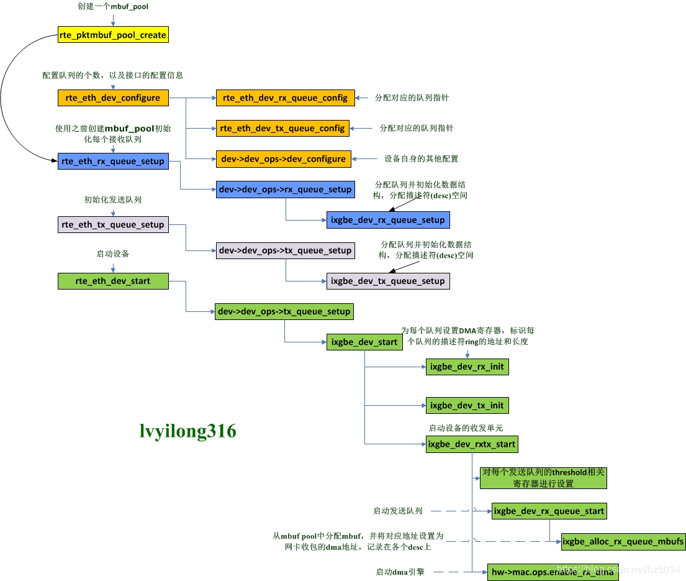

DPDK收发包是基础核心模块，从网卡收到包到驱动把包拷贝到系统内存中，再到系统对这块数据包的内存管理，由于在处理过程中实现了零拷贝，数据包从接收到发送始终只有一份

# 一、收发包分解
* 1. 收发包的配置和初始化，主要是配置收发队列等。
* 2. 数据包的获取和发送，主要是从队列中获取到数据包或者把数据包放到队列中

# 二、收发包的配置和初始化
## 图

  

## 配置
* 收发包的配置最主要的工作就是配置网卡的收发队列，设置DMA拷贝数据包的地址等，
* 配置好地址后，网卡收到数据包后会通过DMA控制器直接把数据包拷贝到指定的内存地址
* 我们使用数据包时，只要去对应队列取出指定地址的数据即可。 

收发包的配置是从rte_eth_dev_configure()开始的，这里根据参数会配置队列的个数，以及接口的配置信息，如队列的使用模式，多队列的方式 

* 1 重要的信息检查
* 2 接收队列的配置 接收队列是从rte_eth_dev_tx_queue_config()开始的
   - (1)如果是第一次配置，那么就为每个队列分配一个指针。
   - (2)如果是重新配置，配置的queue数量不为0，那么就取消之前的配置，重新配置。
   - (3)如果是重新配置，但要求的queue为0，那么释放已有的配置。
* 3 发送的配置也是同样的，在rte_eth_dev_tx_queue_config()

* 4 收发队列配置完成后，就调用设备的配置函数，进行最后的配置。(*dev->dev_ops->dev_configure)(dev)

## 初始化

### 接收队列的初始化

接收队列的初始化是从rte_eth_rx_queue_setup()开始的，这里的参数需要指定要初始化的port_id,queue_id,以及描述符的个数，还可以指定接收的配置，如释放和回写的阈值等。
* 1 先进行各种检查  如初始化的队列号是否合法有效，设备是否已经启动
* 2 获取设备的配置信息，rte_eth_dev_info_get(port_id, &dev_info);
* 3 调用到队列的setup函数做最后的初始化。
    * 3.1 分配队列结构体，并填充结构 rte_zmalloc_socket
    * 3.2 分配描述符队列的空间，按照最大的描述符个数进行分配 rte_eth_dma_zone_reserve
    * 3.3 分配sw_ring，这个ring中存储的对象是struct ixgbe_rx_entry，其实里面就是数据包mbuf的指针

### 发送队列的初始化
发送队列的初始化在前面的检查基本和接收队列一样，只有些许区别在于setup环节   `ixgbe_dev_tx_queue_setup()`
* 1 在发送队列配置中，重点设置了tx_rs_thresh和tx_free_thresh的值。
* 2 然后分配了一个发送队列结构txq,之后分配发送队列ring的空间，并填充txq的结构体
* 3 然后，分配队列的sw_ring,也挂载队列上。
* 4 重置发送队列

## 设备的启动

经过上面的队列初始化，队列的ring和sw_ring都分配了

但是发现木有，DMA仍然还不知道要把数据包拷贝到哪里，我们说过，DPDK是零拷贝的，那么我们分配的mempool中的对象怎么和队列以及驱动联系起来呢？接下来就是最精彩的时刻了----建立mempool、queue、DMA、ring之间的关系

**设备的启动是从rte_eth_dev_start()中开始的**

* 1 通过函数指针 找到设备启动的真正启动函数：ixgbe_dev_start()
* 2 检查设备的链路设置，暂时不支持半双工和固定速率的模式。
* 3 然后把中断禁掉，同时，停掉适配器
* 4 然后重启硬件

**再然后是初始化接收单元：ixgbe_dev_rx_init()**
* 接下来最重要的就是为每个队列设置DMA寄存器，标识每个队列的描述符ring的地址，长度，头，尾等
* 最后，调用ixgbe_set_rx_function()对接收函数再进行设置，主要是针对支持LRO，vector,bulk等处理方法
* 如此，发送单元的初始化就完成了。

**接下来再初始化发送单元：ixgbe_dev_tx_init()**

* 发送单元的的初始化和接收单元的初始化基本操作是一样的，都是填充寄存器的值，重点是设置描述符队列的基地址和长度。

**然后就是依次启动每个接收队列：ixgbe_dev_rx_queue_start()**
* 先对每个发送队列的threshold相关寄存器进行设置，这是发送时的阈值参数 
* 然后就先填充了新分配的mbuf结构，最最重要的是填充计算了dma_addr
* 然后初始化queue ring，即rxd的信息，标明了驱动把数据包放在dma_addr处。
* 然后再设置一下队列ring的头尾寄存器的值

**然后就是依次启动每个发送队列: ixgbe_dev_rx_queue_start()**

* 发送队列的启动比接收队列的启动要简单，只是配置了txdctl寄存器，延时等待TX使能完成，最后，设置队列的头和尾位置都为0。

# 三、数据包的获取和发送

数据包的获取是指驱动把数据包放入了内存中，上层应用从队列中去取出这些数据包；发送是指把要发送的数据包放入到发送队列中，为实际发送做准备。

## 数据包的获取

业务层面获取数据包是从rte_eth_rx_burst()开始的

## 数据包的发送