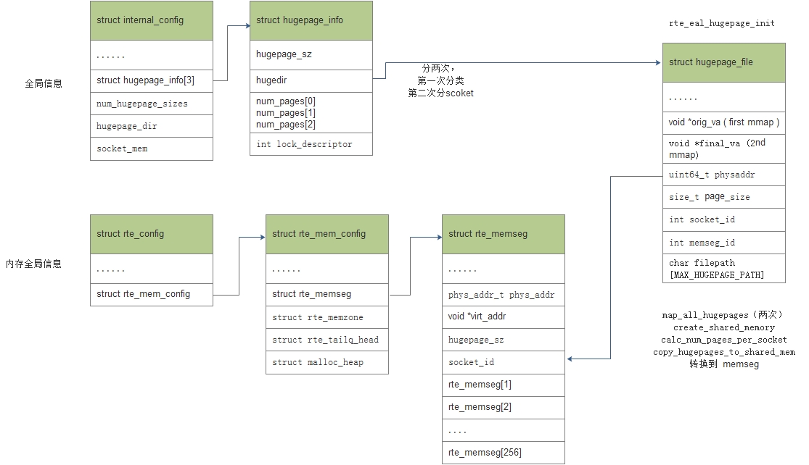
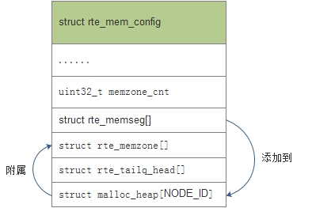
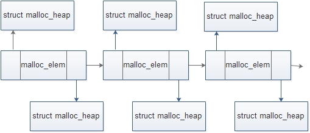

# 组织内存用到的技术
dpdk 之所以使用大页内存，主要是因为 dpdk 要进行快速数据包的处理，数据交换频繁，使用大页可以减少页表的开销，减少 TLB miss 导致的性能损失。

* dpdk 使用 Linux 提供的获取大页、页表、numa 节点表、mmap 功能重新组织内存
    * 大页： 最多可以同时存在 3 种大页。一般只是用 2M 的大页。linux 中获取大页相关信息是通过访问解析 /sys/kernel/mm/hugepages、/proc/meminfo、/proc/mounts 等内容得到的。
    * 页表： linux 中每个进程的页表对应的文件是 /proc/pid/pagemap，本进程的页表是 /proc/self/pagemap。  
    * numa 节点表： linux 中每个物理页所在的 numa socket 表对应的文件是 /proc/pid/numa_maps，本进程的 numa socket 表是 /proc/self/numa_maps


# 内存组织与管理方式

dpdk 将 hugepage 预留的物理内存统一组织管理起来，然后对外提供相应的数据结构和 API 供上层使用。 这里 dpdk 为了方便管理，做了不同层次的封装，见下面这幅图
<div align="center">  </div>

理论上可以通过 rte_memseg 获取虚拟地址使用这些内存了，但 dpdk 提供了统一的方式来使用，不是谁用就可以来拿的。rte_memzone、 rte_mempool 和 rte_mbuf 就是 dpdk 用来组织管理内存使用的。

# 1 大页的初始化与管理
由 `eal_hugepage_info_init` 和 `rte_eal_hugepage_init` 来完成。并且是由主进程来完成，从进程只用 attach 就可以使用这些内存
<div align="center">  </div>

# 2 主进程初始化

总的来说，dpdk 利用上述 linux 内核提供的技术，来初始化大页内存，并将内存信息保存在全局的内存配置结构中 **rte_memseg[]** 中 如下图： 
<div align="center">  </div>

具体流程
<div align="center">  </div>

dpdk 重新组织内存的方式，可以总结如下：
* 把物理地址连续的页映射到进程中，对应的虚拟地址也连续。
* 把物理地址连续，并且在同一个 socket 上的连续页，组织成一个个的段（segment）统一管理。
* 对于相同的物理页，每个进程映射的虚拟地址都相同

通过以上步骤，每个 socket 的内存布局大致就如下所示：
<div align="center">  </div>


# 3 从进程映射

从进程要使用主进程初始化的内存，即共享内存，可以直接将内存映射到进程中使用，主要有以下几步： 
* 根据共享的 `mem_config`，获得 `memseg` 段信息。`memseg` 中包括每个段的信息（段大小、虚拟和物理地址等）。再检查是否能获得每个段对应的虚拟地址空间。 
* 然后，再根据共享的`/var/run/.rte_hugepage_info`获得每个页信息。
* 根据 /var/run/.rte_hugepage_info 中每个页的信息(dir、memseg_id)，把每个页映射到从进程中，映射的虚拟地址和主进程中的一样。


## 内存分配器 memzone 初始化 

大页内存重新组织，以分段的方式放在 rte_memseg[] 中了，但是使用的时候，怎么来分配呢？dpdk 为了方便使用和管理，用了一个内存分配器，即 rte_memzone。

在此之前，我们先看下全局内存配置结构 rte_mem_config
<div align="center">  </div>

从整体上看
* rte_memzone_init 做的事是将上面组织好放在 rte_memseg[] 中的大页内存段添加到 struct malloc_heap 的空闲链表上
* 段属于哪个 socket，就添加到哪个 socket 的 malloc_heap 中。
* 然后再将每个段的地址赋给 rte_memzone 做统一管理
   * <div align="center">  </div>
   * 其中，结构体 struct malloc_elem 表示一个内存对象，是对 struct malloc_heap 和 struct rte_memseg 的抽象，
   * rte_memzone_init 具体的就是将内存段挂接到 malloc_elem 分配的空闲链表中，来供分配者使用：

<div align="center">  </div>

## 内存布局图
<div align="center">  </div>

# 5 内存分配
## 1、 rte_malloc_socket() 

这个是一个基础函数，可以在这个函数的基础上进行封装，主要参数是类型，大小，对齐，以及从哪个 socket 上分。一般来说，分配内存从当前线程运行的 socket 上分配，可以避免内存跨 socket 访问，提高性能。

## 2、rte_memzone_reserve() 
这个函数的返回值类型是struct rte_memzone型的，这是和上一个分配接口的不同之处，同时注意分配时的flag的不同。分配出来的memzone可以直接使用名字索引到。这个函数最终也是会调用到malloc_heap_alloc()

# 6 内存池管理（rte_mempool） 

这是 dpdk 对外提供的两套内存管理方案。rte_mempool 主要用于网卡数据包的收发，rte_malloc 主要为应用程序提供内存使用接口。


rte_mempool 基于内存池的方案，预先分配一块较大的内存供数据包的收发使用，数据包的承载用结构体 rte_mbuf 来表示，一个 rte_mbuf 对应一个 rte_mempool，表明自己隶属于哪一个 rte_mempool，如下：
<div align="center">  </div> 

rte_mempool 由 rte_mempool_create 来创建，指定申请多少个 rte_mbuf 及每个 rte_mbuf 中 elt_size 的大小。elt_size是为网卡接收的数据包预先分配的内存的大小，该内存块就是rte_mbuf->pkt.data的实际存储区域。具体如上图所示

上层应用一般调用自定义的 mbuf 创建函数来申请分配 mempool，如 pktgen 应用就是调用函数 pktgen_mbuf_pool_create -> rte_mempool_create_empty 来创建 mbuf 所在的 mempool

另外，为了能够方便对于 rte_mbuf 的分配和回收，dpdk 采用无锁队列 rte_ring 来管理分配的对象，同时，为了减少多核之间对同一个 rte_ring 的访问，每一个核都维护着一个 cache(**应用层为每个cpu准备的缓存**)，优先从 cache 中取。如下：
<div align="center">  </div> 


调用关系如下
```cpp
    rte_mempool_create
    rte_mempool_create_empty //初始化一个内存池
        rte_memzone_reserve  //为数据包的收发分配足够的内存
    rte_pktmbuf_pool_init    //初始化 mempool 的私有数据区 
    rte_mempool_populate_default
    rte_pktmbuf_init         //初始化rte_mbuf
    rte_mempool_obj_iter
```

# 7 malloc 管理（rte_malloc）

rte_malloc()为程序运行过程中分配内存，模拟从堆中动态分配内存空间。

调用关系如下：
```cpp
    rte_malloc
        rte_malloc_socket
            malloc_heap_alloc
```
最终调用到 malloc_heap_alloc 函数从 rte_mem_config->malloc_heap 中分配内存。

# 8 内存回收

关于内存回收，跟分配的接口对应，也有多个回收函数。

* rte_free() 这个接口，
     * 同样在上层封装了多种接口，如 rte_memzone_free() 等，
     * 主要做的事就是重新把 elem 放进 free_list 上，如果有能够合并的，还会对齐进行合并。
* rte_memzone_free() 
     * 对上面的 rte_free() 做封装。


# 总结

rte_mbuf、 rte_mempool、 rte_memzone、 rte_memseg 几者之间的关系：

<div align="center">  </div> 