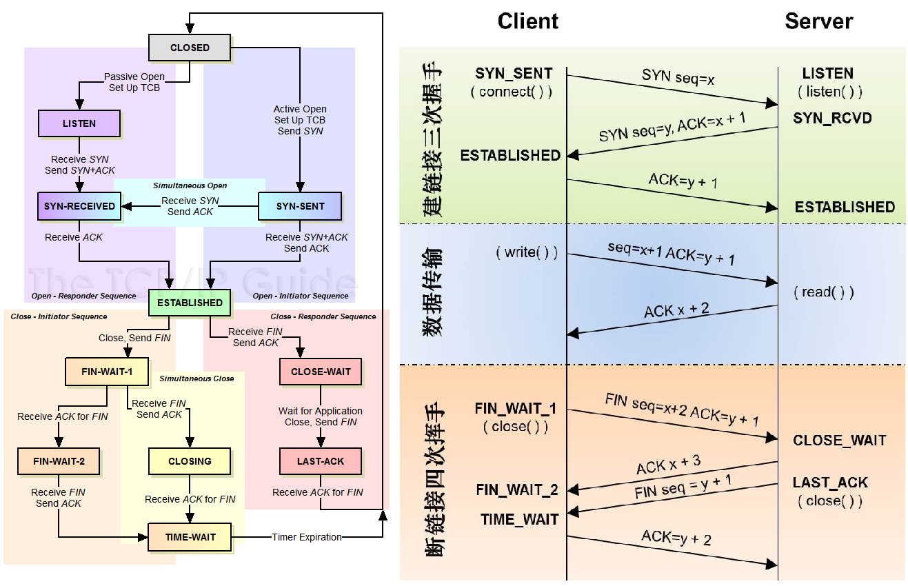

# 1 TCP header

<div align="center">  </div>

需要注意的是

* TCP的包是没有IP地址的，那是IP层上的事，但是有源端口和目标端口。  
* `一个TCP连接需要四个元组来表示是同一个连接（src_ip, src_port, dst_ip, dst_port）准确说是五元组，还有一个是协议。`但因为这里只是说TCP协议，所以，这里我只说四元组。

上图中的四个非常重要的东西：
* Sequence Number：是包的序号，用来解决网络包乱序（reordering）问题。
* Acknowledgement Number：就是ACK——用于确认收到，用来解决不丢包的问题。
* Window：也就是著名的滑动窗口（Sliding Window），用于解决流控的。
* TCP Flag ：也就是包的类型，主要是用于操控TCP的状态机的。


# 2 TCP stream / tcb  


里面主要有啥？
```
1 五元组：源端口号 源IP  目的端口号  目的IP 协议类型
2 status： 十一种状态
3 发送队列
4 接收队列
5 fd
```

应用程序的fd 和 tcb 有啥关系？ 

```
send(fd):  fd  去找 tcb
recv(fd):  tcb 去找 fd
```

# 3 TCP 的状态机

其实，网络上的传输是没有连接的，包括TCP也是一样的。而TCP所谓的“连接”，其实只不过是在通讯的双方维护一个“连接状态”，让它看上去好像有连接一样。所以，TCP的状态变换是非常重要的。

<div align="center">  </div>
（吐个槽：看到这样复杂的状态机，就知道这个协议有多复杂，复杂的东西总是有很多坑爹的事情，所以TCP协议其实也挺坑爹的）

### 为什么建链接要3次握手，断链接需要4次挥手？

* 对于3次握手：`主要是要初始化Sequence Number 的初始值`。
   + 通信的双方要互相通知对方自己的初始化的Sequence Number 也就上图中的 x 和 y。
   + 这个号要作为以后的数据通信的序号，以保证应用层接收到的数据不会因为网络上的传输的问题而乱序（TCP会用这个序号来拼接数据）
* 对于4次挥手：
   + 其实你仔细看是2次，因为TCP是全双工的，所以，发送方和接收方都需要Fin和Ack。只不过，有一方是被动的，所以看上去就成了所谓的4次挥手。


# 4 TCP滑动窗口

我们都知道，TCP必需要解决的可靠传输以及包乱序（reordering）的问题，所以，TCP必需要知道网络实际的数据处理带宽或是数据处理速度，这样才不会引起网络拥塞，导致丢包。

所以，TCP引入了一些技术和设计来做网络流控，Sliding Window是其中一个技术

