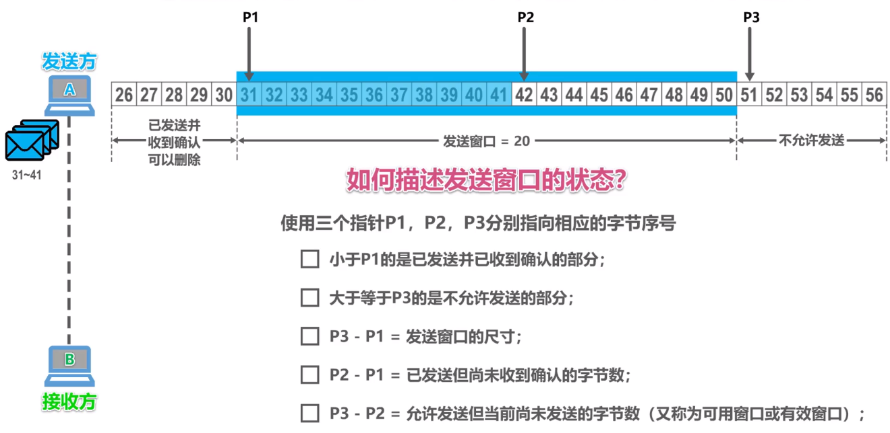
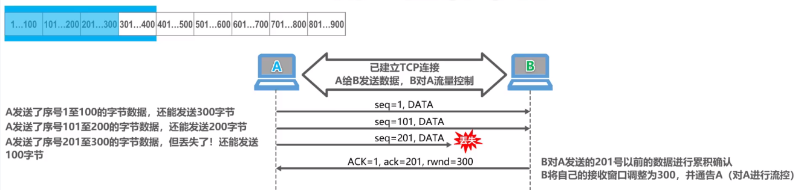
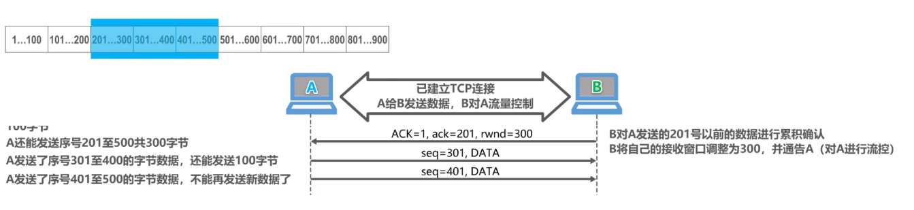
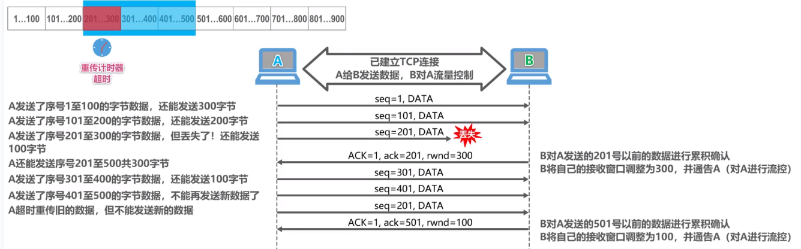

# 1 TCP header

<div align="center">  </div>

需要注意的是

* TCP的包是没有IP地址的，那是IP层上的事，但是有源端口和目标端口。  
* `一个TCP连接需要四个元组来表示是同一个连接（src_ip, src_port, dst_ip, dst_port）准确说是五元组，还有一个是协议。`但因为这里只是说TCP协议，所以，这里我只说四元组。

上图中的四个非常重要的东西：
* Sequence Number：是包的序号，用来解决网络包乱序（reordering）问题。
* Acknowledgement Number：就是ACK——用于确认收到，用来解决不丢包的问题。
* Window：也就是著名的滑动窗口（Sliding Window），用于解决流控的。 这个值本身是通过拥塞控制算出来的
* TCP Flag ：也就是包的类型，主要是用于操控TCP的状态机的。


# 2 TCP stream / tcb  

用来干啥？  
```
用户态应用程序 和TCP的连接桥梁
```

里面主要有啥？
```
1 五元组：源端口号 源IP  目的端口号  目的IP 协议类型
2 status： 十一种状态
3 发送队列
4 接收队列
5 fd
```

应用程序的fd 和 tcb 有啥关系？ 

```
send(fd):  fd  去找 tcb
recv(fd):  tcb 去找 fd
```

# 3 TCP 的状态机

其实，网络上的传输是没有连接的，包括TCP也是一样的。而TCP所谓的“连接”，其实只不过是在通讯的双方维护一个“连接状态”，让它看上去好像有连接一样。所以，TCP的状态变换是非常重要的。

<div align="center">  </div>
（吐个槽：看到这样复杂的状态机，就知道这个协议有多复杂，复杂的东西总是有很多坑爹的事情，所以TCP协议其实也挺坑爹的）

### 为什么建链接要3次握手，断链接需要4次挥手？

* 对于3次握手：`主要是要初始化Sequence Number 的初始值`。
   + 通信的双方要互相通知对方自己的初始化的Sequence Number 也就上图中的 x 和 y。
   + 这个号要作为以后的数据通信的序号，以保证应用层接收到的数据不会因为网络上的传输的问题而乱序（TCP会用这个序号来拼接数据）
* 对于4次挥手：
   + 其实你仔细看是2次，因为TCP是全双工的，所以，发送方和接收方都需要Fin和Ack。只不过，有一方是被动的，所以看上去就成了所谓的4次挥手。


# 4 TCP滑动窗口

我们都知道，TCP必需要解决的可靠传输以及包乱序（reordering）的问题，所以，TCP必需要知道网络实际的数据处理带宽或是数据处理速度，这样才不会引起网络拥塞，导致丢包。

所以，TCP引入了一些技术和设计来做网络流控，Sliding Window是其中一个技术

## 滑动窗口是如何保证顺序的？

1 首先假定主机B给主机A发送一个确认报文段【`rwnd=20 ack=31`】(表明主机B自己的接收窗口大小为20 期望收到的下一个序号为31(序号为30以及以前的数据收到了))   
主机A在收到确认报文后 就可以构造自己的发送窗口了，发送窗口的样子如图所示
<div align="center">  </div>

2 现在假设主机A发送了序号【31-41】的数据，此时发送窗口的位置并没有改变,发送窗口内【31-41】的数据 已经发送但是还没收到确认，而序号为【42-50】的数据是允许发送但尚未发送的，考虑一下 我们如何描述发送窗口的状态？ 

<div align="center">  </div>

3 我们再来看看主机B的接收窗口，假设主机A发送的【32-33】数据到达了主机B 由于他们序号落在了主机窗口内，所以主机B接收他们，将他们存入缓存，但是他们是未按序到达的数据（因为序号为31的数据还没有到达）请注意：**`主机B只能对按序收到的数据中的最高序号给出确认`** 因此主机B 因此主机B给出的确认报文段中的确认序号仍然是31（也就是希望收到序号为31的数据）
<div align="center">  </div>

4 现在假定主机B收到了31的数据，并把数据交付给应用进程，之后，主机B就可以删除这些数据，并把接收窗口向前移动3个序号，给主机A发送确认报文段【`rwnd=20 ack=34`】
<div align="center">  </div>

5 现在确认报文段【`rwnd=20 ack=34`】到达了主机A，主机A收到后就可以把发送窗口向前滑动3个序号 窗口尺寸仍为20，这样就有新序号落入滑动窗口中，而序号【31-33】数据就可以从窗口中删除了

<div align="center">  </div>

6主机A继续发送数据 现在发送窗口内的发送序号已经都用完了（都发出去了）主机A在未收到主机B的确认下，不能在发送新的数据，发送窗口内的数据如果迟迟收不到来自主机B的确认，则会产生**超时重传**
<div align="center">  </div>

## 什么时候给对端发送确认消息？


延迟ACK：每一次收到对方的包的时候，比如收到了一个37 这时候会开启一个定时器：叫做延迟定时器 超过200ms开始发送确认消息，检测之前的包有没有收到，如果200ms以内再有包进来，这时候会再开一个200ms的定时器


# 5 TCP拥塞控制 （发送方）
拥塞控制主要是四个算法：
* 1）慢启动；
* 2）拥塞避免；
* 3）快重传；
* 4）快恢复。


## 1 慢启动算法 (指数级增长)
慢启动的算法如下(cwnd全称Congestion Window)：

* 1）连接建好的开始先初始化cwnd = 1，表明可以传一个MSS大小的数据。
* 2）每当收到一个ACK，cwnd++; 呈线性上升
* 3）每当过了一个RTT，cwnd = cwnd*2; 呈指数让升
* 4）还有一个ssthresh（slow start threshold）【门限值or筏值】，是一个上限，当cwnd >= ssthresh时，就会进入“拥塞避免算法”（后面会说这个算法）
<div align="center">  </div>


## 2 拥塞避免算法 (线性+1规律增长)

前面说过，还有一个ssthresh（slow start threshold）【门限值or筏值】，是一个上限，当cwnd >= ssthresh时，就会进入“拥塞避免算法”。一般来说ssthresh的值是65535，单位是字节，当cwnd达到这个值时后，算法如下：

* 1）收到一个ACK时，cwnd = cwnd + 1/cwnd
* 2）当每过一个RTT时，cwnd = cwnd + 1

这样就可以避免增长过快导致网络拥塞，慢慢的增加调整到网络的最佳值。


## ------------------------------------------------------------------------

慢启动和拥塞避免算法是1988年提出的算法 1990年又增加了两个新的拥塞控制算法，这就是快重传和快恢复


* 有时候，个别报文段会在网络中丢失，但是实际上网络并未发生拥塞
   + 这将导致发送方超时重传，并误认为网络发生拥塞
   + 发送方错误使用慢启动算法，cwnd=1 因而降低了传输效率 


##  ------------------------------------------------------------------------


## 3 快重传和快恢复


* 采用快重传算法可以让发送方今早知道发生了个别报文段的丢失
* 所谓快重传 就是使发送方尽快进行重传，而不是等超时重传计时器超时在重传
  + 要求接收方不要等待自己发送数据时才进行捎带确认，而是要立即发送确认
  + 即使收到了失序的报文段也要立即发出对已经收到报文段的重复确认
  + 发送方一旦收到了`3个连续的重复确认`，就将相应的报文段立即重传，而不是等该报文段的超时重传计时器超时在重传

<div align="center">  </div>

```c
1 假设我们现在发送6个报文段 接收方正常收到了M1和M2 并发回【确认M1和确认M2】的报文段
2 此时发送方的3号报文段M3 丢失，发送方继续发送M4 M5 M6，接收方收到M4后，发现这不是按序到达的报文段，因此发回【重复确认M2】（主机B只能对按序收到的数据中的最高序号给出确认），收到M5，M6后，发现还不是按序到达的，因此在每次发回【重复确认M2】

3 发送方一旦收到了`3个连续的重复确认`，就将相应的报文段M3立即重传，接收方收到后发回【确认M6】重传成功 AMD yes！！！
```
* 发送方一旦收到了3个重复确认，就知道了只是丢失了个别报文段。于是启动的是快恢复算法
   + 快恢复的实现是把快恢复开始时候拥塞窗口值在增大一些 既：cwnd = sshthresh（门限值）  + 3 * MSS （3的意思是确认有3个数据包被收到了）
      + 既然发送方收到3个重复的确认，就表明有3个报文段已经离开了网络
      + 这3个报文段现在已经停留在接收方的缓存中
      + 可见现在网络上不是堆积了报文段而是减少了3个报文段。因此可以适当调大点
   

## 最后 来张总结图

<div align="center">  </div>


# 6 TCP流量控制（接收方）
TCP利用滑动窗口机制实现流量控制机制，一般来说，我们希望数据传的总是更快一些。但是如果对方发的太快，接收方有可能来不及接收，这就会造成数据的丢失。也就是说，所谓的流量控制，就是让发送方的发送速率不要太快，让接收方来得及接收  

## TCP流量控制举例
假设主机AB之间已经建立了TCP连接： A给B发送数据，B对A进行流量控制 先不考虑拥塞情况 
假设主机A每次发送的报文段可携带100字节数据在  在建立连接时候 B告诉A ，我的接收窗口awnd=400，因此，主机A给自己发送窗口设置为400

主机A先发送一个报文段（1-100字节） 【seq=1】这时候还能发送300字节   
主机A在发送一个报文段（101-200） 【seq=101】这时候还能发送200字节  
主机A在发送一个报文段（201-300）【seq=201】此时假设报文丢失 ，此时A还能发送100字节  

此时 主机B对A发送的201号以前的进行确认 B将自己窗口调整为300，并通过A【ACK=1 ack=201，rwnd=300】  （**`对A进行流量控制`**） （根据自己窗口还能接收多少进行调整）

<div align="center">  </div>


主机A收到累积确认后，将滑动窗口向前滑动，将已经确认的序号移出滑动窗口，由于主机B将自己接受窗口调整为300，因此主机A将自己发送窗口调整为300 此时滑动窗口的内容是（200-500字节）， 此时（201-300）的是已经发送但没收到确认的数据，若重传计时器超时，他们会被重传  

主机A继续发送一个报文段（301-400）【seq=301】还能发送100字  
主机A继续发送一个报文段（401-500）【seq=401】此时还能发送0字节 此时序号落在滑动窗口里面的数据已经全部发送出去了

<div align="center">  </div>


假设现在（201-300）的重传计时器超时了 主机A将他们封装成一个新的报文段重新发送出去【seq=201】但是不能发送新的数据   

主机B收到这个超时重传的数据后，主机B对A发送的501之前数据进行确认，B将自己的接收窗口调整为100，并且通过A 【ACK=1 ack=501，rwnd=100】（**`对A进行流量控制`**）

<div align="center">  </div>

主机A收到该累积确认后，将发送窗口向前滑动，将已经确认的序号移出滑动窗口。由于主机B将接收窗口调整为100，因此主机A相应将自己发送窗口调整为100，目前主机A发送窗口的序号为（501-600）  

主机A在发送一个报文（501-600）【seq=501】至此 主机A发送窗口的数据已经全部发送出去了，不能在发送新数据了  

主机B收到TCP报文段后，对601号之前的数据进行累积确认 并将自己接收窗口调整为0 并通告A【ACK=1 ack=601，rwnd=0】（**`对A进行流量控制`**）  

主机A收到该累积确认后，将发送窗口向前滑动，将确认序号的数据移出滑动窗口，由于主机B在接收窗口目前为0，所以主机A的发送窗口也为0，目前，主机A不能在发送报文段了

假设主机B向A发送了0窗口不久，B的接收缓存又有了一些存储空间，于是B调整自己的接收窗口为300并通告A，等待A发来数据。但是该通告丢失了【rwnd=300】  

此时A也一直等待收到B发送的非0窗口的通知。而B也一直等待A发数据，这样就23333  


为了解决这个问题，TCP为每一个连接设有一个持续计时器，只要有一方收到对方的0窗口通知，就启动持续计时器，若持续计时器超时，就发送一个0窗口探测报文，仅携带一字节的数据，而对方在确认这个报文段时，给出自己现在的窗口值，如果窗口仍然是0，那么收到这个报文段的一方，那么收到这个报文段的一方就重新启动持续计时器，如果窗口不是0，那么死锁的僵局就可以被打破

这样是不是有一个疑问？？ 主机A所发送的0窗口探测报文段到达主机B时，如果主机B此时的接收窗口仍然为0，那么主机B怎么接收这个0窗口探测报文段，那怎么给主机A发送确认呢？？  

实际上  TCP规定 即使接收窗口大小为0，也必须接受0窗口探测报文段，确认报文段，以及携带有紧急数据的报文段

需要指出的是： 发送窗口是在拥塞窗口和接收窗口中取最小者


