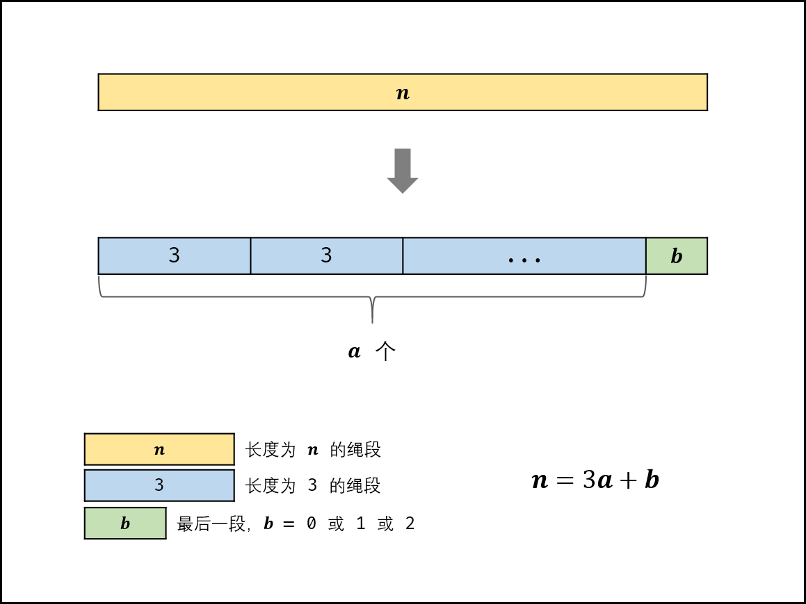

##  [面试题03. 数组中重复的数字](https://leetcode-cn.com/problems/shu-zu-zhong-zhong-fu-de-shu-zi-lcof/)

思路: 把数组视为哈希表
```

由于数组元素的值都在指定的范围内，这个范围恰恰好与数组的下标可以一一对应；

因此看到数值，就可以知道它应该放在什么位置，这里数字nums[i] 应该放在下标为 i 的位置上，这就像是我们人为编写了哈希函数，这个哈希函数的规则还特别简单；

而找到重复的数就是发生了哈希冲突；

```
<div align="center">  </div>

分析：这个思路利用到了数组的元素值的范围恰好和数组的长度是一样的，因此数组本身可以当做哈希表来用。遍历一遍就可以找到重复值，但是修改了原始数组。

```cpp

class Solution {
public:
	void swap(int& a,int& b) {
		int tmp = a;
		a = b;
		b = tmp;
	}

	int findRepeatNumber(vector<int>& nums) {

		for (int i = 0; i < nums.size(); i++){
			// 如果当前的数 nums[i] 没有在下标为 i 的位置上，就把它交换到下标 i 上
	        // 交换过来的数还得做相同的操作，因此这里使用 while
			while (nums[i]!=i)	{
				if (nums[i]==nums[nums[i]]) {
					// 如果下标为 nums[i] 的数值 nums[nums[i]] 它们二者相等
					// 正好找到了重复的元素，将它返回
					return nums[i];
				}
				swap(nums[i], nums[nums[i]]);
			}
		}
		return -1;
	}
};

```


##  [面试题04. 二维数组中的查找](https://leetcode-cn.com/problems/er-wei-shu-zu-zhong-de-cha-zhao-lcof/)
算法思想
```
标志数引入： 此类矩阵中左下角和右上角元素有特殊性，称为标志数。
  左下角元素： 为所在列最大元素，所在行最小元素。 
  右上角元素： 为所在行最大元素，所在列最小元素。

标志数性质： 将 matrix 中的左下角元素（标志数）记作 flag ，则有:
若 flag > target ，则 target 一定在 flag 所在行的上方，即 flag 所在行可被消去。
若 flag < target ，则 target 一定在 flag 所在列的右方，即 flag 所在列可被消去。
本题解以左下角元素为例，同理，右上角元素 也具有行（列）消去的性质。
算法流程： 根据以上性质，设计算法在每轮对比时消去一行（列）元素，以降低时间复杂度。

从矩阵 matrix 左下角元素（索引设为 (i, j) ）开始遍历，并与目标值对比：
当 matrix[i][j] > target 时： 行索引向上移动一格（即 i--），即消去矩阵第 i 行元素；
当 matrix[i][j] < target 时： 列索引向右移动一格（即 j++），即消去矩阵第 j 列元素；
当 matrix[i][j] == target 时： 返回 truetrue 。
若行索引或列索引越界，则代表矩阵中无目标值，返回 falsefalse 。

```

<div align="center">  </div>

算法本质： 每轮 i 或 j 移动后，相当于生成了“消去一行（列）的新矩阵”， 索引(i,j) 指向新矩阵的左下角元素（标志数），因此可重复使用以上性质消去行（列）

```cpp


class Solution {
public:
	bool findNumberIn2DArray(vector<vector<int>>& matrix, int target) {
		int i = matrix.size() - 1, j = 0;

		while (i>=0&&j<matrix[0].size()){
			if (matrix[i][j] > target) i--;
			else if (matrix[i][j] < target)j++;
			else  return true;

		}

		return false;

	}
};
```

## [面试题05. 替换空格](https://leetcode-cn.com/problems/ti-huan-kong-ge-lcof/)

```cpp
class Solution {
public:
    string replaceSpace(string s) {
        string res;
        for(auto c : s){
            if(c == ' ')
                res += "%20";
            else
                res += c;
        }
        return res;
    }
};
```

## [面试题06. 从尾到头打印链表](https://leetcode-cn.com/problems/cong-wei-dao-tou-da-yin-lian-biao-lcof/)

```
class Solution {
public:
    vector<int> reversePrint(ListNode* head) {
        vector<int> res;
        while (head){
            res.push_back(head->val);
            head = head->next;
        }
        reverse(res.begin(), res.end());
        return res;
    }
};

```

## [面试题07. 重建二叉树](https://leetcode-cn.com/problems/zhong-jian-er-cha-shu-lcof/)

题目分析：

> 前序遍历特点： 节点按照 [ 根节点 | 左子树 | 右子树 ] 排序，以题目示例为例：[ 3 | 9 | 20 15 7 ]
中序遍历特点： 节点按照 [ 左子树 | 根节点 | 右子树 ] 排序，以题目示例为例：[ 9 | 3 | 15 20 7 ]
根据题目描述输入的前序遍历和中序遍历的结果中都不含重复的数字，其表明树中每个节点值都是唯一的。

根据以上特点，可以按顺序完成以下工作：

> 前序遍历的首个元素即为根节点 root 的值；
在中序遍历中搜索根节点 root 的索引 ，可将中序遍历划分为 [ 左子树 | 根节点 | 右子树 ] 。
根据中序遍历中的左（右）子树的节点数量，可将前序遍历划分为 [ 根节点 | 左子树 | 右子树 ] 。
自此可确定 三个节点的关系 ：1.树的根节点、2.左子树根节点、3.右子树根节点（即前序遍历中左（右）子树的首个元素）。
> 子树特点： 子树的前序和中序遍历仍符合以上特点，以题目示例的右子树为例：前序遍历：[20 | 15 | 7]，中序遍历 [ 15 | 20 | 7 ] 。
> 根据子树特点，我们可以通过同样的方法对左（右）子树进行划分，每轮可确认三个节点的关系 。此递推性质让我们联想到用 递归方法 处理。


递归解析：

> 递推参数： 前序遍历中根节点的索引pre_root、中序遍历左边界in_left、中序遍历右边界in_right。
终止条件： 当 in_left > in_right ，子树中序遍历为空，说明已经越过叶子节点，此时返回 nullnull 。
递推工作：
建立根节点root： 值为前序遍历中索引为pre_root的节点值。
搜索根节点root在中序遍历的索引i： 为了提升搜索效率，本题解使用哈希表 dic 预存储中序遍历的值与索引的映射关系，每次搜索的时间复杂度为 O(1)O(1)。
构建根节点root的左子树和右子树： 通过调用 recur() 方法开启下一层递归。
左子树： 根节点索引为 pre_root + 1 ，中序遍历的左右边界分别为 in_left 和 i - 1。
右子树： 根节点索引为 i - in_left + pre_root + 1（即：根节点索引 + 左子树长度 + 1），中序遍历的左右边界分别为 i + 1 和 in_right。
返回值： 返回 root，含义是当前递归层级建立的根节点 root 为上一递归层级的根节点的左或右子节点。

```cpp
class Solution {
public:

	//利用原理,先序遍历的第一个节点就是根。在中序遍历中通过根 区分哪些是左子树的，哪些是右子树的
	unordered_map<int, int>dic; //标记中序遍历
	vector<int> preorder; //保留的先序遍历

	TreeNode* recur(int pre_root,int in_left,int in_right) {

		//终止条件
		if (in_left > in_right) {
			return nullptr;
		}

		TreeNode* root = new TreeNode(preorder[pre_root]);

		int idx = dic[preorder[pre_root]];


		//左子树的根节点就是 左子树的(前序遍历）第一个，就是+1,左边边界就是left，右边边界是中间区分的idx-1
		root->left = recur(pre_root+1,in_left,idx-1);

		//右子树的根，就是右子树（前序遍历）的第一个,就是当前根节点 加上左子树的数量
		// pre_root_idx 当前的根 = 左子树的长度 = 左子树的左边-右边 (idx-1 - in_left_idx +1) 。最后+1就是右子树的根了
		root->right = recur(pre_root+(idx-1-in_left+1)+1  ,idx+1,in_right);
		 
		return root;

	}

	TreeNode* buildTree(vector<int>& preorder, vector<int>& inorder) {
		this->preorder = preorder;
		for (int i = 0; i < inorder.size(); i++){
			dic.insert(pair<int,int>(inorder[i],i));
		}

		return recur(0,0,inorder.size()-1);

	}
};


```
## [面试题09. 用两个栈实现队列](https://leetcode-cn.com/problems/yong-liang-ge-zhan-shi-xian-dui-lie-lcof/)


解题思路

算法分为入队和出队过程。

入队过程：将元素放入 inStack 中。

出队过程：

outStack 不为空：弹出元素
outStack 为空：将 inStack 元素依次弹出，放入到 outStack 中（在数据转移过程中，顺序已经从后入先出变成了先入先出）

```cpp

class CQueue {
public:
	CQueue() {

	}

	void appendTail(int value) {
		instack.push(value);
	}

	int deleteHead() {
		if (outstack.empty()) {
			if (instack.empty()) {
				return -1;
  			}
			else
			{
				while (!instack.empty())
				{
					outstack.push(instack.top());
					instack.pop();
				}
			}
		}

		int top = outstack.top();
		outstack.pop();

		return top;

	}

	stack<int>instack;
	stack<int>outstack;
};
```

## [面试题10- I. 斐波那契数列](https://leetcode-cn.com/problems/fei-bo-na-qi-shu-lie-lcof/)

原理： 以斐波那契数列性质 f(n + 1) = f(n) + f(n - 1)f(n+1)=f(n)+f(n−1) 为转移方程。

大数越界： 随着 nn 增大, f(n)f(n) 会超过 Int32 甚至 Int64 的取值范围，导致最终的返回值错误。

```cpp
class Solution {
public:
	//f(n + 1) =f(n)+f(n−1) 
	int fib(int n) {
		if (n == 1) return 1;
		if (n == 0)return 0;

		int f0 = 0;
		int f1 = 1;

		int fn;

		for (int i = 2; i <= n; i++)
		{
			fn = (f1 + f0)% 1000000007;
            f0 = f1;
			f1 = fn;
			
		}

		return fn;
	}
};
```
## [面试题10- II. 青蛙跳台阶问题](https://leetcode-cn.com/problems/qing-wa-tiao-tai-jie-wen-ti-lcof/)


设跳上 n 级台阶有 f(n) 种跳法。在所有跳法中，青蛙的最后一步只有两种情况： 跳上 1级或 2 级台阶
当为 1 级台阶： 剩 n-1 个台阶，此情况共有 f(n-1) 种跳法；
当为 2 级台阶： 剩 n-2 个台阶，此情况共有 f(n-2) 种跳

f(n)=f(n−1)+f(n−2) 

<div align="center">  </div>

```cpp
class Solution {
public:
	//f(n)=f(n−1)+f(n−2) 
	int numWays(int n) {
		
		if (n <= 1) return 1;
		if (n == 2) return 2;

		int f0 = 1;
		int f1 = 2;

		int fn;

		for (int i = 2; i < n; i++)
		{
			fn = (f1 + f0) % 1000000007;
			f0 = f1;
			f1 = fn;
		}

		return fn;
	}
};
```
## [面试题11. 旋转数组的最小数字](https://leetcode-cn.com/problems/xuan-zhuan-shu-zu-de-zui-xiao-shu-zi-lcof/)

解题思路：

如下图所示，寻找旋转数组的最小元素即为寻找 右排序数组 的首个元素 numbers[x] ，称 x 为 旋转点 。  
排序数组的查找问题首先考虑使用 二分法 解决，其可将遍历法的 线性级别 时间复杂度降低至 对数级别 
出处。 

<div align="center">  </div>

算法流程：
循环二分： 设置 ii, jj 指针分别指向 numbers 数组左右两端，m = (i + j) // 2 为每次二分的中点（ "//" 代表向下取整除法，因此恒有 i \leq m < ji≤m<j ），可分为以下三种情况：
* 当 numbers[m] > numbers[j]时： mm 一定在 左排序数组 中，即旋转点 xx 一定在 [m + 1, j][m+1,j] 闭区间内，因此执行 i = m + 1i=m+1；
* 当 numbers[m] < numbers[j] 时： mm 一定在 右排序数组 中，即旋转点 xx 一定在[i, m][i,m] 闭区间内，因此执行 j = mj=m；
* 当 numbers[m] == numbers[j] 时： 无法判断 mm 在哪个排序数组中，即无法判断旋转点 xx 在 [i, m][i,m] 还是 [m + 1, j][m+1,j] 区间中。解决方案： 执行 j = j - 1j=j−1 缩小判断范围 （分析见以下内容） 

```cpp
class Solution {
public:
	int minArray(vector<int>& numbers) {
		int i = 0, j = numbers.size() - 1;
		while (i<j)
		{
			int m = (i + j) / 2;
			if (numbers[m] > numbers[j]) i = m + 1;
			else if (numbers[m] < numbers[j]) j = m;
			else j--;
		}
		return numbers[i];
	}
};

```

## [面试题12. 矩阵中的路径](https://leetcode-cn.com/problems/ju-zhen-zhong-de-lu-jing-lcof/)

解题思路：  
本问题是典型的矩阵搜索问题，可使用 深度优先搜索（DFS）+ 剪枝 解决。

算法原理：  
深度优先搜索： 可以理解为暴力法遍历矩阵中所有字符串可能性。DFS 通过递归，先朝一个方向搜到底，再回溯至上个节点，沿另一个方向搜索，以此类推。  

剪枝： 在搜索中，遇到 这条路不可能和目标字符串匹配成功 的情况（例如：此矩阵元素和目标字符不同、此元素已被访问），则应立即返回，称之为 可行性剪枝 。

DFS模板

```cpp
int check(参数)
{
    if(满足条件)
        return 1;
    return 0;
}
 
void dfs(int step)
{
        判断边界
        {
            相应操作
        }
        尝试每一种可能
        {
               满足check条件
               标记
               继续下一步dfs(step+1)
               恢复初始状态（回溯的时候要用到）
        }
}   
``` 

```cpp
class Solution {
public:
	bool dfs(vector<vector<char>>& board, string word,int i, int j,int k) {
		   
		if (i >= board.size() || i<0 || j>board[0].size() || j < 0 || board[i][j] != word[k]) {
			return false;
		}

		if (k == word.size() - 1)  return true;
		
		char tmp = board[i][j];
		board[i][j] = '/';
		bool res = dfs(board, word, i + 1, j, k + 1) || 
			       dfs(board, word, i - 1, j, k + 1) ||
			       dfs(board, word, i, j+1, k + 1)   || 
			       dfs(board, word, i, j-1, k + 1);
		board[i][j] = tmp;
		return res;
	}

	bool exist(vector<vector<char>>& board, string word) {
		for (int i = 0; i < board.size(); i++)
		{
			for (int j = 0; j < board[0].size(); j++)
			{
				if (dfs(board,word,i,j,0)) return true;
			}
		}
		return false;
	}
};

```

## [面试题13. 机器人的运动范围](https://leetcode-cn.com/problems/ji-qi-ren-de-yun-dong-fan-wei-lcof/)


方法一：深度优先遍历 DFS    


递归参数： 当前元素在矩阵中的行列索引 i 和 j ，两者的数位和 si, sj 。
终止条件： 当 ① 行列索引越界 或 ② 数位和超出目标值 k 或 ③ 当前元素已访问过 时，返回 00 ，代表不计入可达解。  

递推工作：
 标记当前单元格 ：将索引 (i, j) 存入 Set visited 中，代表此单元格已被访问过。
 搜索下一单元格： 计算当前元素的 下、右 两个方向元素的数位和，并开启下层递归 。
 回溯返回值： 返回 1 + 右方搜索的可达解总数 + 下方搜索的可达解总数，代表从本单元格递归搜索的可达解总数。  


```cpp


class Solution {
public:

	int m, n, k;
	vector<vector<bool>>visited;
	int get(int x) {
		int res = 0;
		for (; x; x /= 10) {
			res += x % 10;
		}
		return res;
	}

	//当前元素在矩阵中的行列索引 i 和 j ，两者的数位和 si, sj 
	int dfs(int i,int j,int si,int sj) {
		
		if (i >= m || j >= n || k < si + sj || visited[i][j]) return 0;
		visited[i][j] = true;

		//1 + 右方搜索的可达解总数 + 下方搜索的可达解总数，
		return 1 + dfs(i + 1, j, get(i+1), sj)
			     + dfs(i, j + 1, si,get(j+1));
	}

	int movingCount(int m, int n, int k) {
	   this->m = m; this->n = n; this->k = k;
	   visited.resize(m, vector<bool>(n,false));
	   return dfs(0,0,0,0);
	}
};
```

方法二：广度优先遍历 BFS  

BFS/DFS ： 两者目标都是遍历整个矩阵，不同点在于搜索顺序不同。DFS 是朝一个方向走到底，再回退，以此类推；BFS 则是按照“平推”的方式向前搜索。  
BFS 实现： 通常利用队列实现广度优先遍历。  


算法解析：  

初始化： 将机器人初始点 (0, 0)(0,0) 加入队列 queue ；
迭代终止条件： queue 为空。代表已遍历完所有可达解。
迭代工作：
单元格出队： 将队首单元格的 索引、数位和 弹出，作为当前搜索单元格。
判断是否跳过： 若 ① 行列索引越界 或 ② 数位和超出目标值 k 或 ③ 当前元素已访问过 时，执行 continue 。
标记当前单元格 ：将单元格索引 (i, j) 存入 Set visited 中，代表此单元格 已被访问过 。
单元格入队： 将当前元素的 下方、右方 单元格的 索引、数位和 加入 queue 。
返回值： Set visited 的长度 len(visited) ，即可达解的数量。  

BFS使用队列，把每个还没有搜索到的点一次放入队列，然后再弹出队列的头部元素当做当前遍历点。

如果不需要确定当前遍历到了哪一层，BFS模板如下。  
```python
while queue 不空：
    cur = queue.pop()
    for 节点 in cur的所有相邻节点：
        if 该节点有效且未访问过：
            queue.push(该节点)
```

如果要确定当前遍历到了哪一层，BFS模板如下。  
这里增加了level表示当前遍历到二叉树中的哪一层了，也可以理解为在一个图中，现在已经走了多少步了。size表示在开始遍历新的一层时，队列中有多少个元素，即有多少个点需要向前走一步。

```python
level = 0
while queue 不空：
    size = queue.size()
    while (size --) {
        cur = queue.pop()
        for 节点 in cur的所有相邻节点：
            if 该节点有效且未被访问过：
                queue.push(该节点)
    }
    level ++;
```  

```cpp
class Solution {
public:

	int get(int x) {
		int res = 0;
		for (; x; x /= 10) {
			res += x % 10;
		}
		return res;
	}

	int movingCount(int m, int n, int k) {
	
		vector<vector<bool>>visited(m, vector<bool>(n, false));
	
		queue<vector<int>> que;
	    que.push(vector<int>{0,0,0,0});

		int res = 0;

		while (!que.empty())
		{
			vector<int>x = que.front();que.pop();

			int i = x[0], j = x[1], si = x[2], sj = x[3];

			if (i >= m || j >= n || k < si + sj || visited[i][j]) continue;
			visited[i][j] = true;
			res++;

			que.push(vector<int>{i + 1, j, get(i + 1), sj});
			que.push(vector<int>{i, j + 1, si, get(j + 1)});
		}

		return res;
	}
};

```


## [面试题14- I. 剪绳子](https://leetcode-cn.com/problems/jian-sheng-zi-lcof/)

切分规则：    
最优： 33 。把绳子尽可能切为多个长度为 33 的片段，留下的最后一段绳子的长度可能为 0,1,20,1,2 三种情况。
次优： 22 。若最后一段绳子长度为 22 ；则保留，不再拆为 1+11+1 。
最差： 11 。若最后一段绳子长度为 11 ；则应把一份 3 + 13+1 替换为 2 + 22+2，因为 2 \times 2 > 3 \times 12×2>3×1。


算法流程：
当 n \leq 3n≤3 时，按照规则应不切分，但由于题目要求必须剪成 m>1m>1 段，因此必须剪出一段长度为 11 的绳子，即返回 n - 1n−1 。
当 n>3n>3 时，求 nn 除以 33 的 整数部分 aa 和 余数部分 bb （即 n = 3a + bn=3a+b ），并分为以下三种情况：
当 b = 0b=0 时，直接返回 3^a3 
a
 ；
当 b = 1b=1 时，要将一个 1 + 31+3 转换为 2+22+2，因此返回 3^{a-1} \times 43 
a−1
 ×4；
当 b = 2b=2 时，返回 3^a \times 23 
a
 ×2。

<div align="center">  </div>

```cpp
class Solution {
public:
	int cuttingRope(int n) {
		if (n <= 3) return n - 1;

		int a = n / 3, b = n % 3;

		if (b == 0) return (int)pow(3, a);
		if (b == 1) return (int)pow(3, a - 1) * 4;

		return (int)pow(3, a) * 2;
	}
};
```

## [面试题14- II. 剪绳子 II](https://leetcode-cn.com/problems/jian-sheng-zi-ii-lcof/)

大数求余解法  
大数越界： 当 aa 增大时，最后返回的 3^a3 
a
  大小以指数级别增长，可能超出 int32 甚至 int64 的取值范围，导致返回值错误。
大数求余问题： 在仅使用 int32 类型存储的前提下，正确计算 x^ax 
a
  对 pp 求余（即 x^a \odot px 
a
 ⊙p ）的值。
解决方案： 循环求余 、 快速幂求余 ，其中后者的时间复杂度更低，两种方法均基于以下求余运算规则推出：

```cpp
class Solution {
public:
	int cuttingRope(int n) {
		vector<long> dp(1001, 0);
		dp[1] = 1;
		dp[2] = 1;
		dp[3] = 2;
		dp[4] = 4;
		dp[5] = 6;
		dp[6] = 9;
		for (int i = 7; i <= n; i++) {
			dp[i] = (dp[i - 3] * 3) % 1000000007;
		}
		return dp[n];
	}
};

```

## [面试题15. 二进制中1的个数](https://leetcode-cn.com/problems/er-jin-zhi-zhong-1de-ge-shu-lcof/)

方法一：逐位判断  

根据 与运算 定义，设二进制数字 nn ，则有：
若 n \& 1 = 0n&1=0 ，则 nn 二进制 最右一位 为 00 ；
若 n \& 1 = 1n&1=1 ，则 nn 二进制 最右一位 为 11 。
根据以上特点，考虑以下 循环判断 ：
判断 nn 最右一位是否为 11 ，根据结果计数。
将 nn 右移一位（本题要求把数字 nn 看作无符号数，因此使用 无符号右移 操作）

```cpp
class Solution {
public:
	int hammingWeight(uint32_t n) {
		int res = 0;
		while (n != 0) {
			res += n & 1;
			n >>= 1;
		}
		return res;
	}
};

```

方法二：巧用 n \& (n - 1)n&(n−1)  
(n−1) 解析： 二进制数字 nn 最右边的 11 变成 00 ，此 11 右边的 00 都变成 11 。
n \& (n - 1)n&(n−1) 解析： 二进制数字 nn 最右边的 11 变成 00 ，其余不变  

<div align="center">  </div>

```cpp
class Solution {
public:
	int hammingWeight(uint32_t n) {
		int res = 0;
		while (n != 0) {
			res++;
			n &= n - 1;
		}
		return res;
	}
};
```

## [面试题16. 数值的整数次方](https://leetcode-cn.com/problems/shu-zhi-de-zheng-shu-ci-fang-lcof/)

快速幂解析（二分法角度）：  
快速幂实际上是二分思想的一种应用  

<div align="center">  </div>

转化为位运算：
向下整除 n // 2n//2 等价于 右移一位 n >> 1n>>1 ；
取余数 n \% 2n%2 等价于 判断二进制最右一位值 n \& 1n&1


```cpp
class Solution {
public:
	double myPow(double x, int n) {
		if (x == 0) return 0;
		long  b = n;
		double res = 1.0;

		if (b < 0) {
			x = 1 / x;
			b = -b;
		}


		while (b > 0) {
			if ((b & 1) == 1) res *= x;
			x *= x;
			b >>= 1;
		}
		return res;
	}

};
```


## [面试题17. 打印从1到最大的n位数](https://leetcode-cn.com/problems/da-yin-cong-1dao-zui-da-de-nwei-shu-lcof/)  

```cpp
class Solution {
public:
	vector<int> printNumbers(int n) {
		vector<int> res;
		if (n == 0) return res;
		//打印到数组中
		for (int i=1,max=pow(10,n);i<max;i++)
		{
			res.push_back(i);
		}
		return res;
	}
}; 

```

## [面试题18. 删除链表的节点](https://leetcode-cn.com/problems/shan-chu-lian-biao-de-jie-dian-lcof/)    

```cpp
class Solution {
public:
    ListNode* deleteNode(ListNode* head, int val) {
        ListNode* dummy = new ListNode(0);
        dummy -> next = head;
        ListNode* prev = dummy;
        while(prev && prev -> next) {
            if(prev -> next -> val == val) {
                prev -> next = prev -> next -> next;
                break;
            }
            prev = prev -> next;
        }
        return dummy -> next;
    }
};

```  

## [面试题19. 正则表达式匹配](https://leetcode-cn.com/problems/zheng-ze-biao-da-shi-pi-pei-lcof/)  


## [面试题20. 表示数值的字符串](https://leetcode-cn.com/problems/biao-shi-shu-zhi-de-zi-fu-chuan-lcof/)

思路：
1）先去除字符串首尾的空格
2）然后根据e划分指数和底数
3）判断指数和底数是否合法即可

```cpp
class Solution {
public:

	bool judgeP(string s)//判断底数是否合法
	{
		bool result = false, point = false;
		int n = s.size();
		for (int i = 0; i < n; ++i)
		{
			if (s[i] == '+' || s[i] == '-') {//符号位不在第一位，返回false
				if (i != 0)return false;
			}
			else if (s[i] == '.') {
				if (point)return false;//有多个小数点，返回false
				point = true;
			}
			else if (s[i]<'0' || s[i]>'9') {//非纯数字，返回false
				return false;
			}
			else {
				result = true;
			}
		}
		return result;
	}

	bool judgeS(string s)//判断指数是否合法
	{
		bool result = false;
		//注意指数不能出现小数点，所以出现除符号位的非纯数字表示指数不合法
		for (int i = 0; i < s.size(); ++i)
		{
			if (s[i] == '+' || s[i] == '-') {//符号位不在第一位，返回false
				if (i != 0)return false;
			}
			else if (s[i]<'0' || s[i]>'9') {//非纯数字，返回false
				return false;
			}
			else {
				result = true;
			}
		}
		return result;
	}

	


	bool isNumber(string s) {
		//1、从首尾寻找s中不为空格首尾位置，也就是去除首尾空格
		int i = s.find_first_not_of(' ');   if (i == string::npos) return false;
		int j = s.find_last_not_of(' ');
		s = s.substr(i, j - i + 1);  if (s.empty()) return  false;

		//2、根据e来划分底数和指数
		int e = s.find('e');

		//3、指数为空，判断底数
		if (e == string::npos)return judgeP(s);

		//4、指数不为空，判断底数和指数
		else return judgeP(s.substr(0, e)) && judgeS(s.substr(e + 1));
	}
};
```

## [面试题21. 调整数组顺序使奇数位于偶数前面](https://leetcode-cn.com/problems/diao-zheng-shu-zu-shun-xu-shi-qi-shu-wei-yu-ou-shu-qian-mian-lcof/)

考虑定义双指针 ii , jj 分列数组左右两端，循环执行：
指针 ii 从左向右寻找偶数；
指针 jj 从右向左寻找奇数；
将 偶数 nums[i]nums[i] 和 奇数 nums[j]nums[j] 交换。  

可始终保证： 指针 ii 左边都是奇数，指针 jj 右边都是偶数 

<div align="center">  </div>

```
class Solution {
public:
	void swap(int &a,int&b) {
		int tmp = a;
		a = b;
		b = tmp;
	}

	vector<int> exchange(vector<int>& nums) {
		int i = 0; int j = nums.size() - 1;
		while (i<j)
		{
			while (i < j &&nums[i] % 2 == 1) i++;
			while (i < j &&nums[j] % 2 == 0) j--;


			swap(nums[i],nums[j]);
		}

		return nums;
	}
};

```

## [面试题22. 链表中倒数第k个节点](https://leetcode-cn.com/problems/lian-biao-zhong-dao-shu-di-kge-jie-dian-lcof/)  

使用双指针则可以不用统计链表长度  
<div align="center">  </div>  

初始化： 前指针 former 、后指针 latter ，双指针都指向头节点 head​ 。
构建双指针距离： 前指针 former 先向前走 kk 步（结束后，双指针 former 和 latter 间相距 kk 步）。
双指针共同移动： 循环中，双指针 former 和 latter 每轮都向前走一步，直至 former 走过链表 尾节点 时跳出（跳出后， latter 与尾节点距离为 k-1k−1，即 latter 指向倒数第 kk 个节点）。
返回值： 返回 latter 即可。

```cpp

class Solution {
public:
	ListNode* getKthFromEnd(ListNode* head, int k) {
		ListNode* slow = head, *fast = head;
		for (int i = 0; i < k; i++)
		{
			fast = fast->next;
		}

		while (fast)
		{
			slow = slow->next;
			fast = fast->next;
		}

		return slow;

	}
};
```  
 
## [面试题24. 反转链表](https://leetcode-cn.com/problems/fan-zhuan-lian-biao-lcof/)   

双指针  
我们可以申请两个指针，第一个指针叫 pre，最初是指向 null 的。
第二个指针 cur 指向 head，然后不断遍历 cur。
每次迭代到 cur，都将 cur 的 next 指向 pre，然后 pre 和 cur 前进一位。
都迭代完了(cur 变成 null 了)，pre 就是最后一个节点了。

```cpp
class Solution {
public:
    ListNode* reverseList(ListNode* head) {
        ListNode* cur=head;
        ListNode* pre=nullptr;
        while(cur)
        {
            ListNode* tmp=cur->next;
            cur->next=pre;
            pre=cur;
            cur=tmp;
        }
        return pre;
    }
};

```

## [面试题25. 合并两个排序的链表](https://leetcode-cn.com/problems/he-bing-liang-ge-pai-xu-de-lian-biao-lcof/)  

```cpp

class Solution {
public:
	ListNode* mergeTwoLists(ListNode* l1, ListNode* l2) {
		ListNode* head = new ListNode(0),*cur=head;
		while (l1&&l2)
		{
			if (l1->val < l2->val) {
				cur->next = l1;
				l1 = l1->next;
			}
			else
			{
				cur->next = l2;
				l2 = l2->next;
			}
			cur = cur->next;
		}

		cur->next = (l1 ? l1 : l2);
		return head->next;
	}
};

```

## [面试题26. 树的子结构](https://leetcode-cn.com/problems/shu-de-zi-jie-gou-lcof/)

若树 BB 是树 AA 的子结构，则子结构的根节点可能为树 AA 的任意一个节点。因此，判断树 BB 是否是树 AA 的子结构，需完成以下两步工  
先序遍历树 AA 中的每个节点 n_An 
A
​	
  ；（对应函数 isSubStructure(A, B)）
判断树 AA 中 以 n_An 
A
​	
  为根节点的子树 是否包含树 BB 。（对应函数 recur(A, B)）    

<div align="center">  </div>    

名词规定：树 AA 的根节点记作 节点 AA ，树 BB 的根节点称为 节点 BB 。   

recur(A, B) 函数  
终止条件：
当节点 BB 为空：说明树 BB 已匹配完成（越过叶子节点），因此返回 truetrue ；
当节点 AA 为空：说明已经越过树 AA 叶子节点，即匹配失败，返回 falsefalse ；
当节点 AA 和 BB 的值不同：说明匹配失败，返回 falsefalse ；
返回值：
判断 AA 和 BB 的左子节点是否相等，即 recur(A.left, B.left) ；
判断 AA 和 BB 的右子节点是否相等，即 recur(A.right, B.right) ；

```cpp
class Solution {
public:

	bool recur(TreeNode* A, TreeNode* B) {
		if (B == nullptr) return true;
		if (A == nullptr || A->val != B->val) return false;
		
		return recur(A->left,B->left)&&recur(A->right,B->right);

	}

	bool isSubStructure(TreeNode* A, TreeNode* B) {
	
		return(A!=nullptr&&B!=nullptr) && recur(A, B) || isSubStructure(A->left, B) ||  isSubStructure(A->right,B);
	}
};

```  

## [面试题27. 二叉树的镜像](https://leetcode-cn.com/problems/er-cha-shu-de-jing-xiang-lcof/)  

方法一：递归法 
```cpp
class Solution {
public:
	TreeNode* mirrorTree(TreeNode* root) {
		if (root == nullptr) return nullptr;
		TreeNode* tmp = root->left;
		root->left = mirrorTree(root->right);
		root->right = mirrorTree(tmp);
		return root;

	}
};

```

方法二：辅助栈（或队列）  

```
class Solution {
public:
	TreeNode* mirrorTree(TreeNode* root) {
		if (root == nullptr) return nullptr;
		

		stack<TreeNode*> st;

		st.push(root);
		while (!st.empty())
		{
			TreeNode * node = st.top();    st.pop();
			if (node->left)  st.push(node->left);
			if (node->right)  st.push(node->right);

			TreeNode *tmp = node->left;
			node->left = node->right;
			node->right = tmp;
		}
		return root;

	}
};

```

## [面试题28. 对称的二叉树](https://leetcode-cn.com/problems/dui-cheng-de-er-cha-shu-lcof/)

方法一： 递归法
```
class Solution {
public:
    bool isSymmetric(TreeNode* root) {
        bool res = true;
        if (root!=NULL)
        {
            res = helper(root->left,root->right);
        }
        return res;
    }

    bool helper(TreeNode*A, TreeNode* B)
    {
        // 先写递归终止条件
        if (A==NULL && B==NULL)
            return true;
        // 如果其中之一为空，也不是对称的
        if (A==NULL || B==NULL)
            return false;
        // 走到这里二者一定不为空
        if (A->val != B->val)
            return false;
        // 前序遍历
        return helper(A->left,B->right) && helper(A->right,B->left);
    }
};

```


方法二： 迭代法
```cpp
class Solution {
public:
    bool isSymmetric(TreeNode* root) {
        if (root ==NULL)
            return true;
        //用队列保存节点
        queue<TreeNode*> q;
        //将根节点的左右孩子放到队列中
        q.push(root->left);
        q.push(root->right);
        while(!q.empty())
        {
            //从队列中取出两个节点，再比较这两个节点
            TreeNode* A = q.front();
            q.pop();
            TreeNode* B = q.front();
            q.pop();
            //如果两个节点都为空就继续循环，两者有一个为空就返回false
            if (A==NULL && B==NULL)
                continue;
            if (A==NULL || B==NULL)
                return false;
            if (A->val != B->val)
                return false;
            //将左子树的左孩子， 右子树的右孩子放入队列
            q.push(A->left);
            q.push(B->right);
            //将左子树的右孩子，右子树的左孩子放入队列
            q.push(A->right);
            q.push(B->left);
        }
        return true;
    }
};
```  


## [面试题29. 顺时针打印矩阵](https://leetcode-cn.com/problems/shun-shi-zhen-da-yin-ju-zhen-lcof/)  

打印矩阵的顺序是 “从左向右、从上向下、从右向左、从下向上” 循环  
因此，考虑设定矩阵的“左、上、右、下”四个边界，模拟以上矩阵遍历顺序。 

```cpp

class Solution {
public:
	vector<int> spiralOrder(vector<vector<int>>& matrix) {
		if (matrix.size() == 0) return vector<int>(0,0);

		int l = 0, r = matrix[0].size() - 1, 
			t = 0, b = matrix.size() - 1, 
			x = 0;

		vector<int> res((r + 1)*(b + 1));

		while (true)
		{
			for (int i = l; i <= r; i++) res[x++] = matrix[t][i]; // left to right.
			if (++t > b) break;
			for (int i = t; i <= b; i++) res[x++] = matrix[i][r]; // top to bottom.
			if (l > --r) break;
			for (int i = r; i >= l; i--) res[x++] = matrix[b][i]; // right to left.
			if (t > --b) break;
			for (int i = b; i >= t; i--) res[x++] = matrix[i][l]; // bottom to top.
			if (++l > r) break;

		}

		return res;

	}
};
```  

## [面试题30. 包含min函数的栈](https://leetcode-cn.com/problems/bao-han-minhan-shu-de-zhan-lcof/)  

解题思路 

数据栈 AA ： 栈 AA 用于存储所有元素，保证入栈 push() 函数、出栈 pop() 函数、获取栈顶 top() 函数的正常逻辑。
辅助栈 BB ： 栈 BB 中存储栈 AA 中所有 非严格降序 的元素，则栈 AA 中的最小元素始终对应栈 BB 的栈顶元素，即 min() 函数只需返回栈 BB 的栈顶元素即可。

<div align="center">  </div>    

```cpp


class MinStack {
public:
	/** initialize your data structure here. */
	MinStack() {

	}

	void push(int x) {
		A.push(x);
		if (B.empty()||B.top()>=x) {
			B.push(x);
		}
	}

	void pop() {

		if (A.top() == B.top()) {
			B.pop();
		}
		A.pop();

	}

	int top() {
		return A.top();
	}

	int min() {
		return B.top();
	}

	stack<int> A, B;
};


```

## [面试题31. 栈的压入、弹出序列](https://leetcode-cn.com/problems/zhan-de-ya-ru-dan-chu-xu-lie-lcof/)  
模拟入栈操作，贪心算法  

思路很简单，我们尝试按照 popped 中的顺序模拟一下出栈操作，如果符合则返回 true，否则返回 false。这里用到的贪心法则是如果栈顶元素等于 popped 序列中下一个要 pop 的值，则应立刻将该值 pop 出来。  

我们使用一个栈 st 来模拟该操作。将 pushed 数组中的每个数依次入栈，同时判断这个数是不是 popped 数组中下一个要 pop 的值，如果是就把它 pop 出来。最后检查栈是否为空。    

算法  

初始化栈 stack，j = 0；
遍历 pushed 中的元素 x；
当 j < popped.size() 且栈顶元素等于 popped[j]：
弹出栈顶元素；
j += 1；
如果栈为空，返回 True，否则返回 False。  

```
class Solution {
public:
	bool validateStackSequences(vector<int>& pushed, vector<int>& popped) {
		stack<int>  st;

		int n = popped.size();
		int j = 0;
		for (int i = 0; i < pushed.size(); i++)
		{
			st.push(pushed[i]);

			while (!st.empty()&&j<n&&st.top()==popped[j])
			{
				st.pop();
				++j;
			}
		}

		return st.empty();
	}
};

```  

## [面试题32 - I. 从上到下打印二叉树](https://leetcode-cn.com/problems/cong-shang-dao-xia-da-yin-er-cha-shu-lcof/)

题目要求的二叉树的 从上至下 打印（即按层打印），又称为二叉树的 广度优先搜索（BFS）。
BFS 通常借助 队列 的先入先出特性来实现 

```cpp

class Solution {
public:
	vector<int> levelOrder(TreeNode* root) {
		if (root == nullptr) return vector<int>(0);

		queue<TreeNode*> que; que.push(root);
		vector<int>  ans;

		while (!que.empty())
		{
			TreeNode*node = que.front(); que.pop();
			ans.push_back(node->val);

			if (node->left) que.push(node->left);
			if (node->right) que.push(node->right);
		}

		return ans;

	}
};

```
 
## [面试题32 - II. 从上到下打印二叉树 II](https://leetcode-cn.com/problems/cong-shang-dao-xia-da-yin-er-cha-shu-ii-lcof/)  

BFS 循环： 当队列 queue 为空时跳出；

新建一个临时列表 tmp ，用于存储当前层打印结果；
当前层打印循环： 循环次数为队列 queue 长度（队列中元素为所有当前层节点）；
出队： 队首元素出队，记为 node；
打印： 将 node.val 添加至列表 tmp 尾部；
添加子节点： 若 node 的左（右）子节点不为空，则将左（右）子节点加入队列 queue ；
将当前层结果 tmp 添加入 res 。

```cpp

class Solution {
public:
	vector<vector<int>> levelOrder(TreeNode* root) {

		if (root == nullptr) return vector<vector<int>>(0);
		queue<TreeNode*> que; que.push(root);
		vector<vector<int>> ans;

		while (!que.empty())
		{
			vector<int> res;
			for (int i = 0; i < que.size(); i++)
			{
				TreeNode*node = que.front(); que.pop();
				res.push_back(node->val);

				if (node->left) que.push(node->left);
				if (node->right) que.push(node->right);

			}
			ans.push_back(res);
		}
		return ans;
	}
};


```

## [面试题32 - III. 从上到下打印二叉树 III](https://leetcode-cn.com/problems/cong-shang-dao-xia-da-yin-er-cha-shu-iii-lcof/)  

方法：双端队列 

特例处理： 当树的根节点为空，则直接返回空列表 [] ；
初始化： 打印结果列表 res = [] ，包含根节点的双端队列 deque = [root] ；
BFS 循环： 循环打印奇 / 偶树层，当 deque 为空时跳出；
打印奇数层： 从左向右打印，先左后右加入下层节点；
若 deque 为空，说明向下无偶数层，则跳出；
打印偶数层： 从右向左打印，先右后左加入下层节点；
返回值： 返回打印结果列表 res 即可；

```cpp
class Solution {
public:
	vector<vector<int>> levelOrder(TreeNode* root) {
		vector<vector<int>> res;
		if (root == NULL)
			return res;
		bool flag = true; //从左向右打印为true，从右向左打印为false
		deque<TreeNode*> q;
		q.push_back(root);
		while (!q.empty())
		{
			int n = q.size();
			vector<int> out;
			TreeNode* node;
			while (n > 0)
			{
				if (flag) // 前取后放：从左向右打印，所以从前边取，后边放入
				{
					node = q.front();
					q.pop_front();
					if (node->left)
						q.push_back(node->left);  // 下一层顺序存放至尾
					if (node->right)
						q.push_back(node->right);
				}
				else  //后取前放： 从右向左，从后边取，前边放入
				{
					node = q.back();
					q.pop_back();
					if (node->right)
						q.push_front(node->right);  // 下一层逆序存放至首
					if (node->left)
						q.push_front(node->left);
				}
				out.push_back(node->val);
				n--;
			}
			flag = !flag;
			res.push_back(out);
		}
		return res;
	}
};

```  

## [面试题33. 二叉搜索树的后序遍历序列](https://leetcode-cn.com/problems/er-cha-sou-suo-shu-de-hou-xu-bian-li-xu-lie-lcof/)  


方法一：递归分治  

根据二叉搜索树的定义，可以通过递归，判断所有子树的 正确性 （即其后序遍历是否满足二叉搜索树的定义） ，若所有子树都正确，则此序列为二叉搜索树的后序遍历。  

终止条件： 当 i \geq ji≥j ，说明此子树节点数量 \leq 1≤1 ，无需判别正确性，因此直接返回 truetrue ；
递推工作：
划分左右子树： 遍历后序遍历的 [i, j][i,j] 区间元素，寻找 第一个大于根节点 的节点，索引记为 mm 。此时，可划分出左子树区间 [i,m-1][i,m−1] 、右子树区间 [m, j - 1][m,j−1] 、根节点索引 jj 。
判断是否为二叉搜索树：
左子树区间 [i, m - 1][i,m−1] 内的所有节点都应 << postorder[j]postorder[j] 。而第 1.划分左右子树 步骤已经保证左子树区间的正确性，因此只需要判断右子树区间即可。
右子树区间 [m, j-1][m,j−1] 内的所有节点都应 >> postorder[j]postorder[j] 。实现方式为遍历，当遇到 \leq postorder[j]≤postorder[j] 的节点则跳出；则可通过 p = jp=j 判断是否为二叉搜索树。
返回值： 所有子树都需正确才可判定正确，因此使用 与逻辑符 \&\&&& 连接。
p = jp=j ： 判断 此树 是否正确。
recur(i, m - 1)recur(i,m−1) ： 判断 此树的左子树 是否正确。
recur(m, j - 1)recur(m,j−1) ： 判断 此树的右子树 是否正确。  


