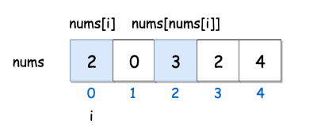

##  [面试题03. 数组中重复的数字](https://leetcode-cn.com/problems/shu-zu-zhong-zhong-fu-de-shu-zi-lcof/)

思路: 把数组视为哈希表
```

由于数组元素的值都在指定的范围内，这个范围恰恰好与数组的下标可以一一对应；

因此看到数值，就可以知道它应该放在什么位置，这里数字nums[i] 应该放在下标为 i 的位置上，这就像是我们人为编写了哈希函数，这个哈希函数的规则还特别简单；

而找到重复的数就是发生了哈希冲突；

```
<div align="center">  </div>

分析：这个思路利用到了数组的元素值的范围恰好和数组的长度是一样的，因此数组本身可以当做哈希表来用。遍历一遍就可以找到重复值，但是修改了原始数组。

```cpp

class Solution {
public:
	void swap(int& a,int& b) {
		int tmp = a;
		a = b;
		b = tmp;
	}

	int findRepeatNumber(vector<int>& nums) {

		for (int i = 0; i < nums.size(); i++){
			// 如果当前的数 nums[i] 没有在下标为 i 的位置上，就把它交换到下标 i 上
	        // 交换过来的数还得做相同的操作，因此这里使用 while
			while (nums[i]!=i)	{
				if (nums[i]==nums[nums[i]]) {
					// 如果下标为 nums[i] 的数值 nums[nums[i]] 它们二者相等
					// 正好找到了重复的元素，将它返回
					return nums[i];
				}
				swap(nums[i], nums[nums[i]]);
			}
		}
		return -1;
	}
};

```


##  [面试题04. 二维数组中的查找](https://leetcode-cn.com/problems/er-wei-shu-zu-zhong-de-cha-zhao-lcof/)
算法思想
```
标志数引入： 此类矩阵中左下角和右上角元素有特殊性，称为标志数。
  左下角元素： 为所在列最大元素，所在行最小元素。 
  右上角元素： 为所在行最大元素，所在列最小元素。

标志数性质： 将 matrix 中的左下角元素（标志数）记作 flag ，则有:
若 flag > target ，则 target 一定在 flag 所在行的上方，即 flag 所在行可被消去。
若 flag < target ，则 target 一定在 flag 所在列的右方，即 flag 所在列可被消去。
本题解以左下角元素为例，同理，右上角元素 也具有行（列）消去的性质。
算法流程： 根据以上性质，设计算法在每轮对比时消去一行（列）元素，以降低时间复杂度。

从矩阵 matrix 左下角元素（索引设为 (i, j) ）开始遍历，并与目标值对比：
当 matrix[i][j] > target 时： 行索引向上移动一格（即 i--），即消去矩阵第 i 行元素；
当 matrix[i][j] < target 时： 列索引向右移动一格（即 j++），即消去矩阵第 j 列元素；
当 matrix[i][j] == target 时： 返回 truetrue 。
若行索引或列索引越界，则代表矩阵中无目标值，返回 falsefalse 。

```

<div align="center">  </div>

算法本质： 每轮 i 或 j 移动后，相当于生成了“消去一行（列）的新矩阵”， 索引(i,j) 指向新矩阵的左下角元素（标志数），因此可重复使用以上性质消去行（列）

```cpp


class Solution {
public:
	bool findNumberIn2DArray(vector<vector<int>>& matrix, int target) {
		int i = matrix.size() - 1, j = 0;

		while (i>=0&&j<matrix[0].size()){
			if (matrix[i][j] > target) i--;
			else if (matrix[i][j] < target)j++;
			else  return true;

		}

		return false;

	}
};
```

## [面试题05. 替换空格](https://leetcode-cn.com/problems/ti-huan-kong-ge-lcof/)

```cpp
class Solution {
public:
    string replaceSpace(string s) {
        string res;
        for(auto c : s){
            if(c == ' ')
                res += "%20";
            else
                res += c;
        }
        return res;
    }
};
```

## [面试题06. 从尾到头打印链表](https://leetcode-cn.com/problems/cong-wei-dao-tou-da-yin-lian-biao-lcof/)

```
class Solution {
public:
    vector<int> reversePrint(ListNode* head) {
        vector<int> res;
        while (head){
            res.push_back(head->val);
            head = head->next;
        }
        reverse(res.begin(), res.end());
        return res;
    }
};

```

## [面试题07. 重建二叉树](https://leetcode-cn.com/problems/zhong-jian-er-cha-shu-lcof/)
