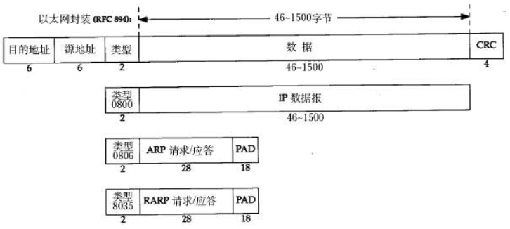
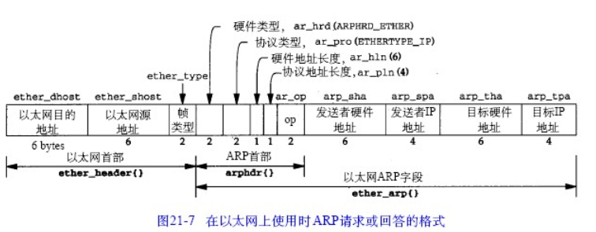

## 搞这玩意有啥好处

 1 TCP协议的细节  
 2 服务器并发数量的极限  
 3 网卡数据的理解


## 单台服务器并发数量的极限在哪？ 

我们应该考虑以下五元组  

-------**CPU  内存  网卡  带宽   内核**

结论是如今最大的瓶颈在于内核 于是有人提出把协议栈搬到用户态的解决方案


##  如何把协议栈做到用户态里面？ 

将网卡映射到内存中： netmap/dpdk  

站在CPU的角度  mmap  把网卡内部（网卡上存储数据）空间 之间映射到内存中

这样 就使得我们操作网卡和操作内存是一样的 这个就是把协议栈做到用户态的基础

---

##  如何在netmap基础上面实现一个小的UDP协议栈？

### **数据结构定义**：

UDP数据帧如下


以太网头



```
struct ethhdr {
	unsigned char h_dest[ETH_ALEN];
	unsigned char h_source[ETH_ALEN];
	unsigned short h_proto;
} __attribute__ ((packed));
```

IP头


```
标识：也就是说的每一个的ID号 唯一地标识主机发送的每一个数据报，其初始值是随机的，每发送一个数据报其值就加1。
 
标志: 位1保留，位2表禁止分片(DF)，若设置了此位，IP模块将不对数据报进行分片，在此情况下若IP数据报超过MTU，IP模块将丢弃数据报并返回一个ICMP差错报文；位3标识更多分片(MF)，除了数据报的最后一个分片，其他分片都要把它设置为1
  
位偏移：分片相对原始IP数据报数据部分的偏移。
  
生存时间:：数据报到达目的地之前允许经过的路由器跳数。TTL值被发送端设置，常设置为64。数据报在转发过程中每经过一个路由该值就被路由器减1.当TTL值为0时，路由器就将该数据包丢弃，并向源端发送一个ICMP差错报文。

```
```
struct iphdr {
	unsigned char version:4;
    unsigned char ihl:4;
	unsigned char tos;
	unsigned short tot_len;
	unsigned short id;
	unsigned short flag_off;
	unsigned char ttl;
	unsigned char protocol;
	unsigned short check;
	unsigned int saddr;
	unsigned int daddr;
} __attribute__ ((packed));
```
udp头


```
struct udphdr {
	unsigned short source;
	unsigned short dest;
	unsigned short len;
	unsigned short check;
} __attribute__ ((packed));
```
udp应用数据
```
struct udppkt {
	struct ethhdr eh;
	struct iphdr ip;
	struct udphdr udp;
	unsigned char body[128];
} __attribute__ ((packed));
```

利用netmap去读取
```
int main(){

    //打开网卡设备
    struct nm_desc* nmr=nm_open("net_map:eth0",NULL);
    if(nmr==NULL){
        return -1;
    }

    //设置poll读事件
    struct pollfd pfd={0};
    pfd.fd=nmr->fd;
    pfd.events=POLLIN;

    
    unsigned char*stream=NULL;
    struct nm_pkthdr h;
    while(1){
         
        //poll监听
        int ret=poll(&fd,1,-1);
        if(ret<0) continue;
        
        //网卡来数据了
        if(pfd.revents&POLLIN){
          stream =nm_nextpkt(mnr,&h); //抓回数据

          //转为以太网帧格式
          struct ethhdr*eh=(struct ethhd*)stream;

          if(ntohs(eh->h_proto)==PROTO_IP){ //判断是不是IP数据
              
              //转为udp格式
              struct updpkt *upd=(struct updpkt*)stream; 


              if(ntohs(udp->ip.proto)==PROTO_UDP){ //判断是不是UDP数据
                   int udp_length= ntohs(udp->udp_length);

                   udp->body[udp_length-8]='\0'; 
                   printf("udp->%\n",udp->body);
              }         
          }
        }
    }
}

```
这么写为啥发一段时间就没数据了？？


arp协议的工作原理 （IP层）
```
在每台安装有TCP/IP协议的电脑里都有一个ARP缓存表，表里的IP地址与MAC地址是一一对应的

------------------------------------------------------------
我们以主机A（192.168.1.5）向主机B（192.168.1.1）发送数据为例。

当发送数据时，主机A会在自己的ARP缓存表中寻找是否有目标IP地址。如果找到了，也就知道了目标MAC地址，直接把目标MAC地址写入帧里面发送就可以了；

如果在ARP缓存表中没有找到相对应的IP地址，主机A就会在网络上发送一个广播，目标MAC地址是“FF.FF.FF.FF.FF.FF”，这表示向同一网段内的所有主机发出这样的询问：“192.168.1.1的MAC地址是什么？”网络上其他主机并不响应ARP询问，只有主机B接收到这个帧时，才向主机A做出这样的回应：“192.168.1.1的MAC地址是00-aa-00-62-c6-09”。
这样，主机A就知道了主机B的MAC地址，它就可以向主机B发送信息了。同时它还更新了自己的ARP缓存表，下次再向主机B发送信息时，直接从ARP缓存表里查找就可以了。

ARP缓存表采用了老化机制，在一段时间内如果表中的某一行没有使用，就会被删除，这样可以大大减少ARP缓存表的长度，加快查询速度。

------------------------------------------------------------

ARP攻击就是通过伪造IP地址和MAC地址实现ARP欺骗，能够在网络中产生大量的ARP通信量使网络阻塞，攻击者只要持续不断的发出伪造的ARP响应包就能更改目标主机ARP缓存中的IP-MAC条目，造成网络中断或中间人攻击。

ARP攻击主要是存在于局域网网络中，局域网中若有一个人感染ARP木马，则感染该ARP木马的系统将会试图通过“ARP欺骗”手段截获所在网络内其它计算机的通信信息，并因此造成网内其它计算机的通信故障。
```


ARP头


```
struct arphdr {
	unsigned short h_type;
	unsigned short h_proto;
	unsigned char h_addrlen;
	unsigned char protolen;
	unsigned short oper;
	unsigned char smac[ETH_ALEN];
	unsigned int sip;
	unsigned char dmac[ETH_ALEN];
	unsigned int dip;
} __attribute__ ((packed));
```


####  为啥每一层都有一个效验？
因为之前的网络丢失情况还是很严重的 所以在每一层都在加校验 更方便去查找那一层出现了问题

---

##  如何在netmap基础上面实现一个小的TCP协议栈？

```
1 TCP header  
2 TCP stream / tcb  
3 滑动窗口
4 慢启动
5 定时器
```

### TCP头 


conect 三次握手  
```
第一次： SYN=1  seqnum=1234   
第二次： ACK=1  acknum=1235   SYN=1 seqnum=4567
第三次： ACK=1  acknum=4568
````


