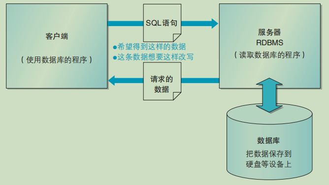

## 1-数据库和SQL

**数据库是什么** ？
* 数据库是将大量数据保存起来，通过计算机加工而成的可以进行高效访问的数据集合。
* 用来管理数据库的计算机系统称为数据库管理系统（DBMS）。
* 关系数据库通过关系数据库管理系统（RDBMS）进行管理。

DBMS的种类
* 层次数据库（Hierarchical Database，HDB）
   * 最古老的数据库之一，它把数据通过层次结构（树形结构）的方式表现出来。
* 关系数据库（Relational Database，RDB）
   * 它也采用由行和列组成的二维表来管理数据 还使用专门的 SQL对数据进行操作。
* 面向对象数据库（Object Oriented Database，OODB）
   
* XML数据库（XML Database，XMLDB）
* 键值存储系统（Key-Value Store，KVS）
   * 可以把它想象成关联数组或者散列 单纯用来保存查询所使用的主键（Key）和值（Value）的组合的数据库

**数据库的结构**
最常见的系统结构就是客户端 / 服务器类型（C/S类型）这种结构

  

**SQL概要**

● SQL通过一条语句来描述想要进行的操作，发送给RDBMS。
● 原则上 SQL语句都会使用分号结尾。
● SQL根据操作目的可以分为 DDL、DML和 DCL。

SQL语句及其种类

* DDL（Data Definition Language，数据定义语言）  用来创建或者删除存储数据用的数据库以及数据库中的表等对象。
    * CREATE：创建数据库和表等对象
    * DROP： 删除数据库和表等对象
    * ALTER： 修改数据库和表等对象的结构

* DML（Data Manipulation Language，数据操纵语言）  用来查询或者变更表中的记录。
    * SELECT：查询表中的数据
    * INSERT：向表中插入新数据
    * UPDATE：更新表中的数据
    * DELETE：删除表中的数据

* DCL（Data Control Language，数据控制语言）  用来确认或者取消对数据库中的数据进行的变更
   * COMMIT： 确认对数据库中的数据进行的变更
   * ROLLBACK：取消对数据库中的数据进行的变更
   * GRANT： 赋予用户操作权限
   * REVOKE： 取消用户的操作权限

实际使用的 SQL 语句当中有 90% 属于 DML

**表的创建**

**表的删除和更新**