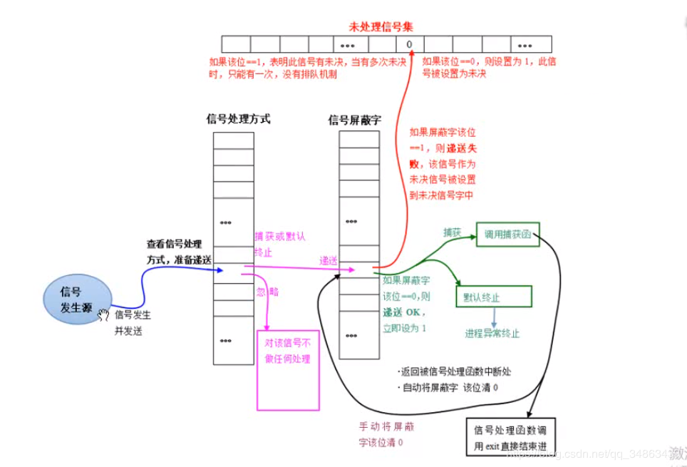

Linux提供的“进程通信”方式有哪些?

  

# 信号

### 谁会向进程发送信号？
总结起来，会有三个“人”会向进程发送信号，分别是“另一进程”、“OS内核”、“硬件”

### 进程收到信号后，进程会如何处理?
三种处理方式，分别是忽略、捕获、默认。

### 信号处理的完整过程

  

### 常见信号

| 信号 | 描述 |
|:--:|:--:|
|SIGHUP|挂起进程，当父进程退出时，所有子进程都会收到SIGHUP信号|
|SIGINT|终止进程（CTRL + C）|
|SIGQUIT|终止前台进程组并产生一个core文件（CTRL + \）|
|SIGCHLD|子进程终止时给父进程发送的信号，如果父进程没有捕获代码，则这个信号被忽略|
|SIGTERM|关机时，init进程向系统中进程发出的信号，提示进程即将关机，进程可以捕获然后执行一些清理|
|SIGKILL(不能捕获或忽略)|杀掉进程|
|SIGSTOP(不能捕获或忽略)|停止进程，但不终止进程|
|SIGTSTP|停止或暂停进程，但不终止进程（CTRL + Z）|
|SIGCONT|继续运行停止的进程|

# [进程间的通信](https://blog.csdn.net/qq_34863439/article/details/103258088#1.%20%E6%97%A0%E5%90%8D%E7%AE%A1%E9%81%93%20%C2%A0%C2%A0%20%C2%A0)

## 1.管道

### 1.1 无名管道
