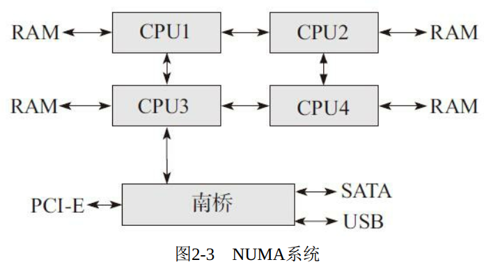

##系统架构介绍？

经典计算机系统

  

在这种系统中， 所有的数据交换都需要通过北桥：可以看出， 这种系统的瓶颈就在北桥中

这种系统设计的另外一个瓶颈体现在对内存
的访问上。 不管是处理器或者显卡， 还是南桥的硬盘、 网卡或者光驱，
都需要频繁访问内存， 当这些设备都争相访问内存时， 增大了对北桥带
宽的竞争， 而且北桥到内存之间也只有一条总线

为了解决这个瓶颈， 产生了如下图所示的NUMA

  

当然， 这样的架构也存在缺点。 该
系统中， 访问内存所花的时间和处理器相关。 之所以和处理器相关是因
为该系统每个处理器都有本地内存（Local memory） ， 访问本地内存的
时间很短， 而访问远程内存（remote memory） ， 即其他处理器的本地
内存， 需要通过额外的总线

## Cache系统

Cache的种类:  L1 L2 核心私有 L3核心共享

TLB（Translation Look-aside Buffer） Cache:专门用于缓存内存中的页表项。 

如果需要的地址在TLB Cache
中， 相连存储器迅速返回结果， 然后处理器用该物理地址访问内存， 这
样的查找操作也称为TLB命中； 如果需要的地址不在TLB Cache中， 也
就是不命中， 处理器就需要到内存中访问多级页表， 才能最终得到物理
地址

我们知道 内存很大 cache很小?如何把
内存中的内容存放到Cache中去呢？ 这就需要一个映射算法和一个分块
机制。

分块机制就是说， Cache和内存以块为单位进行数据交换， 块的大
小通常以在内存的一个存储周期中能够访问到的数据长度为限。 当今主
流块的大小都是64字节， 因此一个Cache line就是指64个字节大小的数
据块

而映射算法是指把内存地址空间映射到Cache地址空间。 具体来
说， 就是把存放在内存中的内容按照某种规则装入到Cache中， 并建立
内存地址与Cache地址之间的对应关系

Cache的写策略

直写（write-through） ： 所谓直写， 就是指在处理器对Cache写入的
同时， 将数据写入到内存中这种策略保证了在任何时刻， 内存的数据
和Cache中的数据都是同步的， 

回写（write-back） ：回写系统通过将Cache line的标志位字段添加一个Dirty标志位， 当
处理器在改写了某个Cache line后， 并不是马上把其写回内存， 而是将
该Cache line的Dirty标志设置为1。 当处理器再次修改时候 发现这个标志位 写把原数据写回内存 在将新数据写入cache中  

也就是只有当cache数据发生修改时候 这时候cache的原数据才会写入内存中

其实， 回写策略在多核系统中会引起Cache一致性的问题。

Cache预取
Cache之所以能够提高系统性能， 主要是程序执行存在局部性现
象， 即时间局部性和空间局部性。

我们来看DPDK是怎么利用的
以下是一个基本过程。

1） 写 “接收描述符”到内存， 填充数据缓冲区指针， 网卡收到报文后
就会根据这个地址把报文内容填充进去。
2） 从内存中读取接收描述符（当收到报文时， 网卡会更新该结
构） （内存读） ， 从而确认是否收到报文。

3） 从接收描述符确认收到报文时， 从内存中读取控制结构体的指
针（ 内存读） ， 再从内存中读取控制结构体（ 内存读） ， 把从接收描述
符读取的信息填充到该控制结构体。
4） 更新接收队列寄存器， 表示软件接收到了新的报文。
5） 内存中读取报文头部（ 内存读） ， 决定转发端口。
6） 从控制结构体把报文信息填入到发送队列发送描述符， 更新发
送队列寄存器。
7） 从内存中读取发送描述符（ 内存读） ， 检查是否有包被硬件传
送出去。
8） 如果有的话， 从内存中读取相应控制结构体（ 内存读） ， 释放
数据缓冲区。

可以看出， 处理一个报文的过程， 需要6次读取内存（ 见上“内存
读”） 。 

因此， DPDK必须保证所有需要读取的数据都在Cache中， 否则一
旦出现Cache不命中， 性能将会严重下降。 为了保证这点， DPDK采用
了多种技术来进行优化， 代码层面的预取只是其中的一种。

Cache一致性

对于 读写 处理器内部的寄存器     cache   内存

多个核同时操作一个Cache Line进行写操作造成的。 Cache一致性问题的根源是因为存在多个处理器独占的
Cache，

解决Cache一致性问题的机制有两种： 基于目录的协议（ Directorybased protocol） 和总线窥探协议（ 

DPDK如何保证Cache一致性

1、数据定义边界对齐 ：DPDK的数据结构“struct lcore_conf”总是以Cache行对齐， 这样就不会
出现该数据结构横跨两个Cache行的问题。

2、每个核单独享有自己的数据结构 
DPDK中对每个核都进行编号， 这样核n就只需要访问
lcore[n]， 核m只需要访问lcore[m]， 这样就避免了多个核访问同一个结
构体。

3、对于必然同时访问的临界区，对于网络端口而讲，网卡有多队列，每个核用自己的队列。其他的临界区——应该不可避免要用一些窥探协议来处理

TLB问题与大页

分页是指把物理内存分成固定大小的块， 按照页来进行分配和释
放。 一般常规页大小为4K（212） 个字节， 之后又因为一些需要， 出现
了大页， 比如2M（220） 个字节和1G（230） 个字节的大小

我们知道TLB大小是很有限的， 随着程序的变大或者程序使用内存
的增加， 那么势必会增加TLB的使用项， 最后导致TLB出现不命中的情
况。 

Linux操作系统采用了基于hugetlbfs的特殊文件系统来加入对
2MB或者1GB的大页面支持。

DDIO

当一个网络报文送到服务器的网卡时， 网卡通过外部总线（比如
PCI总线） 把数据和报文描述符送到内存。 接着， CPU从内存读取数据
到Cache进而到寄存器。 进行处理之后， 再写回到Cache， 并最终送到内
存中。 最后， 网卡读取内存数据， 经过外部总线送到网卡内部， 最终通
过网络接口发送出去

可以看出， 对于一个数据报文， CPU和网卡需要多次访问内存。 而
内存相对CPU来讲是一个非常慢速的部件。 CPU需要等待数百个周期才
能拿到数据， 在这过程中， CPU什么也做不了。

DDIO技术是如何改进的呢？ 这种技术使外部网卡和CPU通过LLC
Cache直接交换数据， 绕过了内存这个相对慢速的部件。

