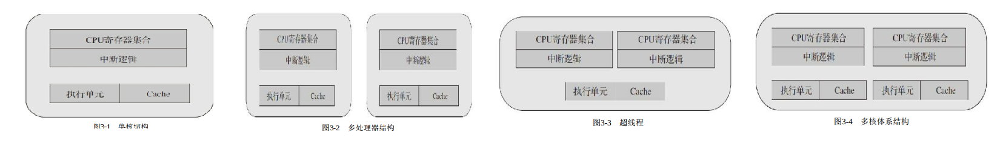

处理器性能提升主要有两个途径， 一个是提高IPC（每个时钟周期
内可以执行的指令条数） ， 另一个是提高处理器主频率

CPU介绍

  

处理器核数： processor cores， 即俗称的“CPU核数”， 逻辑处理器核心数：

逻辑处理器核心数： 有没有开超线程

系统物理处理器封装ID： Socket中文翻译成“插槽”， 也就是所谓的
物理处理器封装个数， 即俗称的“物理CPU数”
数”

系统逻辑处理器ID： 逻辑处理器数的英文名是logical processor， 即
俗称的“逻辑CPU数”，

亲和性

DPDK通过把线程绑定到逻辑核的方法来避免跨核任务中的切换开销， 但对于绑定运行的当前逻辑核， 仍然可能会有线程切换的发生， 若希望进一步减少其他任务对于某个特定任务的影响， 在亲和的基础上更进一步， 可以采取把逻辑核从内核调度系统剥离的方法

DPDK的线程基于pthread接口创建， 属于抢占式线程模型， 受内核
调度支配。 DPDK通过在多核设备上创建多个线程， 每个线程绑定到单
独的核上， 减少线程调度的开销， 以提高性能

DPDK的lcore指的是EAL线程， 本质是基于
pthread（Linux/FreeBSD） 封装实现

DPDK的线程其实就是普通的
pthread。 使用cgroup能把CPU的配额灵活地配置在不同的线程上。

单指令多数据SIMD

DPDK中的memcpy就利用到了SSE/AVX的特点。 比较典型的就是rte_memcpy内存拷贝函数。