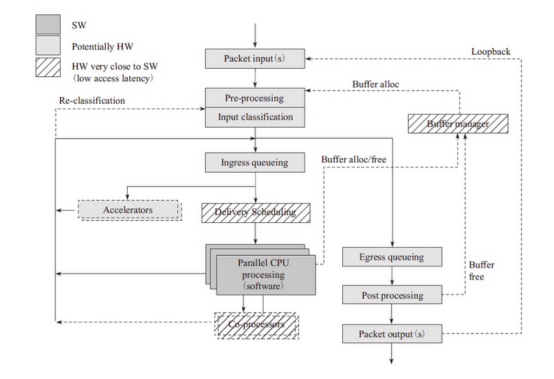
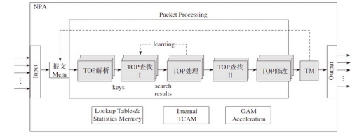
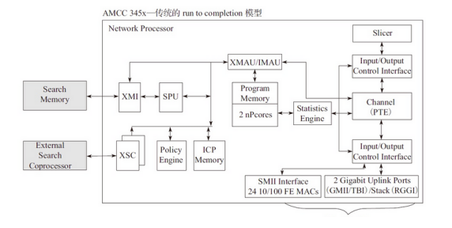

报文处理模块划分

  

Packet input： 报文输入。
·Pre-processing： 对报文进行比较粗粒度的处理。
·Input classification： 对报文进行较细粒度的分流。
·Ingress queuing： 提供基于描述符的队列FIFO。
·Delivery/Scheduling： 根据队列优先级和CPU状态进行调度。
·Accelerator： 提供加解密和压缩/解压缩等硬件功能。
·Egress queueing： 在出口上根据QOS等级进行调度。
·Post processing： 后期报文处理释放缓存。
·Packet output： 从硬件上发送出去。

转发框架介绍

 流水线模型（pipeline）

  

 
 将整个功能拆分成多个独立的阶段，不同阶段通过队列传递产品

 run to completion模型

 这个模型是DPDK针对一般的程序的运行方法，一个程序分为几个不同的逻辑功能，几个逻辑功能会在一个CPU的核上运行，我们下面看下模型的视图

 
  

 从run to completion的模型中，我们可以清楚地看出，每个IA的物理核都负责处理整个报文的生命周期从RX到TX，这点非常类似前面所提到的AMCC的nP核的作用。在pipeline模型中可以看出，报文的处理被划分成不同的逻辑功能单元A、B、C，一个报文需分别经历A、B、C三个阶段，这三个阶段的功能单元可以不止一个并且可以分布在不同的物理核上

 ## 转发算法

除了良好的转发框架之外，转发中很重要的一部分内容就是对于报文字段的匹配和识别，在DPDK中主要用到了精确匹配（Exact Match）算法和最长前缀匹配（Longest Prefix Matching，LPM）算法来进行报文的匹配从而获得相应的信息

精确匹配算法

相当于使用了Hash算法

最长匹配算法

使用了两级表。针对IPv4路由查找，一级是2^24个条目，二级是2^8的条目。用空间换时间。
